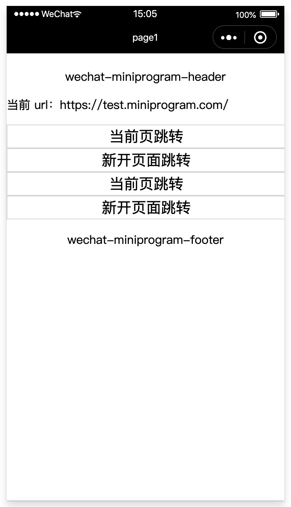
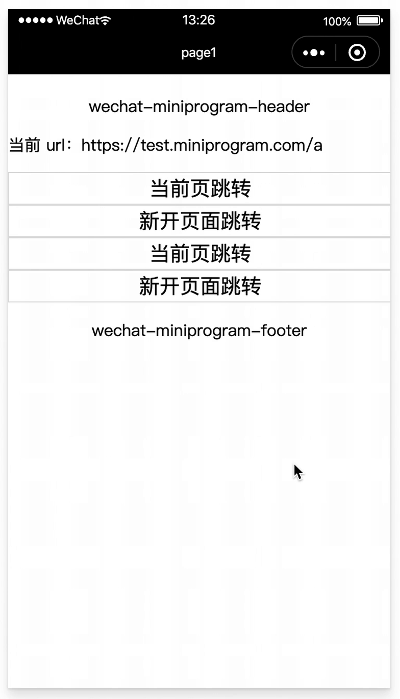

# 多页开发

### 1、用法

对于多页面的应用，在 Web 端可以直接通过 a 标签或者 location 对象进行跳转，但是在小程序中则行不通；同时 Web 端的页面 url 实现和小程序页面路由也是完全不一样的，因此对于多页开发最大的难点在于如何进行页面跳转。

#### 1.1 修改 webpack 配置

对于多页应用，此处和 Web 端一致，有多少个页面就需要配置多少个入口文件。如下例子，这个应用中包含 page1、page2 和 page2 三个页面：

```js
// webpack.mp.config.js
module.exports = {
  entry: {
    page1: path.resolve(__dirname, '../src/page1/main.mp.js'),
    page2: path.resolve(__dirname, '../src/page2/main.mp.js'),
    page3: path.resolve(__dirname, '../src/page3/main.mp.js'),
  },
  // ... other options
}
```

#### 1.2 修改 webpack 插件配置

`mp-webpack-plugin` 这个插件的配置同样需要调整，需要开发者提供各个页面对应的 url 给 kbone。

```js
module.exports = {
  origin: 'https://test.miniprogram.com',
  entry: '/page1',
  router: {
    page1: ['/(home|page1)?', '/test/(home|page1)'],
    page2: ['/test/page2/:id'],
    page3: ['/test/page3/:id'],
  },
  // ... other options
}
```

其中 origin 即 window.location.origin 字段，使用 kbone 的应用所有页面必须同源，不同源的页面禁止访问。entry 页面表示这个应用的入口 url。router 配置则是各个页面对应的 url，可以看到每个页面可能不止对应一个 url，而且这里的 url 支持参数配置。

有了以上几个配置后，就可以在 kbone 内使用 a 标签或者 location 对象进行跳转。kbone 会将要跳转的 url 进行解析，然后根据配置中的 origin 和 router 查找出对应的页面，然后拼出页面在小程序中的路由，最后通过小程序 API 进行跳转（利用 wx.redirectTo 等方法）。

### 2、案例

在 `kbone-advanced` 目录下创建 `02-mulpages` 目录。本案例在这个目录下实现。

#### 2.1 创建 package.json

```
cd 02-mulpages
npm init -y
```

编辑 package.json：

```js
{
  "name": "01-env",
  "version": "1.0.0",
  "description": "",
  "main": "index.js",
  "scripts": {
    "mp": "cross-env NODE_ENV=production webpack --config build/webpack.mp.config.js --progress --hide-modules"
  },
  "dependencies": {
    "add": "^2.0.6",
    "vue": "^2.5.11"
  },
  "browserslist": [
    "> 1%",
    "last 2 versions",
    "not ie <= 8"
  ],
  "devDependencies": {
    "babel-core": "^6.26.0",
    "babel-loader": "^7.1.2",
    "babel-preset-env": "^1.6.0",
    "cross-env": "^5.0.5",
    "css-loader": "^0.28.7",
    "file-loader": "^1.1.4",
    "html-webpack-plugin": "^4.0.0-beta.5",
    "mini-css-extract-plugin": "^0.5.0",
    "optimize-css-assets-webpack-plugin": "^5.0.1",
    "stylehacks": "^4.0.3",
    "vue-loader": "^15.7.0",
    "vue-template-compiler": "^2.6.10",
    "webpack": "^4.29.6",
    "webpack-cli": "^3.2.3",
    "mp-webpack-plugin": "latest"
  },
  "keywords": [],
  "author": "",
  "license": "ISC"
}
```

安装依赖包：

```
npm install
```

#### 2.2 配置 webpack

在 `02-mulpages` 目录下创建 `build` 文件夹，在文件夹下创建 `webpack.mp.config.js` 文件，内容如下：

```js
const path = require('path')
const webpack = require('webpack')
const MiniCssExtractPlugin = require('mini-css-extract-plugin')
const { VueLoaderPlugin } = require('vue-loader')
const OptimizeCSSAssetsPlugin = require('optimize-css-assets-webpack-plugin');
const TerserPlugin = require('terser-webpack-plugin')
const MpPlugin = require('mp-webpack-plugin') // 用于构建小程序代码的 webpack 插件

const isOptimize = false // 是否压缩业务代码，开发者工具可能无法完美支持业务代码使用到的 es 特性，建议自己做代码压缩

module.exports = {
  mode: 'production',
  entry: {
    page1: path.resolve(__dirname, '../src/page1/main.mp.js'),
    page2: path.resolve(__dirname, '../src/page2/main.mp.js'),
    page3: path.resolve(__dirname, '../src/page3/main.mp.js'),
  },
  output: {
    path: path.resolve(__dirname, '../dist/mp/common'), // 放到小程序代码目录中的 common 目录下
    filename: '[name].js', // 必需字段，不能修改
    library: 'createApp', // 必需字段，不能修改
    libraryExport: 'default', // 必需字段，不能修改
    libraryTarget: 'window', // 必需字段，不能修改
  },
  target: 'web', // 必需字段，不能修改
  optimization: {
    runtimeChunk: false, // 必需字段，不能修改
    splitChunks: { // 代码分隔配置，不建议修改
      chunks: 'all',
      minSize: 1000,
      maxSize: 0,
      minChunks: 1,
      maxAsyncRequests: 100,
      maxInitialRequests: 100,
      automaticNameDelimiter: '~',
      name: true,
      cacheGroups: {
        vendors: {
          test: /[\\/]node_modules[\\/]/,
          priority: -10
        },
        default: {
          minChunks: 2,
          priority: -20,
          reuseExistingChunk: true
        }
      }
    },

    minimizer: isOptimize ? [
      // 压缩CSS
      new OptimizeCSSAssetsPlugin({
        assetNameRegExp: /\.(css|wxss)$/g,
        cssProcessor: require('cssnano'),
        cssProcessorPluginOptions: {
          preset: ['default', {
            discardComments: {
              removeAll: true,
            },
            minifySelectors: false, // 因为 wxss 编译器不支持 .some>:first-child 这样格式的代码，所以暂时禁掉这个
          }],
        },
        canPrint: false
      }),
      // 压缩 js
      new TerserPlugin({
        test: /\.js(\?.*)?$/i,
        parallel: true,
      })
    ] : [],
  },
  module: {
    rules: [
      {
        test: /\.css$/,
        use: [
          MiniCssExtractPlugin.loader,
          'css-loader'
        ],
      },
      {
        test: /\.vue$/,
        loader: [
          'vue-loader',
        ],
      },
      {
        test: /\.js$/,
        use: {
          loader: 'babel-loader',
          options: {
            presets: ['env']
          }
        },
        exclude: /node_modules/
      },
      {
        test: /\.(png|jpg|gif|svg)$/,
        loader: 'file-loader',
        options: {
          name: '[name].[ext]?[hash]'
        }
      }
    ]
  },

  resolve: {
    extensions: ['*', '.js', '.vue', '.json']
  },

  plugins: [
    new webpack.DefinePlugin({
      'process.env.isMiniprogram': true, // 注入环境变量，用于业务代码判断
    }),
    new MiniCssExtractPlugin({
      filename: '[name].wxss',
    }),
    new VueLoaderPlugin(),
    new MpPlugin(require('./miniprogram.config.js')),
  ],
}
```

在 `02-mulpages/build` 文件夹下创建 `miniprogram.config.js` 文件，内容如下：

```js
module.exports = {	
	origin: 'https://test.miniprogram.com',	
	entry: '/',	
	router: {		
		page1: ['/a'],
		page2: ['/b'],
		page3: ['/c'],
	},	
	redirect: {		
		notFound: 'page1',		
		accessDenied: 'page1',
	},
	generate: {
    appEntry: 'miniprogram-app',
    // 构建完成后是否自动安装小程序依赖。'npm'：使用 npm 自动安装依赖
		autoBuildNpm: 'npm'
	},
	runtime: {
		cookieStore: 'memory',
	},
	app: {
		navigationBarTitleText: 'kbone-multiple-pages',
	},
	global: {
		share: true,
	},
	pages: {
		page1: {
			extra: {
				navigationBarTitleText: 'page1',
			},
		},
	},
	projectConfig: {
		appid: '',
    projectname: 'kbone-multiple-pages',
	},
	packageConfig: {
		author: 'Felixlu',
	}
}
```

#### 2.3 编写三个页面

在 `/src/` 下创建 `page1`, `page2`, `page3` 三个文件夹，在文件夹里创建三个页面，每个页面由 `App.vue` 和 `main.mp.js` 两个文件组成。

##### 1、page1 页面

`/src/page1/App.vue` 内容：

```vue
<template>
  <div class="cnt">
    <Header></Header>
    <p>当前 url：{{url}}</p>
    <a href="/b">当前页跳转</a>
    <a href="/c" target="_blank">新开页面跳转</a>
    <button @click="onClickJump">当前页跳转</button>
    <button @click="onClickOpen">新开页面跳转</button>
    <Footer></Footer>
  </div>
</template>

<script>
import Header from '../common/Header.vue'
import Footer from '../common/Footer.vue'
export default {
  name: 'App',
  components: {
    Header,
    Footer
  },
  data() {
    return {
      url: location.href,
    }
  },
  created() {
    window.addEventListener('wxload', query => console.log('page1 wxload', query))
    window.addEventListener('wxshow', () => console.log('page1 wxshow'))
    window.addEventListener('wxready', () => console.log('page1 wxready'))
    window.addEventListener('wxhide', () => console.log('page1 wxhide'))
    window.addEventListener('wxunload', () => console.log('page1 wxunload'))
    window.onShareAppMessage = () => {
      return {
        title: 'kbone-demo',
        // path: '/a', // 当前页面
        // path: 'https://test.miniprogram.com/a', // 当前页面的完整 url
        // path: '/b', // 其他页面
        // path: 'https://test.miniprogram.com/b', // 其他页面的完整 url
        miniprogramPath: `/pages/page2/index?type=share&targeturl=${encodeURIComponent('https://test.miniprogram.com/b')}`, // 自己组装分享页面路由
      }
    }
  },
  mounted() {
    // cookie
    console.log('before set cookie', document.cookie)
    document.cookie = `time=${+new Date()}; expires=Wed Jan 01 2220 00:00:00 GMT+0800; path=/`
    console.log('after set cookie', document.cookie)
  },
  methods: {
    onClickJump() {
      window.location.href = '/b'
    },
    onClickOpen() {
      window.open('/c')
    },
  },
}
</script>

<style>
.cnt {
  margin-top: 20px;
}
a, button {
  display: block;
  width: 100%;
  height: 30px;
  line-height: 30px;
  text-align: center;
  font-size: 20px;
  border: 1px solid #ddd;
}
</style>
```

`/src/page1/main.mp.js` 内容：

```js
import Vue from 'vue'
import App from './App.vue'

export default function createApp() {
  const container = document.createElement('div')
  container.id = 'app'
  document.body.appendChild(container)

  return new Vue({
    el: '#app',
    render: h => h(App)
  })
}
```

`/src/common/Header.vue` 内容：

```vue
<template>
  <div class="header">
    <p>wechat-miniprogram-header</p>
  </div>
</template>

<script>
import add from 'add'
import { printf } from './utils'
export default {
  mounted() {
    printf('I am Header --> ' + add([7, 8]))
  },
}
</script>

<style>
.header {
  margin-bottom: 10px;
  width: 100%;
  text-align: center;
}
</style>
```

`/src/common/utils.js` 内容：

```js
export function printf(str) {
  console.log('common/utils.js --> ', str)
}
```

`/src/common/Footer.vue` 内容：

```vue
<template>
  <div class="footer">
    <p>wechat-miniprogram-footer</p>
  </div>
</template>

<script>
export default {}
</script>

<style>
.footer {
  margin-top: 10px;
  width: 100%;
  text-align: center;
}
</style>
```

##### 2、page2 页面

`/src/page2/App.vue` 内容：

```vue
<template>
  <div class="cnt">
    <Header></Header>
    <p>当前 url：{{url}}</p>
    <a href="/a">回到首页</a>
    <button @click="onClickJump">回到首页</button>
    <button @click="onClickReLaunch">relaunch</button>
    <Footer></Footer>
  </div>
</template>

<script>
import Header from '../common/Header.vue'
import Footer from '../common/Footer.vue'
export default {
  name: 'App',
  components: {
    Header,
    Footer
  },
  data() {
    return {
      url: location.href,
    }
  },
  created() {
    window.addEventListener('wxload', query => console.log('page2 wxload', query))
    window.addEventListener('wxshow', () => console.log('page2 wxshow'))
    window.addEventListener('wxready', () => console.log('page2 wxready'))
    window.addEventListener('wxhide', () => console.log('page2 wxhide'))
    window.addEventListener('wxunload', () => console.log('page2 wxunload'))
    window.onShareAppMessage = () => {
      return {
        title: 'kbone-demo',
        path: '/a',
      }
    }
  },
  methods: {
    onClickJump() {
      window.location.href = '/a'
    },
    onClickReLaunch() {
      wx.reLaunch({
        url: `/pages/page1/index?type=jump&targeturl=${encodeURIComponent('/a')}`,
      })
    },
  },
}
</script>

<style>
.cnt {
  margin-top: 20px;
}
a, button {
  display: block;
  width: 100%;
  height: 30px;
  line-height: 30px;
  text-align: center;
  font-size: 20px;
  border: 1px solid #ddd;
}
</style>
```

`/src/page2/main.mp.js` 内容：

```js
import Vue from 'vue'
import App from './App.vue'

export default function createApp() {
  const container = document.createElement('div')
  container.id = 'app'
  document.body.appendChild(container)

  return new Vue({
    el: '#app',
    render: h => h(App)
  })
}
```

##### 3、page3 页面

`/src/page3/App.vue` 内容：

```vue
<template>
  <div class="cnt">
    <Header></Header>
    <p>当前 url：{{url}}</p>
    <button @click="onClickBack">回到上一页</button>
    <button @click="onClickClose">关闭当前窗口</button>
    <Footer></Footer>
  </div>
</template>

<script>
import Header from '../common/Header.vue'
import Footer from '../common/Footer.vue'
export default {
  name: 'App',
  components: {
    Header,
    Footer
  },
  data() {
    return {
      url: location.href,
    }
  },
  created() {
    window.addEventListener('wxload', query => console.log('page3 wxload', query))
    window.addEventListener('wxshow', () => console.log('page3 wxshow'))
    window.addEventListener('wxready', () => console.log('page3 wxready'))
    window.addEventListener('wxhide', () => console.log('page3 wxhide'))
    window.addEventListener('wxunload', () => console.log('page3 wxunload'))
    window.onShareAppMessage = () => {
      return {
        title: 'kbone-demo',
        path: '/a',
      }
    }
  },
  methods: {
    onClickBack() {
      if (process.env.isMiniprogram) {
        wx.navigateBack()
      }
    },
    onClickClose() {
      window.close()
    },
  },
}
</script>

<style>
.cnt {
  margin-top: 20px;
}
a, button {
  display: block;
  width: 100%;
  height: 30px;
  line-height: 30px;
  text-align: center;
  font-size: 20px;
  border: 1px solid #ddd;
}
</style>
```

`/src/page3/main.mp.js` 内容：

```js
import Vue from 'vue'
import App from './App.vue'

export default function createApp() {
  const container = document.createElement('div')
  container.id = 'app'
  document.body.appendChild(container)

  return new Vue({
    el: '#app',
    render: h => h(App)
  })
}
```

#### 2.4 小程序端效果预览

```
npm run mp
```


