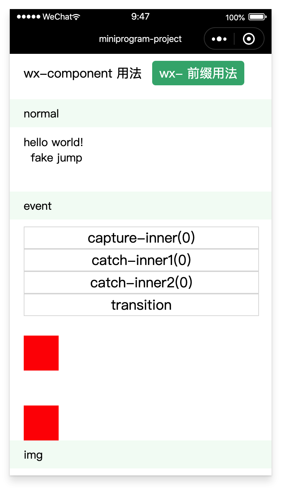

# 使用小程序内置组件

### 1、用法

需要明确的是，如果没有特殊需求的话，请尽量使用 html 标签来编写代码，使用内置组件时请按需使用。这是因为绝大部分内置组件外层都会被包裹一层自定义组件，如果自定义组件的实例数量达到一定量级的话，理论上是会对性能造成一定程度的影响，所以对于 view、text、image 等会被频繁使用的内置组件，如果没有特殊需求的话请直接使用 div、span、img 等 html 标签替代。

部分内置组件可以直接使用 html 标签替代，比如 input 组件可以使用 input 标签替代。目前已支持的可替代组件列表：

```
<input /> --> input 组件
<input type="radio" /> --> radio 组件
<input type="checkbox" /> --> checkbox 组件
<label><label> --> label 组件
<textarea></textarea> --> textarea 组件
 --> image 组件
<video></video> --> video 组件
<canvas></canvas> --> canvas 组件
```

还有一部分内置组件在 html 中没有标签可替代，那就需要使用 wx-component 标签或者使用 wx- 前缀，基本用法如下：

```
<!-- wx-component 标签用法 -->
<wx-component behavior="picker" mode="region" @change="onChange">选择城市</wx-component>
<wx-component behavior="button" open-type="share" @click="onClickShare">分享</wx-component>

<!-- wx- 前缀用法 -->
<wx-picker mode="region" @change="onChange">选择城市</wx-picker>
<wx-button open-type="share" @click="onClickShare">分享</wx-button>
```

如果使用 wx-component 标签表示要渲染小程序内置组件，然后 behavior 字段表示要渲染的组件名；其他组件属性传入和官方文档一致，事件则采用 vue 的绑定方式。

wx-component 或 wx- 前缀已支持内置组件列表：

- cover-image 组件
- cover-view 组件
- movable-area 组件
- movable-view 组件
- scroll-view 组件
- swiper 组件
- swiper-item 组件
- view 组件
- icon 组件
- progress 组件
- text 组件
- button 组件
- editor 组件
- form 组件
- picker 组件
- picker-view 组件
- picker-view-column 组件
- slider 组件
- switch 组件
- navigator 组件
- camera 组件
- image 组件
- live-player 组件
- live-pusher 组件
- map 组件
- ad 组件
- official-account 组件
- open-data 组件
- web-view 组件

内置组件的子组件会被包裹在一层自定义组件里面，因此内置组件和子组件之间会隔着一层容器，该容器会追加 h5-virtual 到 class 上（除了 view、cover-view、text、scroll-view 和 picker-view 组件外，因为这些组件需要保留子组件的结构，所以沿用 0.x 版本的渲染方式）。

>0.x 版本：在 0.x 版本中，绝大部分内置组件在渲染时会在外面多包装一层自定义组件，可以近似认为内置组件和其父级节点中间会多一层 div 容器，所以会对部分样式有影响。这个 div 容器会追加一个名为 h5-xxx 的 class，例如使用 video 组件，那么会在这个 div 容器上追加一个名为 h5-video 的 class，以便对其做特殊处理。另外如果是用 wx-component 或是 wx- 前缀渲染的内置组件，会在容器追加的 class 是 h5-wx-component，为了更方便进行识别，这种情况会再在容器额外追加 wx-xxx 的 class。

生成的结构大致如下：

```
<!-- 源码 -->
<div>
  <canvas>
    <div></div>
    <div></div>
  </canvas>
  <wx-map>
    <div></div>
    <div></div>
  </wx-map>
  <wx-scroll-view>
    <div></div>
    <div></div>
  </wx-scroll-view>
</div>

<!-- 1.x 版本生成的结构 -->
<view>
  <canvas class="h5-canvas wx-canvas wx-comp-canvas">
    <element class="h5-virtual">
      <cover-view></cover-view>
      <cover-view></cover-view>
    </element>
  </canvas>
  <map class="h5-wx-component wx-map wx-comp-map">
    <element class="h5-virtual">
      <cover-view></cover-view>
      <cover-view></cover-view>
    </element>
  </map>
  <element class="h5-wx-component wx-scroll-view">
    <scroll-view class="wx-comp-scroll-view">
      <view></view>
      <view></view>
    </scroll-view>
  </element>
</view>

<!-- 0.x 版本本生成的结构 -->
<view>
  <element class="h5-canvas">
    <canvas class="wx-comp-canvas">
      <cover-view></cover-view>
      <cover-view></cover-view>
    </canvas>
  </element>
  <element class="h5-wx-component wx-map">
    <map class="wx-comp-map">
      <cover-view></cover-view>
      <cover-view></cover-view>
    </map>
  </element>
  <element class="h5-wx-component wx-scroll-view">
    <scroll-view class="wx-comp-scroll-view">
      <view></view>
      <view></view>
    </scroll-view>
  </element>
</view>
```

>PS：button 标签不会被渲染成 button 内置组件，同理 form 标签也不会被渲染成 form 内置组件，如若需要请按照上述原生组件使用说明使用。
>
>PS：因为自定义组件的限制，movable-area/movable-view、swiper/swiper-item、picker-view/picker-view-column 这三组组件必须作为父子存在才能使用，比如 swiper 组件和 swiper-item 必须作为父子组件才能使用，如：

```
<wx-swiper>
  <wx-swiper-item>A</wx-swiper-item>
  <wx-swiper-item>B</wx-swiper-item>
  <wx-swiper-item>C</wx-swiper-item>
</wx-swiper>
```

>PS：默认 canvas 内置组件的 touch 事件为通用事件的 Touch 对象，而不是 CanvasTouch 对象，如果需要用到 CanvasTouch 对象的话可以改成监听 canvastouchstart、canvastouchmove、canvastouchend 和 canvastouchcancel 事件。

>PS：原生组件的表现在小程序中表现会和 web 端标签有些不一样，具体可参考原生组件说明文档。

>PS：原生组件下的子节点，div、span 等标签会被渲染成 cover-view，img 会被渲染成 cover-image，如若需要使用 button 内置组件请使用 wx-component 或 wx- 前缀。

>PS：如果将插件配置 runtime.wxComponent 的值配置为 noprefix，则可以用不带前缀的方式使用内置组件。

>PS：某些 Web 框架（如 react）会强行将节点属性值转成字符串类型。对于普通类型数组（如 wx-picker 组件的 value 属性），字符串化会变成,连接，kbone 会自动做解析，开发者无需处理；对于对象数组（如 wx-picker 组件的 range 属性），如遇到被自动转成字符串的情况，开发者需要将此对象数组转成 json 串传入。

### 2、案例

在 `kbone-advanced` 目录下创建 `03-native-components` 目录。本案例在这个目录下实现。

#### 2.1 创建 package.json

```
cd 03-native-components
npm init -y
```

编辑 package.json：

```json
{
  "scripts": {
    "mp": "cross-env NODE_ENV=production webpack --config build/webpack.mp.config.js --progress --hide-modules"
  },
  "dependencies": {
    "vue": "^2.5.11"
  },
  "browserslist": [
    "> 1%",
    "last 2 versions",
    "not ie <= 8"
  ],
  "devDependencies": {
    "babel-core": "^6.26.0",
    "babel-loader": "^7.1.2",
    "babel-preset-env": "^1.6.0",
    "babel-preset-stage-3": "^6.24.1",
    "cross-env": "^5.0.5",
    "css-loader": "^0.28.7",
    "extract-text-webpack-plugin": "^3.0.2",
    "file-loader": "^1.1.4",
    "html-webpack-plugin": "^4.0.0-beta.5",
    "mini-css-extract-plugin": "^0.5.0",
    "optimize-css-assets-webpack-plugin": "^5.0.1",
    "stylehacks": "^4.0.3",
    "vue-loader": "^15.7.0",
    "vue-template-compiler": "^2.6.10",
    "webpack": "^4.29.6",
    "webpack-cli": "^3.2.3",
    "mp-webpack-plugin": "latest"
  }
}
```

安装依赖包：

```
npm install
```

#### 2.2 配置 webpack

在 `03-native-components` 目录下创建 `build` 文件夹，在文件夹下创建 `webpack.mp.config.js` 文件，内容如下：

```js
const path = require('path')
const webpack = require('webpack')
const MiniCssExtractPlugin = require('mini-css-extract-plugin')
const { VueLoaderPlugin } = require('vue-loader')
const OptimizeCSSAssetsPlugin = require('optimize-css-assets-webpack-plugin');
const TerserPlugin = require('terser-webpack-plugin')
const MpPlugin = require('mp-webpack-plugin') // 用于构建小程序代码的 webpack 插件

const isOptimize = false // 是否压缩业务代码，开发者工具可能无法完美支持业务代码使用到的 es 特性，建议自己做代码压缩

module.exports = {
  mode: 'production',
  entry: {
    index: path.resolve(__dirname, '../src/index/main.mp.js'),
  },
  output: {
    path: path.resolve(__dirname, '../dist/mp/common'), // 放到小程序代码目录中的 common 目录下
    filename: '[name].js', // 必需字段，不能修改
    library: 'createApp', // 必需字段，不能修改
    libraryExport: 'default', // 必需字段，不能修改
    libraryTarget: 'window', // 必需字段，不能修改
  },
  target: 'web', // 必需字段，不能修改
  optimization: {
    runtimeChunk: false, // 必需字段，不能修改
    splitChunks: { // 代码分隔配置，不建议修改
      chunks: 'all',
      minSize: 1000,
      maxSize: 0,
      minChunks: 1,
      maxAsyncRequests: 100,
      maxInitialRequests: 100,
      automaticNameDelimiter: '~',
      name: true,
      cacheGroups: {
        vendors: {
          test: /[\\/]node_modules[\\/]/,
          priority: -10
        },
        default: {
          minChunks: 2,
          priority: -20,
          reuseExistingChunk: true
        }
      }
    },

    minimizer: isOptimize ? [
      // 压缩CSS
      new OptimizeCSSAssetsPlugin({
        assetNameRegExp: /\.(css|wxss)$/g,
        cssProcessor: require('cssnano'),
        cssProcessorPluginOptions: {
          preset: ['default', {
            discardComments: {
              removeAll: true,
            },
            minifySelectors: false, // 因为 wxss 编译器不支持 .some>:first-child 这样格式的代码，所以暂时禁掉这个
          }],
        },
        canPrint: false
      }),
      // 压缩 js
      new TerserPlugin({
        test: /\.js(\?.*)?$/i,
        parallel: true,
      })
    ] : [],
  },
  module: {
    rules: [
      {
        test: /\.css$/,
        use: [
          MiniCssExtractPlugin.loader,
          'css-loader'
        ],
      },
      {
        test: /\.vue$/,
        loader: 'vue-loader',
      },
      {
        test: /\.js$/,
        use: [
          'babel-loader'
        ],
        exclude: /node_modules/
      },
      {
        test: /\.(png|jpg|gif|svg)$/,
        loader: 'file-loader',
        options: {
          name: '[name].[ext]?[hash]'
        }
      }
    ]
  },
  resolve: {
    extensions: ['*', '.js', '.vue', '.json']
  },
  plugins: [
    new webpack.DefinePlugin({
      'process.env.isMiniprogram': process.env.isMiniprogram, // 注入环境变量，用于业务代码判断
    }),
    new MiniCssExtractPlugin({
      filename: '[name].wxss',
    }),
    new VueLoaderPlugin(),
    new MpPlugin(require('./miniprogram.config.js')),
  ],
}
```

在 `03-native-components` 文件夹下创建 `miniprogram.config.js` 文件，内容如下：

```js
module.exports = {	
	origin: 'https://test.miniprogram.com',	
	entry: '/',	
	router: {		
		index: [
			'/',
		],
	},	
	redirect: {		
		notFound: 'index',		
		accessDenied: 'index',
	},
	generate: {
    appWxss: 'none',
    // 构建完成后是否自动安装小程序依赖。'npm'：使用 npm 自动安装依赖
		autoBuildNpm: 'npm'
	},
	runtime: {
		// wxComponent: 'noprefix',
    wxComponent: 'default'
	},
	app: {
		navigationBarTitleText: 'miniprogram-project',
	},	
	projectConfig: {
		appid: '',
    projectname: 'native-components',
	},	
	packageConfig: {
		author: 'Felixlu',
	},
}
```

### 2.3 创建 index.html

在 `03-native-components` 目录下创建 `index.html` 文件，内容如下：

```html
<!DOCTYPE html>
<html lang="en">
  <head>
    <meta charset="utf-8">
    <meta name="viewport" content="width=device-width, initial-scale=1, maximum-scale=1.0, minimum-scale=1.0, user-scalable=no,minimal-ui, viewport-fit=cover" />
    <meta content="yes"name="apple-mobile-web-app-capable"/>
    <meta content="black"name="apple-mobile-web-app-status-bar-style"/>
    <meta name="format-detection"content="telephone=no, email=no" />
    <title>vue</title>
    <style type="text/css">
      #app {
        font-family: 'Avenir', Helvetica, Arial, sans-serif;
        -webkit-font-smoothing: antialiased;
        -moz-osx-font-smoothing: grayscale;
        text-align: center;
        color: #2c3e50;
        margin-top: 60px;
      }
    </style>
  </head>
  <body>
    <div id="app"></div>
  </body>
</html>
```

### 2.4 创建小程序入口文件

在 `03-native-components/src/index` 目录下创建 `main.mp.js` 小程序入口文件，内容如下：

```js
import Vue from 'vue'
import App from './App.vue'

export default function createApp() {
  const container = document.createElement('div')
  container.id = 'app'
  document.body.appendChild(container)

  return new Vue({
    el: '#app',
    render: h => h(App)
  })
}
```

### 2.4 编写系列组件

#### 2.4.1 App.vue

在 `src/index` 下创建 `App.vue` 文件，内容如下：

```vue
<template>
  <div>
    <ul class="tab">
      <li class="tab-item" :class="{selected: wxPrefix === 0}" @click="wxPrefix = 0">wx-component 用法</li>
      <li class="tab-item" :class="{selected: wxPrefix === 1}" @click="wxPrefix = 1">wx- 前缀用法</li>
      <!-- <li class="tab-item" :class="{selected: wxPrefix === 2}" @click="wxPrefix = 2">无前缀用法</li> -->
    </ul>
    <Comp :wxPrefix="wxPrefix" />
  </div>
</template>

<script>
import Comp from './Component.vue'

export default {
  name: 'App',
  components: {
    Comp,
  },
  data() {
    return {
      wxPrefix: 1, // 0 - wx-component 用法，1 - wx- 前缀用法，2 - 无前缀用法(需要配置 runtime.wxComponent 字段)
    }
  },
}
</script>

<style>
.tab {
  padding: 10px;
}

.tab-item {
  display: inline-block;
  margin-bottom: 10px;
  font-size: 18px;
  padding: 5px 10px;
  border-radius: 5px;
}

.tab-item.selected {
  background: #3eaf7c;
  color: #fff;
}
</style>
```

#### 2.4.2 Component.vue

在 `src/index` 下创建 `Component.vue` 文件，内容如下：

```vue
<template>
  <!-- className 属性用来测试 -->
  <div className="cnt2">
    <div class="group" v-for="item in list" :key="item">
      <div class="label">{{item}}</div>
      <wx-view class="comp">
        <div v-if="item === 'normal'">
          <div>
            <div class="inline">hello </div>
            <div class="inline">world!</div>
          </div>
          <div>
            <a class="margin-left-10 block" href="javascript: void(0)">fake jump</a>
          </div>
        </div>
        <div v-if="item === 'event'">
          <div @click="onRootClick">
            <wx-capture @touchstart="onParentTouchStart" @touchend="onParentTouchEnd" @click="onParentClick">
              <button @click="onClick">capture-inner({{eventCount}})</button>
            </wx-capture>
            <wx-catch @touchstart="onParentTouchStart" @touchend="onParentTouchEnd" @click="onParentClick">
              <button @click="onClick">catch-inner1({{eventCount}})</button>
            </wx-catch>
            <wx-catch @click="onParentClick">
              <button @click="onClick">catch-inner2({{eventCount}})</button>
            </wx-catch>
            <div class="event-cnt">
              <wx-animation :class="['event-t', transition ? 'event-t-s' : 'event-t-e']" @transitionend="onTransitionEnd"></wx-animation>
              <button @click="startTranstion">transition</button>
            </div>
            <div class="event-cnt">
              <wx-animation class="event-a" @animationstart="onAnimationStart" @animationiteration="onAnimationIteration" @animationend="onAnimationEnd"></wx-animation>
            </div>
          </div>
        </div>
        <!-- 可使用 html 标签替代的内置组件 -->
        <div v-else-if="item === 'img'">
          
          
        </div>
        <div v-else-if="item === 'input'">
          <input type="text" placeholder="请输入文本内容" @input="onInput" v-model="input.inputText" @change="onInputChange" />
          <input type="number" placeholder="请输入数字内容" @input="onInput" v-model="input.inputNumber" data-is-number="yes" />
          <input type="radio" />
          <input type="radio" name="radio" value="radio1" @input="onInput" v-model="input.inputRadio" />
          <input type="radio" name="radio" value="radio2" @input="onInput" v-model="input.inputRadio" />
          <input type="checkbox" @input="onInput" v-model="input.inputCheckbox" />
          <input type="hidden" value="I am Hidden" />
        </div>
        <textarea v-else-if="item === 'textarea'" class="textarea-node" style="height: 30px;" placeholder="请输入内容" maxlength="50" :auto-height="true" adjust-position="" value="我是 textarea" @input="onTextareaInput" />
        <div v-else-if="item === 'label'">
          <!-- input -->
          <label>
            <div>输入框1</div>
            <input placeholder="输入框1" @change="onLabelChange"/>
          </label>
          <label for="input2">
            <div>输入框2</div>
          </label>
          <input id="input2" placeholder="输入框2" @change="onLabelChange"/>
          <!-- radio -->
          <label>
            <div>radio1</div>
            <input name="label-radio" type="radio" checked="checked" @change="onLabelChange"/>
          </label>
          <label for="input3">
            <div>radio2</div>
          </label>
          <input name="label-radio" type="radio" id="input3" @change="onLabelChange"/>
          <!-- checkbox -->
          <label>
            <div>checkbox1</div>
            <input type="checkbox" @change="onLabelChange"/>
          </label>
          <label for="input4">
            <div>checkbox2</div>
          </label>
          <input type="checkbox" id="input4" @change="onLabelChange"/>
          <!-- switch -->
          <label>
            <div>switch1</div>
            <template>
              <wx-component v-if="!wxPrefix" behavior="switch" @change="onLabelChange"></wx-component>
              <wx-switch v-else class="switch-node" @change="onLabelChange"></wx-switch>
            </template>
          </label>
          <label for="switch2">
            <div>switch2</div>
          </label>
          <template>
            <wx-component v-if="!wxPrefix" behavior="switch" id="switch2" @change="onLabelChange"></wx-component>
            <wx-switch v-else id="switch2" @change="onLabelChange"></wx-switch>
          </template>
        </div>
        <video v-else-if="item === 'video'" class="video" src="http://wxsnsdy.tc.qq.com/105/20210/snsdyvideodownload?filekey=30280201010421301f0201690402534804102ca905ce620b1241b726bc41dcff44e00204012882540400&bizid=1023&hy=SH&fileparam=302c020101042530230204136ffd93020457e3c4ff02024ef202031e8d7f02030f42400204045a320a0201000400" :muted="true" :show-mute-btn="true" :controls="true">
          <Inner></Inner>
        </video>
        <canvas v-else-if="item === 'canvas'" class="canvas" ref="canvas" type="2d" width="300" height="200">
          <Inner style="margin-top: 100px;"></Inner>
        </canvas>
        <!-- 使用 wx-component 来创建内置组件 -->
        <template v-else-if="item === 'view'">
          <wx-component v-if="!wxPrefix" :behavior="item">我是视图</wx-component>
          <wx-view v-else-if="wxPrefix === 1">我是视图</wx-view>
          <view v-else-if="wxPrefix === 2">我是视图</view>
          <wx-component v-if="!wxPrefix" :behavior="item" :hidden="true">我是 hidden 视图</wx-component>
          <wx-view v-else-if="wxPrefix === 1" :hidden="true">我是 hidden 视图</wx-view>
          <view v-else-if="wxPrefix === 2" :hidden="true">我是 hidden 视图</view>
        </template>
        <template v-else-if="item === 'text'">
          <wx-component v-if="!wxPrefix" :behavior="item" :selectable="true">{{'this is first line\nthis is second line'}}</wx-component>
          <wx-text v-else-if="wxPrefix === 1" :selectable="true">{{'this is first line\nthis is second line'}}</wx-text>
          <text v-else-if="wxPrefix === 2" :selectable="true">{{'this is first line\nthis is second line'}}</text>
        </template>
        <template v-else-if="item === 'rich-text'">
          <wx-component v-if="!wxPrefix" :behavior="item" :nodes="richText.nodes"></wx-component>
          <wx-rich-text v-else-if="wxPrefix === 1" :nodes="richText.nodes"></wx-rich-text>
          <rich-text v-else-if="wxPrefix === 2" :nodes="richText.nodes"></rich-text>
        </template>
        <template v-else-if="item === 'swiper'">
          <wx-component v-if="!wxPrefix" :behavior="item" :class="item" :indicator-dots="swiper.indicatorDots" :autoplay="swiper.autoplay" :interval="5000" :duration="500" @change="onSwiperChange">
            <wx-component behavior="swiper-item" class="swiper-item-1" item-id="1"><span>A</span></wx-component>
            <wx-component behavior="swiper-item" class="swiper-item-2" item-id="2"><span>B</span></wx-component>
            <wx-component behavior="swiper-item" class="swiper-item-3" item-id="3"><span>C</span></wx-component>
            <div>不会被渲染</div>
          </wx-component>
          <wx-swiper v-else-if="wxPrefix === 1" :class="item" :indicator-dots="swiper.indicatorDots" :autoplay="swiper.autoplay" :interval="5000" :duration="500" @change="onSwiperChange">
            <wx-swiper-item class="swiper-item-1" item-id="1"><span>A</span></wx-swiper-item>
            <wx-swiper-item class="swiper-item-2" item-id="2"><span>B</span></wx-swiper-item>
            <wx-swiper-item class="swiper-item-3" item-id="3"><span>C</span></wx-swiper-item>
            <div>不会被渲染</div>
          </wx-swiper>
          <swiper v-else-if="wxPrefix === 2" :class="item" :indicator-dots="swiper.indicatorDots" :autoplay="swiper.autoplay" :interval="5000" :duration="500" @change="onSwiperChange">
            <swiper-item class="swiper-item-1" item-id="1"><span>A</span></swiper-item>
            <swiper-item class="swiper-item-2" item-id="2"><span>B</span></swiper-item>
            <swiper-item class="swiper-item-3" item-id="3"><span>C</span></swiper-item>
            <div>不会被渲染</div>
          </swiper>
          <div>
            <wx-switch name="switch-a" :checked="swiper.indicatorDots" @change="swiper.indicatorDots = !swiper.indicatorDots" /> 指示点
          </div>
          <div>
            <wx-switch name="switch-a" :checked="swiper.autoplay" @change="swiper.autoplay = !swiper.autoplay" /> 自动播放
          </div>
        </template>
        <template v-else-if="item === 'movable'">
          <wx-component v-if="!wxPrefix" :behavior="item" :class="item" :scale-area="true">
            <wx-component ref="movable-view" class="movable-view" behavior="movable-view" direction="all" :inertia="true" :out-of-bounds="true" :x="movable.x" :y="movable.y" :scale-value="movable.scaleValue" :scale="true" @change="onMovableChange" @scale="onMovableScale"><span>text</span></wx-component>
            <wx-component class="movable-view" behavior="movable-view" direction="all" :x="0" :y="0">plaintext</wx-component>
          </wx-component>
          <wx-movable-area v-else-if="wxPrefix === 1" :class="item" :scale-area="true">
            <wx-movable-view ref="movable-view" class="movable-view" direction="all" :inertia="true" :out-of-bounds="true" :x="movable.x" :y="movable.y" :scale-value="movable.scaleValue" :scale="true" @change="onMovableChange" @scale="onMovableScale"><span>text</span></wx-movable-view>
            <wx-movable-view class="movable-view" direction="all" :x="0" :y="0">plaintext</wx-movable-view>
          </wx-movable-area>
          <movable-area v-else-if="wxPrefix === 2" :class="item" :scale-area="true">
            <movable-view ref="movable-view" class="movable-view" direction="all" :inertia="true" :out-of-bounds="true" :x="movable.x" :y="movable.y" :scale-value="movable.scaleValue" :scale="true" @change="onMovableChange" @scale="onMovableScale"><span>text</span></movable-view>
            <movable-view class="movable-view" direction="all" :x="0" :y="0">plaintext</movable-view>
          </movable-area>
          <wx-button @click="onClickMovableMove">move to (30px, 30px)</wx-button>
          <wx-button @click="onClickMovableScale">scale to 3.0</wx-button>
        </template>
        <template v-else-if="item === 'form'">
          <!-- form 组件 -->
          <wx-form :report-submit="true" @submit="onFormSubmit" @reset="onFormReset">
            <div>
              <div>form 组件</div>
              <input type="text" name="text-a" value="text value" />
              <input type="text" value="text value2" />
              <input type="number" name="number-a" value="123" />
              <textarea name="textare-a" value="textare value" />
              <wx-switch name="switch-a" :checked="true" />
              <wx-slider name="slider-a" min="50" max="200" :show-value="true" />
              <wx-picker name="picker-a" :value="1" :range="['美国', '中国', '巴西', '日本']">点击&nbsp;&nbsp;选择国家</wx-picker>
              <div class="ipt-group"><input type="radio" name="radio-a" value="radio1" :checked="true" />radio1</div>
              <div class="ipt-group"><input type="radio" name="radio-a" value="radio2" />radio2</div>
              <div class="ipt-group"><input type="checkbox" name="checkbox-a" value="checkbox1" :checked="true" />checkbox1</div>
              <div class="ipt-group"><input type="checkbox" name="checkbox-a" value="checkbox2" :checked="true" />checkbox2</div>
              <div class="ipt-group"><input type="checkbox" name="checkbox-a" value="checkbox3" />checkbox3</div>
              <input type="hidden" name="hidden-a" value="hidden value" />
              <button type="submit">submit（普通标签）</button>
              <button type="reset">reset（普通标签）</button>
              <button>什么也不做（普通标签）</button>
              <wx-button form-type="submit">submit（内置组件）</wx-button>
              <wx-button form-type="reset">reset（内置组件）</wx-button>
              <wx-button>什么也不做（内置组件）</wx-button>
            </div>
          </wx-form>
          <!-- form 标签 -->
          <form @submit="onFormSubmit" @reset="onFormReset">
            <div>
              <div>form 标签</div>
              <input type="text" name="text-b" value="text value" />
              <input type="text" value="text value2" />
              <input type="number" name="number-b" value="123" />
              <textarea name="textare-b" value="textare value" />
              <wx-switch name="switch-b" :checked="true" />
              <wx-slider name="slider-b" min="50" max="200" :show-value="true" />
              <wx-picker name="picker-a" :value="1" :range="['美国', '中国', '巴西', '日本']">点击&nbsp;&nbsp;选择国家</wx-picker>
              <div class="ipt-group"><input type="radio" name="radio-b" value="radio1" :checked="true" />radio1</div>
              <div class="ipt-group"><input type="radio" name="radio-b" value="radio2" />radio2</div>
              <div class="ipt-group"><input type="checkbox" name="checkbox-b" value="checkbox1" :checked="true" />checkbox1</div>
              <div class="ipt-group"><input type="checkbox" name="checkbox-b" value="checkbox2" :checked="true" />checkbox2</div>
              <div class="ipt-group"><input type="checkbox" name="checkbox-b" value="checkbox3" />checkbox3</div>
              <input type="hidden" name="hidden-b" value="hidden value" />
              <button type="submit">submit（普通标签）</button>
              <button type="reset">reset（普通标签）</button>
              <button>什么也不做（普通标签）</button>
              <wx-button form-type="submit">submit（内置组件）</wx-button>
              <wx-button form-type="reset">reset（内置组件）</wx-button>
              <wx-button>什么也不做（内置组件）</wx-button>
            </div>
          </form>
        </template>
        <template v-else-if="item === 'button'">
          <!-- className 属性用来测试 -->
          <wx-component v-if="!wxPrefix" :behavior="item" className="wx-button-custom" open-type="share">分享</wx-component>
          <wx-button v-else-if="wxPrefix === 1" className="wx-button-custom" open-type="share">分享</wx-button>
          <button v-else-if="wxPrefix === 2" className="wx-button-custom" open-type="share">分享</button>
          <wx-component v-if="!wxPrefix" :behavior="item" open-type="getPhoneNumber" @getphonenumber="onGetPhoneNumber">获取手机号</wx-component>
          <wx-button v-else-if="wxPrefix === 1" open-type="getPhoneNumber" @getphonenumber="onGetPhoneNumber">获取手机号</wx-button>
          <button v-else-if="wxPrefix === 2" open-type="getPhoneNumber" @getphonenumber="onGetPhoneNumber">获取手机号</button>
          <wx-component v-if="!wxPrefix" :behavior="item">
            <span>span1</span>
            <input type="checkbox"/>
            <span>span2</span>
          </wx-component>
          <wx-button v-else-if="wxPrefix === 1">
            <span>span1</span>
            <input type="checkbox"/>
            <span>span2</span>
          </wx-button>
          <button v-else-if="wxPrefix === 2">
            <span>span1</span>
            <input type="checkbox"/>
            <span>span2</span>
          </button>
        </template>
        <template v-else-if="item === 'image'">
          <wx-component v-if="!wxPrefix" :behavior="item" src="https://res.wx.qq.com/wxdoc/dist/assets/img/0.4cb08bb4.jpg"></wx-component>
          <wx-image v-else-if="wxPrefix === 1" src="https://res.wx.qq.com/wxdoc/dist/assets/img/0.4cb08bb4.jpg"></wx-image>
          <image v-else-if="wxPrefix === 2" src="https://res.wx.qq.com/wxdoc/dist/assets/img/0.4cb08bb4.jpg"></image>
        </template>
        <template v-else-if="item === 'icon'">
          <div v-if="!wxPrefix">
            <div><wx-component :behavior="item" v-for="subItem in icon.size" :key="subItem" type="success" :size="subItem"></wx-component></div>
            <div><wx-component :behavior="item" v-for="subItem in icon.color" :key="subItem" type="success" size="40" :color="subItem"></wx-component></div>
            <div><wx-component :behavior="item" v-for="subItem in icon.type" :key="subItem" :type="subItem" size="40"></wx-component></div>
          </div>
          <div v-else-if="wxPrefix === 1">
            <div><wx-icon v-for="subItem in icon.size" :key="subItem" type="success" :size="subItem"></wx-icon></div>
            <div><wx-icon v-for="subItem in icon.color" :key="subItem" type="success" size="40" :color="subItem"></wx-icon></div>
            <div><wx-icon v-for="subItem in icon.type" :key="subItem" :type="subItem" size="40"></wx-icon></div>
          </div>
          <div v-else-if="wxPrefix === 2">
            <div><icon v-for="subItem in icon.size" :key="subItem" type="success" :size="subItem"></icon></div>
            <div><icon v-for="subItem in icon.color" :key="subItem" type="success" size="40" :color="subItem"></icon></div>
            <div><icon v-for="subItem in icon.type" :key="subItem" :type="subItem" size="40"></icon></div>
          </div>
        </template>
        <template v-else-if="item === 'progress'">
          <div v-if="!wxPrefix">
            <wx-component :behavior="item" percent="20" :show-info="true"></wx-component>
            <wx-component :behavior="item" percent="40" stroke-width="12"></wx-component>
            <wx-component :behavior="item" percent="60" color="pink"></wx-component>
            <wx-component :behavior="item" percent="80" :active="true"></wx-component>
          </div>
          <div v-else-if="wxPrefix === 1">
            <wx-progress percent="20" :show-info="true"></wx-progress>
            <wx-progress percent="40" stroke-width="12"></wx-progress>
            <wx-progress percent="60" color="pink"></wx-progress>
            <wx-progress percent="80" :active="true"></wx-progress>
          </div>
          <div v-else-if="wxPrefix === 2">
            <progress percent="20" :show-info="true"></progress>
            <progress percent="40" stroke-width="12"></progress>
            <progress percent="60" color="pink"></progress>
            <progress percent="80" :active="true"></progress>
          </div>
        </template>
        <template v-else-if="item === 'navigator'">
          <wx-component v-if="!wxPrefix" :behavior="item" target="miniProgram" open-type="exit">退出小程序</wx-component>
          <wx-navigator v-else-if="wxPrefix === 1" target="miniProgram" open-type="exit">退出小程序</wx-navigator>
          <navigator v-else-if="wxPrefix === 2" target="miniProgram" open-type="exit">退出小程序</navigator>
        </template>
        <template v-else-if="item === 'open-data'">
          <div v-if="!wxPrefix">
            <wx-component :behavior="item" type="userNickName"></wx-component>
            <wx-component :behavior="item" type="userAvatarUrl"></wx-component>
            <wx-component :behavior="item" type="userGender"></wx-component>
            <wx-component :behavior="item" type="userGender" lang="zh_CN"></wx-component>
            <wx-component :behavior="item" type="userCity"></wx-component>
            <wx-component :behavior="item" type="userProvince"></wx-component>
            <wx-component :behavior="item" type="userCountry"></wx-component>
            <wx-component :behavior="item" type="userLanguage"></wx-component>
          </div>
          <div v-else-if="wxPrefix === 1">
            <wx-open-data type="userNickName"></wx-open-data>
            <wx-open-data type="userAvatarUrl"></wx-open-data>
            <wx-open-data type="userGender"></wx-open-data>
            <wx-open-data type="userGender" lang="zh_CN"></wx-open-data>
            <wx-open-data type="userCity"></wx-open-data>
            <wx-open-data type="userProvince"></wx-open-data>
            <wx-open-data type="userCountry"></wx-open-data>
            <wx-open-data type="userLanguage"></wx-open-data>
          </div>
          <div v-else-if="wxPrefix === 2">
            <open-data type="userNickName"></open-data>
            <open-data type="userAvatarUrl"></open-data>
            <open-data type="userGender"></open-data>
            <open-data type="userGender" lang="zh_CN"></open-data>
            <open-data type="userCity"></open-data>
            <open-data type="userProvince"></open-data>
            <open-data type="userCountry"></open-data>
            <open-data type="userLanguage"></open-data>
          </div>
        </template>
        <template v-else-if="item === 'picker'">
          <div v-if="!wxPrefix">
            <wx-component :behavior="item" :value="1" :range="['美国', '中国', '巴西', '日本']">点击&nbsp;&nbsp;选择国家</wx-component>
            <wx-component :behavior="item" mode="region" @change="onPickerChange">
              <span>点击&nbsp;&nbsp;</span>
              <span>选择城市</span>
            </wx-component>
          </div>
          <div v-else-if="wxPrefix === 1">
            <wx-picker :value="1" :range="['美国', '中国', '巴西', '日本']">点击&nbsp;&nbsp;选择国家</wx-picker>
            <wx-picker mode="region" @change="onPickerChange">
              <span>点击&nbsp;&nbsp;</span>
              <span>选择城市</span>
            </wx-picker>
          </div>
          <div v-else-if="wxPrefix === 2">
            <picker :value="1" :range="['美国', '中国', '巴西', '日本']">点击&nbsp;&nbsp;选择国家</picker>
            <picker mode="region" @change="onPickerChange">
              <span>点击&nbsp;&nbsp;</span>
              <span>选择城市</span>
            </picker>
          </div>
        </template>
        <template v-else-if="item === 'picker-view'">
          <div>{{pickerView.year}}年{{pickerView.month}}月{{pickerView.day}}日</div>
          <div v-if="!wxPrefix">
            <wx-component :behavior="item" indicator-style="height: 50px;" style="width: 100%; height: 300px;" :value="pickerView.value" @change="onPickerViewChange">
              <wx-component behavior="picker-view-column">
                <div v-for="item in pickerView.years" :key="item" style="line-height: 50px">{{item}}年</div>
              </wx-component>
              <wx-component behavior="picker-view-column">
                <div v-for="item in pickerView.months" :key="item" style="line-height: 50px">{{item}}月</div>
              </wx-component>
              <wx-component behavior="picker-view-column">
                <div v-for="item in pickerView.days" :key="item" style="line-height: 50px">{{item}}日</div>
              </wx-component>
            </wx-component>
          </div>
          <div v-else-if="wxPrefix === 1">
            <wx-picker-view indicator-style="height: 50px;" style="width: 100%; height: 300px;" :value="pickerView.value" @change="onPickerViewChange">
              <wx-picker-view-column>
                <div v-for="item in pickerView.years" :key="item" style="line-height: 50px">{{item}}年</div>
              </wx-picker-view-column>
              <wx-picker-view-column>
                <div v-for="item in pickerView.months" :key="item" style="line-height: 50px">{{item}}月</div>
              </wx-picker-view-column>
              <wx-picker-view-column>
                <div v-for="item in pickerView.days" :key="item" style="line-height: 50px">{{item}}日</div>
              </wx-picker-view-column>
            </wx-picker-view>
          </div>
          <div v-else-if="wxPrefix === 2">
            <picker-view indicator-style="height: 50px;" style="width: 100%; height: 300px;" :value="pickerView.value" @change="onPickerViewChange">
              <picker-view-column>
                <div v-for="item in pickerView.years" :key="item" style="line-height: 50px">{{item}}年</div>
              </picker-view-column>
              <picker-view-column>
                <div v-for="item in pickerView.months" :key="item" style="line-height: 50px">{{item}}月</div>
              </picker-view-column>
              <picker-view-column>
                <div v-for="item in pickerView.days" :key="item" style="line-height: 50px">{{item}}日</div>
              </picker-view-column>
            </picker-view>
          </div>
        </template>
        <template v-else-if="item === 'switch'">
          <div v-if="!wxPrefix">
            <wx-component :behavior="item" type="switch" :checked="true" @change="onSwitchChange"></wx-component>
            <wx-component :behavior="item" type="checkbox" @change="onSwitchChange"></wx-component>
          </div>
          <div v-else-if="wxPrefix === 1">
            <wx-switch type="switch" :checked="true" @change="onSwitchChange"></wx-switch>
            <wx-switch type="checkbox" @change="onSwitchChange"></wx-switch>
          </div>
          <div v-else-if="wxPrefix === 2">
            <switch type="switch" :checked="true" @change="onSwitchChange"></switch>
            <switch type="checkbox" @change="onSwitchChange"></switch>
          </div>
        </template>
        <template v-else-if="item === 'slider'">
          <wx-component v-if="!wxPrefix" :behavior="item" min="50" max="200" :show-value="true" @change="onSliderChange"></wx-component>
          <wx-slider v-else-if="wxPrefix === 1" min="50" max="200" :show-value="true" @change="onSliderChange"></wx-slider>
          <slider v-else-if="wxPrefix === 2" min="50" max="200" :show-value="true" @change="onSliderChange"></slider>
        </template>
        <template v-else-if="item === 'map'">
          <wx-component v-if="!wxPrefix" :behavior="item" :class="item" :longitude="113.324520" :latitude="23.099994" :scale="14" :controls="map.controls" :markers="map.markers" :polyline="map.polyline" :show-location="true" @markertap="onMapMarkerTap" @regionchange="onMapRegionChange" @controltap="onMapControlTap">
            <Inner></Inner>
          </wx-component>
          <wx-map v-else-if="wxPrefix === 1" :class="item" :longitude="113.324520" :latitude="23.099994" :scale="14" :controls="map.controls" :markers="map.markers" :polyline="map.polyline" :show-location="true" @markertap="onMapMarkerTap" @regionchange="onMapRegionChange" @controltap="onMapControlTap">
            <Inner></Inner>
          </wx-map>
          <map v-else-if="wxPrefix === 2" :class="item" :longitude="113.324520" :latitude="23.099994" :scale="14" :controls="map.controls" :markers="map.markers" :polyline="map.polyline" :show-location="true" @markertap="onMapMarkerTap" @regionchange="onMapRegionChange" @controltap="onMapControlTap">
            <Inner></Inner>
          </map>
        </template>
        <template v-else-if="item === 'cover-view'">
          <wx-compoennt v-if="!wxPrefix" :behavior="item">测试 cover-view</wx-compoennt>
          <wx-cover-view v-else-if="wxPrefix === 1">测试 cover-view</wx-cover-view>
          <cover-view v-else-if="wxPrefix === 2">测试 cover-view</cover-view>
        </template>
        <template v-else-if="item === 'cover-image'">
          <wx-component v-if="!wxPrefix" behavior="cover-view">
            <wx-component :behavior="item" src="https://res.wx.qq.com/wxdoc/dist/assets/img/0.4cb08bb4.jpg"></wx-component>
          </wx-component>
          <wx-cover-view v-else-if="wxPrefix === 1">
            <wx-cover-image src="https://res.wx.qq.com/wxdoc/dist/assets/img/0.4cb08bb4.jpg"></wx-cover-image>
          </wx-cover-view>
          <cover-view v-else-if="wxPrefix === 2">
            <wx-cover-image src="https://res.wx.qq.com/wxdoc/dist/assets/img/0.4cb08bb4.jpg"></wx-cover-image>
          </cover-view>
        </template>
        <template v-else-if="item === 'live-player'">
          <wx-component v-if="!wxPrefix" :behavior="item" :class="item" mode="live" :autoplay="true" src="rtmp://live.hkstv.hk.lxdns.com/live/hks" @statechange="onLivePlayerStateChange">
            <Inner></Inner>
          </wx-component>
          <wx-live-player v-else-if="wxPrefix === 1" :class="item" mode="live" :autoplay="true" src="rtmp://live.hkstv.hk.lxdns.com/live/hks" @statechange="onLivePlayerStateChange">
            <Inner></Inner>
          </wx-live-player>
          <live-player v-else-if="wxPrefix === 2" :class="item" mode="live" :autoplay="true" src="rtmp://live.hkstv.hk.lxdns.com/live/hks" @statechange="onLivePlayerStateChange">
            <Inner></Inner>
          </live-player>
        </template>
        <template v-else-if="item === 'live-pusher'">
          <wx-component v-if="!wxPrefix" :behavior="item" :class="item" mode="RTC" :autopush="true" url="https://domain/push_stream" @statechange="onLivePusherStateChange">
            <Inner></Inner>
          </wx-component>
          <wx-live-pusher v-else-if="wxPrefix === 1" :class="item" mode="RTC" :autopush="true" url="https://domain/push_stream" @statechange="onLivePusherStateChange">
            <Inner></Inner>
          </wx-live-pusher>
          <live-pusher v-else-if="wxPrefix === 2" :class="item" mode="RTC" :autopush="true" url="https://domain/push_stream" @statechange="onLivePusherStateChange">
            <Inner></Inner>
          </live-pusher>
        </template>
        <template v-else-if="item === 'editor'">
          <wx-component v-if="!wxPrefix" :behavior="item" placeholder="请输入内容" :show-img-size="true" :show-img-toolbar="true" :show-img-resize="true" @statuschange="onEditorStatusChange" @ready="onEditorReady"></wx-component>
          <wx-editor v-else-if="wxPrefix === 1" placeholder="请输入内容" :show-img-size="true" :show-img-toolbar="true" :show-img-resize="true" @statuschange="onEditorStatusChange" @ready="onEditorReady"></wx-editor>
          <editor v-else-if="wxPrefix === 2" placeholder="请输入内容" :show-img-size="true" :show-img-toolbar="true" :show-img-resize="true" @statuschange="onEditorStatusChange" @ready="onEditorReady"></editor>
        </template>
        <template v-else-if="item === 'camera'">
          <wx-component v-if="!wxPrefix" :behavior="item" :class="item">
            <Inner></Inner>
          </wx-component>
          <wx-camera v-else-if="wxPrefix === 1" :class="item">
            <Inner></Inner>
          </wx-camera>
          <camera v-else-if="wxPrefix === 2" :class="item">
            <Inner></Inner>
          </camera>
        </template>
        <template v-else-if="item === 'ad'">
          <wx-component v-if="!wxPrefix" :behavior="item" :class="item" unit-id="123" @error="onAdError"></wx-component>
          <wx-ad v-else-if="wxPrefix === 1" :class="item" unit-id="123" @error="onAdError"></wx-ad>
          <ad v-else-if="wxPrefix === 2" :class="item" unit-id="123" @error="onAdError"></ad>
        </template>
        <template v-else-if="item === 'official-account'">
          <wx-component v-if="!wxPrefix" :behavior="item" :class="item" @error="onOfficialAccountError"></wx-component>
          <wx-official-account v-else-if="wxPrefix === 1" :class="item" @error="onOfficialAccountError"></wx-official-account>
          <official-account v-else-if="wxPrefix === 2" :class="item" @error="onOfficialAccountError"></official-account>
        </template>
        <template v-else-if="item === 'web-view'">
          <wx-component v-if="!wxPrefix" :behavior="item" :class="item" src="https://www.qq.com/"></wx-component>
          <wx-web-view v-else-if="wxPrefix === 1" :class="item" src="https://www.qq.com/"></wx-web-view>
          <web-view v-else-if="wxPrefix === 2" :class="item" src="https://www.qq.com/"></web-view>
        </template>
        <template v-else-if="item === 'scroll-view'">
          <div>
            <wx-component ref="scroll-view" v-if="!wxPrefix" :behavior="item" :class="item + '-y'" :scroll-into-view="'y1' + scrollView.yDest" :scroll-y="true" :scroll-with-animation="true" @scroll="onScrollViewScroll"><Inner2 type="y1"/></wx-component>
            <wx-scroll-view ref="scroll-view" v-else-if="wxPrefix === 1" :class="item + '-y'" :scroll-into-view="'y2' + scrollView.yDest" :scroll-y="true" :scroll-with-animation="true" @scroll="onScrollViewScroll"><Inner2 type="y2"/></wx-scroll-view>
            <scroll-view ref="scroll-view" v-else-if="wxPrefix === 2" :class="item + '-y'" :scroll-into-view="'y3' + scrollView.yDest" :scroll-y="true" :scroll-with-animation="true" @scroll="onScrollViewScroll"><Inner2 type="y3"/></scroll-view>
            <div class="scroll-view-btn" @click="onClickScrollViewYBtn">滚动到第三个滑块</div>
          </div>
          <div>
            <wx-component ref="scroll-view" v-if="!wxPrefix" :behavior="item" :class="item + '-x'" :scroll-into-view="'x1' + scrollView.xDest" :scroll-x="true" :scroll-with-animation="true" @scroll="onScrollViewScroll"><Inner2 type="x1"/></wx-component>
            <wx-scroll-view ref="scroll-view" v-else-if="wxPrefix === 1" :class="item + '-x'" :scroll-into-view="'x2' + scrollView.xDest" :scroll-x="true" :scroll-with-animation="true" @scroll="onScrollViewScroll"><Inner2 type="x2"/></wx-scroll-view>
            <scroll-view ref="scroll-view" v-else-if="wxPrefix === 2" :class="item + '-x'" :scroll-into-view="'x3' + scrollView.xDest" :scroll-x="true" :scroll-with-animation="true" @scroll="onScrollViewScroll"><Inner2 type="x3"/></scroll-view>
            <div class="scroll-view-btn" @click="onClickScrollViewXBtn">滚动到第二个滑块</div>
          </div>
        </template>
        <!-- 不支持标签 -->
        <template v-else-if="item === 'xxxx'" >
          <wx-component v-if="!wxPrefix" :behavior="item"></wx-component>
          <wx-xxxx v-else-if="wxPrefix === 1"></wx-xxxx>
        </template>
        <iframe v-else-if="item === 'iframe'"></iframe>
        <div v-else-if="item === 'intersection'">
          <div>{{intersection.appear ? '小球出现' : '小球消失'}}</div>
          <wx-scroll-view class="intersection-scroll-view" :scroll-y="true">
            <div class="intersection-scroll-area" :style="intersection.appear ? 'background: #ccc' : ''">
              <div class="intersection-ball"></div>
            </div>
          </wx-scroll-view>
        </div>
      </wx-view>
    </div>
  </div>
</template>

<script>
import Inner from './Inner.vue'
import Inner2 from './Inner2.vue'

export default {
  name: 'Component',
  components: {
    Inner,
    Inner2,
  },
  props: ['wxPrefix'],
  data() {
    const date = new Date()
    const years = []
    const months = []
    const days = []

    for (let i = 1990; i <= date.getFullYear(); i++) {
      years.push(i)
    }

    for (let i = 1; i <= 12; i++) {
      months.push(i)
    }

    for (let i = 1; i <= 31; i++) {
      days.push(i)
    }

    return {
      list: [
        'normal',
        'event',
        'img',
        'input',
        'textarea',
        'label',
        'video',
        'canvas',
        'view',
        'text',
        'rich-text',
        'swiper',
        'movable',
        'picker-view',
        'form',
        'button',
        'icon',
        'progress',
        'open-data',
        'navigator',
        'picker',
        'picker-view',
        'switch',
        'slider',
        'image',
        'map',
        'cover-view',
        'cover-image',
        'live-player',
        'live-pusher',
        'camera',
        'editor',
        'ad',
        'official-account',
        'scroll-view',
        // 'web-view',
        'xxxx',
        'iframe',
        'intersection',
      ],
      eventCount: 0,
      transition: false,
      icon: {
        size: [20, 30, 40, 50, 60, 70],
        color: ['red', 'orange', 'yellow', 'green', 'rgb(0,255,255)', 'blue', 'purple'],
        type: ['success', 'success_no_circle', 'info', 'warn', 'waiting', 'cancel', 'download', 'search', 'clear']
      },
      input: {
        inputText: '',
        inputNumber: '',
        inputRadio: 'radio2',
        inputCheckbox: true,
      },
      map: {
        markers: [{
          iconPath: 'https://i.loli.net/2019/07/27/5d3c141367f2784840.jpg',
          id: 0,
          latitude: 23.099994,
          longitude: 113.324520,
          width: 50,
          height: 50,
        }],
        polyline: [{
          points: [{
            longitude: 113.3245211,
            latitude: 23.10229,
          }, {
            longitude: 113.324520,
            latitude: 23.21229,
          }],
          color: '#FF0000DD',
          width: 2,
          dottedLine: true,
        }],
        controls: [{
          id: 1,
          iconPath: 'https://i.loli.net/2019/07/27/5d3c143497e6d38917.jpg',
          position: {
            left: 0,
            top: 300 - 50,
            width: 50,
            height: 50,
          },
          clickable: true,
        }],
      },
      scrollView: {
        yDest: '',
        xDest: '',
      },
      pickerView: {
        years: years,
        year: date.getFullYear(),
        months: months,
        month: 2,
        days: days,
        day: 2,
        value: [9999, 1, 1],
      },
      movable: {
        x: 10,
        y: 10,
        scaleValue: 1.2,
      },
      swiper: {
        indicatorDots: true,
        autoplay: false,
      },
      richText: {
        nodes: [{
          name: 'div',
          attrs: {
            class: 'rich-text-div',
            style: 'line-height: 60px; color: red;',
          },
          children: [{
            type: 'text',
            text: 'Hello&nbsp;World!',
          }],
        }],
      },
      intersection: {
        appear: false,
      },
    }
  },
  watch: {
    'input.inputText'(value) {
      console.log('input.inputText', value)
    },
    'input.inputNumber'(value) {
      console.log('input.inputNumber', value)
    },
    'input.inputRadio'(value) {
      console.log('input.inputRadio', value)
    },
    'input.inputCheckbox'(value) {
      console.log('input.inputCheckbox', value)
    },
  },
  created() {
    window.onDealWithNotSupportDom = dom => {
      dom.textContent = `标签 ${dom.tagName.toLowerCase()} 暂不支持`
    }
  },
  mounted() {
    wx.login({
      success(res) {
        console.log('login success', res)
      }
    })

    const canvas = this.$refs.canvas[0]
    canvas.$$prepare().then(domNode => {
      const context = domNode.getContext('2d')

      context.strokeStyle = '#00ff00'
      context.lineWidth = 5
      context.rect(0, 0, 200, 200)
      context.stroke()
      context.strokeStyle = '#ff0000'
      context.lineWidth = 2
      context.moveTo(160, 100)
      context.arc(100, 100, 60, 0, 2 * Math.PI, true)
      context.moveTo(140, 100)
      context.arc(100, 100, 40, 0, Math.PI, false)
      context.moveTo(85, 80)
      context.arc(80, 80, 5, 0, 2 * Math.PI, true)
      context.moveTo(125, 80)
      context.arc(120, 80, 5, 0, 2 * Math.PI, true)
      context.stroke()
    }).catch(console.error)

    canvas.$$getNodesRef().then(nodesRef => {
      nodesRef.boundingClientRect(res => {
        console.log('test $$getNodesRef', res)
      }).exec()
    })

    this.observer = window.$$createIntersectionObserver()
    this.observer
      .relativeTo('.h5-body >>> .intersection-scroll-view')
      .observe('.h5-body >>> .intersection-ball', res => {
        console.log(res)
        this.intersection.appear = res.intersectionRatio > 0
      })
  },
  methods: {
    onClick() {
      this.eventCount++
      console.log('click')
    },

    onParentTouchStart() {
      console.log('parent touchstart')
    },

    onParentTouchEnd() {
      console.log('parent touchend')
    },

    onParentClick() {
      console.log('parent click')
    },

    onRootClick() {
      console.log('root click')
    },

    startTranstion() {
      this.transition = !this.transition
    },

    onTransitionEnd() {
      console.log('transition end')
    },

    onAnimationStart() {
      console.log('animation start')
    },

    onAnimationIteration() {
      console.log('animation iteration')
    },

    onAnimationEnd() {
      console.log('animation end')
    },

    onInput(evt) {
      console.log('onInput', evt.target.value, evt)
    },

    onInputChange(evt) {
      console.log('onInputChange', evt.target.value, evt)
    },

    onTextareaInput(evt) {
      console.log('onTextareaInput', evt.target.value)
    },

    onImgLoad(evt) {
      console.log('onImgLoad')
    },

    onPickerChange(evt) {
      console.log('onPickerChange', evt.detail)
    },

    onMapMarkerTap(evt) {
      console.log('onMapMarkerTap', evt.detail)
    },

    onMapRegionChange(evt) {
      console.log('onMapRegionChange', evt.detail)
    },

    onMapControlTap(evt) {
      console.log('onMapControlTap', evt.detail)
    },

    onLivePlayerStateChange(evt) {
      console.log('onLivePlayerStateChange', evt.detail)
    },

    onLivePusherStateChange(evt) {
      console.log('onLivePusherStateChange', evt.detail)
    },

    onSwitchChange(evt) {
      console.log('onSwitchChange', evt.detail)
    },

    onLabelChange(evt) {
      console.log('onLabelChange', evt.detail)
    },

    onSliderChange(evt) {
      console.log('onSliderChange', evt.detail)
    },

    onEditorStatusChange(evt) {
      console.log('onEditorStatusChange', evt.detail)
    },

    onEditorReady(evt) {
      console.log('onEditorReady', evt.detail)
    },

    onAdError(evt) {
      console.log('onAdError', evt.detail)
    },

    onScrollViewScroll(evt) {
      console.log('onScrollViewScroll', evt.detail)
    },

    onClickScrollViewYBtn() {
      const domNodes = this.$refs['scroll-view'] || []
      if (domNodes[0]) {
        const wxPrefix = this.wxPrefix
        const prefix = wxPrefix === 1 ? 'y2' : wxPrefix === 2 ? 'y3' : 'y1'
        domNodes[0].setAttribute('scroll-into-view', prefix + 'block3')
      }
      this.scrollView.yDest = 'block3'
    },

    onClickScrollViewXBtn() {
      const domNodes = this.$refs['scroll-view'] || []
      if (domNodes[1]) {
        const wxPrefix = this.wxPrefix
        const prefix = wxPrefix === 1 ? 'x2' : wxPrefix === 2 ? 'x3' : 'x1'
        domNodes[1].setAttribute('scroll-into-view', prefix + 'block2')
      }
      this.scrollView.xDest = 'block2'
    },

    onOfficialAccountError(evt) {
      console.log('onOfficialAccountError', evt.detail)
    },

    onFormSubmit(evt) {
      console.log('form submit', evt.$$from, evt.detail)
    },

    onFormReset(evt) {
      console.log('form reset', evt.$$from)
    },

    onSwiperChange(evt) {
      console.log('onSwiperChange', evt.detail)
    },

    onPickerViewChange(evt) {
      this.pickerView.year = this.pickerView.years[evt.detail.value[0]]
      this.pickerView.month = this.pickerView.months[evt.detail.value[1]]
      this.pickerView.day = this.pickerView.days[evt.detail.value[2]]
      this.pickerView.value = evt.detail.value
      console.log('onPickerViewChange', evt.detail)
    },

    onMovableChange(evt) {
      console.log('onMovableChange', evt.detail)
    },

    onMovableScale(evt) {
      console.log('onMovableScale', evt.detail)
    },

    onGetPhoneNumber(evt) {
      console.log('onGetPhoneNumber', evt)
    },

    onClickMovableMove() {
      const domNodes = this.$refs['movable-view'] || []
      if (domNodes[0]) {
        domNodes[0].setAttribute('x', 30)
        domNodes[0].setAttribute('y', 30)
      }
      this.movable.x = this.movable.y = 30
    },

    onClickMovableScale() {
      const domNodes = this.$refs['movable-view'] || []
      if (domNodes[0]) {
        domNodes[0].setAttribute('scale-value', 3)
      }
      this.movable.scaleValue = 3
    },
  }
}
</script>

<style>
.event-cnt {
  position: relative;
  height: 100px;
}

.event-t, .event-a {
  left: 0;
  top: 60px;
  width: 50px;
  height: 50px;
  background-color: red;
  position: absolute;
  transition: all 0.5s;
}

.event-t-s {
  left: 50px;
}

.event-t-e {
  left: 0;
}

@keyframes event-aa {
  0% {
    left: 0;
  }
  50% {
    left: 50px
  }
  100% {
    left: 0;
  }
}

.event-a {
  animation: 1s ease 0s 8 event-aa;
}

.label {
  padding: 0 20px;
  height: 40px;
  line-height: 40px;
  background: rgba(7, 193, 96, 0.06);
}

textarea .wx-comp-textarea {
  background-color: #ddd;
}

.inline {
  display: inline;
}

.block {
  display: block;
}

.margin-left-10 {
  margin-left: 10px;
}

.comp {
  padding: 10px 20px;
}

.video {
  position: relative;
  width: 300px;
  height: 225px;
}

.map {
  width: 300px;
  height: 200px;
}

.live-player, .live-pusher, .camera {
  width: 300px;
  height: 225px;
}

.scroll-view-y {
  width: 100%;
  height: 125px;
}

.scroll-view-x {
  width: 300px;
  height: 125px;
}

.scroll-view-btn {
  margin: 10px 20px;
  text-align: center;
  background: #07c160;
  color: #fff;
  line-height: 30px;
  height: 30px;
  font-size: 16px;
  border-radius: 5px;
}

.ipt-group input {
  display: inline-block;
}

button {
  display: block;
  width: 100%;
  height: 30px;
  line-height: 30px;
  text-align: center;
  font-size: 20px;
  border: 1px solid #ddd;
}

.swiper {
  display: block;
  height: 150px;
}

.swiper-item-1, .swiper-item-2, .swiper-item-3 {
  display: flex;
  height: 150px;
  align-items: center;
  justify-content: center;
  color: #fff;
  font-size: 18px;
}
.swiper-item-1 {
  background-color: #1AAD19;
}
.swiper-item-2 {
  background-color: #2782D7;
}
.swiper-item-3 {
  background-color: #F1F1F1;
  color: #353535;
}

.movable {
  height: 250px;
  width: 250px;
  background: #ccc;
  overflow: hidden;
}
.movable-view {
  display: flex;
  align-items: center;
  justify-content: center;
  height: 50px;
  width: 50px;
  background: #1AAD19;
  color: #fff;
}

.rich-text-div {
  font-size: 30px;
}

.intersection-scroll-view {
  height: 200px;
  background: #fff;
  border: 1px solid #ccc;
  box-sizing: border-box;
}

.intersection-scroll-area {
  padding-top: 200px;
  height: 650px;
  display: flex;
  flex-direction: column;
  align-items: center;
  transition: .5s;
}

.intersection-ball {
  width: 100px;
  height: 100px;
  background: #1AAD19;
  border-radius: 50%;
}
</style>
```

#### 2.4.3 Inner.vue

在 `src/index` 下创建 `Inner.vue` 文件，内容如下：

```vue
<template>
  <div>
    <div class="controls" @click="onVideoControlsClick">
      <div>
        img1:
        
      </div>
      <div>
        img2:
        
      </div>
      <div>this is video</div>
    </div>
    <div class="btn-cnt">
      <wx-component class="video-btn" behavior="button" open-type="share">分享</wx-component>
    </div>
  </div>
</template>

<script>
export default {
  name: 'Inner',
  methods: {
    onVideoControlsClick(evt) {
      console.log('onVideoControlsClick')
    },
  }
}
</script>

<style>
.controls {
  display: flex;
  width: 100%;
  height: 60px;
  background: #ddd;
  align-items: center;
}

.controls .video-img {
  width: 40px;
  height: 40px;
}

.btn-cnt {
  position: relative;
  width: 100%;
}

.btn-cnt .video-btn {
  margin: 10px auto;
  width: 100px;
  height: 30px;
  color: #fff;
  background: #07c160;
  text-align: center;
  line-height: 30px;
  border-radius: 10px;
}
</style>
```

#### 2.4.4 Inner2.vue

在 `src/index` 下创建 `Inner2.vue` 文件，内容如下：

```vue
<template>
  <div :class="type[0] === 'x' ? 'inner2-x' : 'inner2-y'">
    <div :id="type + 'block1'" class="block block1"></div>
    <div :id="type + 'block2'" class="block block2"></div>
    <div :id="type + 'block3'" class="block block3"></div>
    <div :id="type + 'block4'" class="block block4"></div>
    <div :id="type + 'block5'" class="block block5"></div>
  </div>
</template>

<script>
export default {
  name: 'Inner2',
  props: ['type'],
}
</script>

<style>
.inner2-x {
  display: flex;
}
.block {
  width: 100%;
  height: 50px;
}
.inner2-x .block {
  flex: 0 0 125px;
  width: 125px;
  height: 125px;
}
.block1 {
  background: #dff0d8;
}
.block2 {
  background: #f5f5f5;
}
.block3 {
  background: #d9edf7;
}
.block4 {
  background: #fcf8e3;
}
.block5 {
  background: #f2dede;
}
</style>
```

#### 2.4.5 小程序端效果预览

```
npm run mp
```


