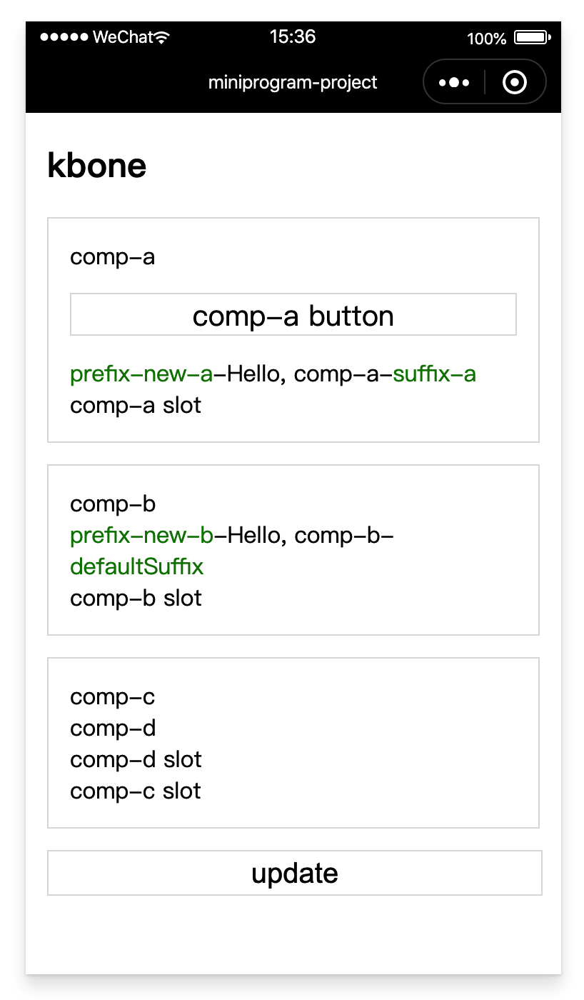

# 使用小程序自定义组件

### 1、用法

需要明确的是，如果可以使用 Web 端组件技术实现的话请尽量使用 Web 端技术（如 vue、react 组件），使用自定义组件请按需使用。这是因为自定义组件外层会被包裹上 kbone 的自定义组件，而当自定义组件的实例数量达到一定量级的话，理论上是会对性能造成一定程度的影响。

要在 kbone 中使用自定义组件，需要将所有自定义组件和其依赖放到一个固定的目录，这个目录可以自己拟定，假设这个目录为 src/custom-components：

#### 1.1 修改 webpack 插件配置

在 mp-webpack-plugin 这个插件的配置中的 generate 字段内补充 wxCustomComponent，其中 root 是组件根目录，即上面提到的目录：src/custom-component，usingComponents 则用来配置要用到的自定义组件。

```js
module.exports = {
  generate: {
    wxCustomComponent: {
      root: path.join(__dirname, '../src/custom-components'),
      usingComponents: {
        'comp-a': 'comp-a/index',
        'comp-b': {
          path: 'comp-b/index',
          props: ['propa', 'propb'],
          events: ['someevent'],
        },
      },
    },
  },
  // ... other options
}
```

usingComponents 里的声明和小程序页面的 usingComponents 字段类似。键为组件名，值可以为组件相对 root 字段的路径，也可以是一个配置对象。这个配置对象的 path 为组件相对路径，props 表示要这个组件会被用到的 properties，events 表示这个组件会被监听到的事件。

#### 1.2 将自定义组件放入组件根目录

下面以 comp-b 组件为例：

```html
<!-- comp-b.wxml -->
<view>comp-b</view>
<view>propa: {{propa}} -- propb: {{propb}}</view>
<button bindtap="onTap">click me</button>
<slot></slot>
```

```js
// comp-b.js
Component({
  properties: {
  propa: {type: String, value: ''},
  propb: {type: String, value: ''},
  },
  methods: {
  onTap() {
    this.triggerEvent('someevent')
  },
  },
})
```

#### 1.3 使用自定义组件

假设使用 vue 技术，然后下面同样以 comp-b 组件为例：

```vue
<template>
  <div>
  <comp-b :propa="propa" :propb="propb" @someevent="onEvent">
    <div>comp-b slot</div>
  </comp-b>
  </div>
</template>
<script>
export default {
  data() {
  return {propa: 'propa-value', propb: 'propb-value'}
  },
  methods: {
  onEvent(evt) {
    console.log('someevent', evt)
  },
  },
}
</script>
```

>PS：如果使用 react 等其他框架其实和 vue 同理，因为它们的底层都是调用 document.createElement 来创建节点。当在 webpack 插件配置声明了这个自定义组件的情况下，在调用 document.createElement 创建该节点时会被转换成创建 wx-custom-component 标签，类似于内置组件的 wx-component 标签。

### 2、案例

在 `kbone-advanced` 目录下创建 `04-custom-components` 目录。本案例在这个目录下实现。

#### 2.1 创建 package.json

```
cd 04-custom-components
npm init -y
```

编辑 package.json：

```js
{
  "scripts": {
    "mp": "cross-env NODE_ENV=production webpack --config build/webpack.mp.config.js --progress --hide-modules"
  },
  "dependencies": {
    "vue": "^2.5.11"
  },
  "browserslist": [
    "> 1%",
    "last 2 versions",
    "not ie <= 8"
  ],
  "devDependencies": {
    "babel-core": "^6.26.0",
    "babel-loader": "^7.1.2",
    "babel-preset-env": "^1.6.0",
    "babel-preset-stage-3": "^6.24.1",
    "cross-env": "^5.0.5",
    "css-loader": "^0.28.7",
    "extract-text-webpack-plugin": "^3.0.2",
    "file-loader": "^1.1.4",
    "html-webpack-plugin": "^4.0.0-beta.5",
    "mini-css-extract-plugin": "^0.5.0",
    "mp-webpack-plugin": "latest",
    "optimize-css-assets-webpack-plugin": "^5.0.1",
    "stylehacks": "^4.0.3",
    "vue-loader": "^15.7.0",
    "vue-template-compiler": "^2.6.10",
    "webpack": "^4.29.6",
    "webpack-cli": "^3.2.3"
  }
}
```

安装依赖包：

```
npm install
```

#### 2.2 配置 webpack

在 `04-custom-components` 目录下创建 `build` 文件夹，在文件夹下创建 `webpack.mp.config.js` 文件，内容如下：

```js
const path = require('path')
const webpack = require('webpack')
const MiniCssExtractPlugin = require('mini-css-extract-plugin')
const { VueLoaderPlugin } = require('vue-loader')
const OptimizeCSSAssetsPlugin = require('optimize-css-assets-webpack-plugin');
const TerserPlugin = require('terser-webpack-plugin')
const MpPlugin = require('mp-webpack-plugin') // 用于构建小程序代码的 webpack 插件

const isOptimize = false // 是否压缩业务代码，开发者工具可能无法完美支持业务代码使用到的 es 特性，建议自己做代码压缩

module.exports = {
  mode: 'production',
  entry: {
    index: path.resolve(__dirname, '../src/index/main.mp.js'),
  },
  output: {
    path: path.resolve(__dirname, '../dist/mp/common'), // 放到小程序代码目录中的 common 目录下
    filename: '[name].js', // 必需字段，不能修改
    library: 'createApp', // 必需字段，不能修改
    libraryExport: 'default', // 必需字段，不能修改
    libraryTarget: 'window', // 必需字段，不能修改
  },
  target: 'web', // 必需字段，不能修改
  optimization: {
    runtimeChunk: false, // 必需字段，不能修改
    splitChunks: { // 代码分隔配置，不建议修改
      chunks: 'all',
      minSize: 1000,
      maxSize: 0,
      minChunks: 1,
      maxAsyncRequests: 100,
      maxInitialRequests: 100,
      automaticNameDelimiter: '~',
      name: true,
      cacheGroups: {
        vendors: {
          test: /[\\/]node_modules[\\/]/,
          priority: -10
        },
        default: {
          minChunks: 2,
          priority: -20,
          reuseExistingChunk: true
        }
      }
    },

    minimizer: isOptimize ? [
      // 压缩CSS
      new OptimizeCSSAssetsPlugin({
        assetNameRegExp: /\.(css|wxss)$/g,
        cssProcessor: require('cssnano'),
        cssProcessorPluginOptions: {
          preset: ['default', {
            discardComments: {
              removeAll: true,
            },
            minifySelectors: false, // 因为 wxss 编译器不支持 .some>:first-child 这样格式的代码，所以暂时禁掉这个
          }],
        },
        canPrint: false
      }),
      // 压缩 js
      new TerserPlugin({
        test: /\.js(\?.*)?$/i,
        parallel: true,
      })
    ] : [],
  },
  module: {
    rules: [
      {
        test: /\.css$/,
        use: [
          MiniCssExtractPlugin.loader,
          'css-loader'
        ],
      },
      {
        test: /\.vue$/,
        loader: 'vue-loader',
      },
      {
        test: /\.js$/,
        use: [
          'babel-loader'
        ],
        exclude: /node_modules/
      },
      {
        test: /\.(png|jpg|gif|svg)$/,
        loader: 'file-loader',
        options: {
          name: '[name].[ext]?[hash]'
        }
      }
    ]
  },
  resolve: {
    extensions: ['*', '.js', '.vue', '.json']
  },
  plugins: [
    new webpack.DefinePlugin({
      'process.env.isMiniprogram': process.env.isMiniprogram, // 注入环境变量，用于业务代码判断
    }),
    new MiniCssExtractPlugin({
      filename: '[name].wxss',
    }),
    new VueLoaderPlugin(),
    new MpPlugin(require('./miniprogram.config.js')),
  ],
}
```

在 `04-custom-components/build` 文件夹下创建 `miniprogram.config.js` 文件，内容如下：

```js
const path = require('path')

module.exports = {
	origin: 'https://test.miniprogram.com',
	entry: '/',
	router: {
		index: ['/'],
	},
	redirect: {	
		notFound: 'index',	
		accessDenied: 'index',
	},
	generate: {
		wxCustomComponent: {
			root: path.join(__dirname, '../src/custom-components'),
			usingComponents: {
				'comp-a': {
					path: 'comp-a',
					props: ['prefix', 'suffix'],
					events: ['someevent'],
				},
				'comp-b': {
					path: 'comp-b/index',
					props: ['prefix'],
				},
				'comp-c': 'comp-c',
			},
    },
    // 构建完成后是否自动安装小程序依赖。'npm'：使用 npm 自动安装依赖
		autoBuildNpm: 'npm'
	},
	app: {
		navigationBarTitleText: 'miniprogram-project',
	},
	projectConfig: {
		appid: '',
    projectname: 'custom-components',
	},
	packageConfig: {
		author: 'Felixlu',
	},
}
```

#### 2.3 编写案例有关组件

##### 2.3.1 创建 main.mp.js

在项目根目录下创建 `/src/index`，在 `index` 下创建 `main.mp.js` 文件，内容如下：

```js
import Vue from 'vue'
import App from './App.vue'

export default function createApp() {
  const container = document.createElement('div')
  container.id = 'app'
  document.body.appendChild(container)

  return new Vue({
    el: '#app',
    render: h => h(App)
  })
}
```

##### 2.3.2 创建 App.vue 组件

在 `/src/index` 下创建 `App.vue` 组件，内容为：

```vue
<template>
  <div class="cnt">
    <h2>kbone</h2>
    <comp-a ref="compA" class="block" :prefix="prefixA" :suffix="suffixA" @someevent="onEvent">
      <div>comp-a slot</div>
    </comp-a>
    <comp-b class="block" :prefix="prefixB">
      <div>comp-b slot</div>
    </comp-b>
    <comp-c class="block">
      <div>comp-c slot</div>
    </comp-c>
    <button class="btn" @click="onClick">update</button>
  </div>
</template>

<script>
export default {
  name: 'App',
  data() {
    return {
      suffixA: 'suffix-a',
      prefixB: 'prefix-b',
    }
  },
  methods: {
    onClick() {
      this.prefixA = 'prefix-new-a'
      this.prefixB = 'prefix-new-b'

      this.$refs.compA._wxCustomComponent.printf()
    },

    onEvent(evt) {
      console.log('someevent', evt)
    },
  },
}
</script>

<style>
.cnt {
  margin: 15px;
}

.block {
  border: 1px solid #ddd;
  padding: 15px;
  box-sizing: content-box;
  display: block;
  margin-bottom: 15px;
}

.btn {
  margin-top: 15px;
  display: block;
  width: 100%;
  height: 30px;
  line-height: 30px;
  text-align: center;
  font-size: 20px;
  border: 1px solid #ddd;
}
</style>
``` 

##### 2.3.3 创建 comp-a 组件

在根目录下创建 `/src/custom-components` 文件夹，在这个文件夹下创建小程序原生组件 `comp-a`，四个文件内容如下：

/src/custom-components/comp-a.wxml

```html
<view>comp-a</view>
<button class="btn" bindtap="onTap">comp-a button</button>
<view><text class="prefix">{{prefix}}</text>-{{str}}-<text class="suffix">{{suffix}}</text></view>
<slot></slot>
```

/src/custom-components/comp-a.js

```js
const _ = require('./common/utils')

Component({
  properties: {
    prefix: {
      type: String,
      value: 'defaultPrefix',
    },
    suffix: {
      type: String,
      value: 'defaultSuffix',
    },
  },
  data: {
    str: _.getWords() + 'comp-a',
  },
  methods: {
    onTap() {
      this.triggerEvent('someevent', {
        detail: {
          from: 'comp-a',
        },
      })
    },

    printf() {
      console.log('I am comp-a')
    },
  },
})
```

/src/custom-components/common/utils.js

```js
module.exports = {
  getWords() {
    return 'Hello, '
  },
}
```

/src/custom-components/comp-a.json

```json
{
  "component": true
}
```

/src/custom-components/comp-a.wxss

```
// 内容为空
```

##### 2.3.4 创建 comp-b 组件

在根目录下创建 `/src/custom-components/comp-b` 文件夹，在这个文件夹下创建小程序原生组件 `comp-b`，四个文件内容如下：

/src/custom-components/comp-b/index.wxml

```html
<view>comp-b</view>
<view><text class="prefix">{{prefix}}</text>-{{str}}-<text class="suffix">{{suffix}}</text></view>
<slot></slot>
```

/src/custom-components/comp-b/index.js

```js
const _ = require('../common/utils')

Component({
  properties: {
    prefix: {
      type: String,
      value: 'defaultPrefix',
    },
    suffix: {
      type: String,
      value: 'defaultSuffix',
    },
  },
  data: {
    str: _.getWords() + 'comp-b',
  },
})
```

/src/custom-components/comp-b/index.json

```json
{
  "component": true
}
```

/src/custom-components/comp-b/index.wxss

```css
.prefix, .suffix {
  color: green;
}
```

##### 2.3.5 创建 comp-c 组件

在 `/src/custom-components` 文件夹下创建小程序原生组件 `comp-c`，四个文件内容如下：

/src/custom-components/comp-c.wxml

```html
<view>comp-c</view>
<comp-d>
  <view>comp-d slot</view>
</comp-d>
<slot></slot>
```

/src/custom-components/comp-c.js

```js
Component({})
```

/src/custom-components/comp-c.json

```json
{
  "component": true,
  "usingComponents": {
    "comp-d": "./comp-d"
  }
}
```

/src/custom-components/comp-c.wxss

```
// 内容为空
```

##### 2.3.6 创建 comp-d 组件

在 `/src/custom-components` 文件夹下创建小程序原生组件 `comp-d`，四个文件内容如下：

/src/custom-components/comp-d.wxml

```html
<view>comp-d</view>
<slot></slot>
```

/src/custom-components/comp-d.js

```js
Component({})
```

/src/custom-components/comp-d.json

```json
{
  "component": true
}
```

/src/custom-components/comp-d.wxss

```
// 内容为空
```

#### 2.4 小程序端效果预览

```
npm run mp
```

