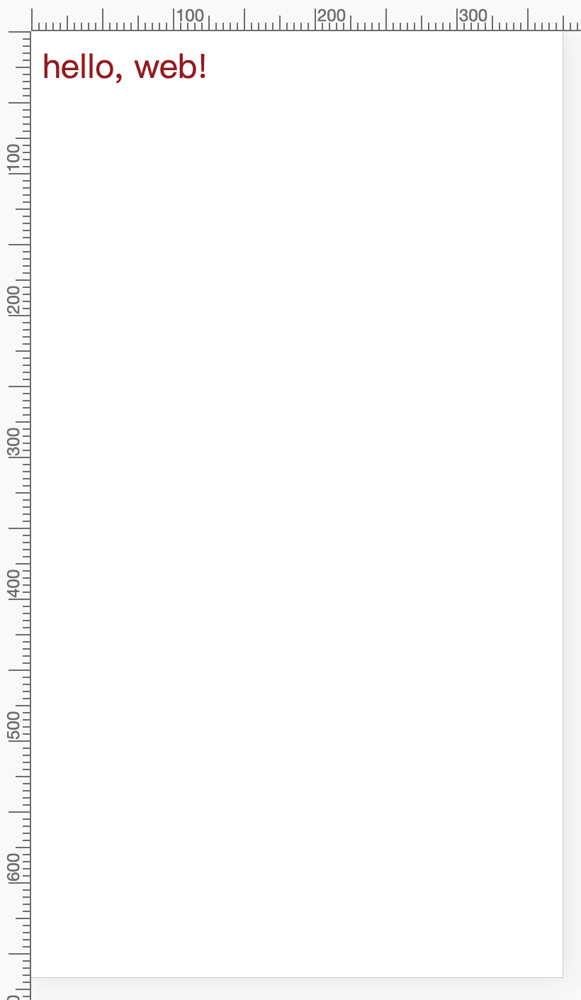
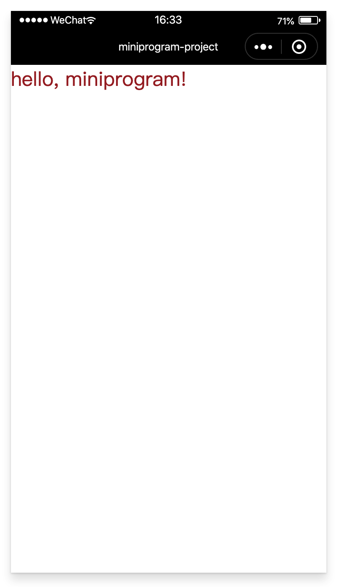

# 使用 rem

`kbone` 没有支持 `rpx`，取而代之的是可以使用更为传统的 `rem` 进行开发。使用流程如下：

### 1、用法

#### 1.1 修改 webpack 插件配置

在 mp-webpack-plugin 这个插件的配置中的 global 字段内补充 rem 配置。

```js
module.exports = {
  global: {
    rem: true,
  },
  // ... other options
}
```

#### 1.2 在业务代码里就可以设置 html 的 font-size 样式了，比如如下方式：

```js
window.onload = function() {
  if (process.env.isMiniprogram) {
    // 小程序
    document.documentElement.style.fontSize = wx.getSystemInfoSync().screenWidth / 16 + 'px'
  } else {
    // Web 端
    document.documentElement.style.fontSize = document.documentElement.getBoundingClientRect().width / 16 + 'px'
  }
}
```

#### 1.3 在业务代码的样式里使用 rem。

```
.content {
  width: 10rem;
}
```

> PS：这个特性只在基础库 2.9.0 及以上版本支持。

### 2、案例

在 `kbone-advanced` 目录下创建 `05-rem` 目录，本案例在这个目录下完成。

#### 2.1 创建 package.json

```
cd 05-rem
npm init -y
```

编辑 package.json：

```json
{
  "name": "01-env",
  "version": "1.0.0",
  "description": "",
  "main": "index.js",
  "scripts": {
    "build": "rimraf dist/web && cross-env NODE_ENV=production webpack --config build/webpack.config.js --progress --hide-modules",
    "mp": "cross-env NODE_ENV=production webpack --config build/webpack.mp.config.js --progress --hide-modules"
  },
  "dependencies": {
    "add": "^2.0.6",
    "vue": "^2.5.11"
  },
  "browserslist": [
    "> 1%",
    "last 2 versions",
    "not ie <= 8"
  ],
  "devDependencies": {
    "babel-core": "^6.26.0",
    "babel-loader": "^7.1.2",
    "babel-preset-env": "^1.6.0",
    "cross-env": "^5.0.5",
    "css-loader": "^0.28.7",
    "file-loader": "^1.1.4",
    "html-webpack-plugin": "^4.0.0-beta.5",
    "mini-css-extract-plugin": "^0.5.0",
    "optimize-css-assets-webpack-plugin": "^5.0.1",
    "stylehacks": "^4.0.3",
    "vue-loader": "^15.7.0",
    "vue-template-compiler": "^2.6.10",
    "webpack": "^4.29.6",
    "webpack-cli": "^3.2.3",
    "mp-webpack-plugin": "latest"
  },
  "keywords": [],
  "author": "",
  "license": "ISC"
}
```

安装依赖包：

```
npm install
```

#### 2.2 配置 webpack

在 05-rem/build 目录下创建 webpack.config.js，内容如下：

```js
var path = require('path')
var MiniCssExtractPlugin = require('mini-css-extract-plugin')
const webpack = require('webpack')
const { VueLoaderPlugin } = require('vue-loader')
const HtmlWebpackPlugin = require('html-webpack-plugin')

module.exports = {
  mode: 'production',
  entry: {
    index: path.resolve(__dirname, '../src/main.js'),
  },
  output: {
    path: path.resolve(__dirname, '../dist/web/'),
    publicPath: './',
    filename: '[name].js'
  },
  target: 'web',
  module: {
    rules: [
      {
        test: /\.css$/,
        use: [
          MiniCssExtractPlugin.loader,
          'css-loader'
        ],
      },      {
        test: /\.vue$/,
        loader: 'vue-loader',
      },
      {
        test: /\.js$/,
        use: {
          loader: 'babel-loader',
          options: {
            presets: ['env']
          }
        },
        exclude: /node_modules/
      },
      {
        test: /\.(png|jpg|gif|svg)$/,
        loader: 'file-loader',
        options: {
          name: '[name].[ext]?[hash]'
        }
      }
    ]
  },
  
  resolve: {
    extensions: ['*', '.js', '.vue', '.json']
  },

  plugins: [
    new webpack.DefinePlugin({
      'process.env.isMiniprogram': false, // 注入环境变量，用于业务代码判断
    }),
    new MiniCssExtractPlugin({
      filename: '[name].css'
    }),
    new VueLoaderPlugin(),
    new HtmlWebpackPlugin({
      filename: 'index.html',
      chunks: ['index'],
      template: path.join(__dirname, '../index.html')
    }),
  ]
}
```

#### 2.3 创建 main.js

在 `01-env/src` 目录下创建 `main.js`，内容如下：

```js
import Vue from 'vue'
import App from './App'

window.onload = function() {
  if (process.env.isMiniprogram) {
    // 小程序
    document.documentElement.style.fontSize = wx.getSystemInfoSync().screenWidth / 16 + 'px'
  } else {
    // Web 端
    document.documentElement.style.fontSize = document.documentElement.getBoundingClientRect().width / 16 + 'px'
  }
}

new Vue({
  el: '#app',
  render: h => h(App)
})
```

#### 2.3 创建 App.vue

在 `05-rem/src` 目录下创建 `App.vue`，内容如下：

```vue
<template>
  <div class="title">
    hello, {{info}}!
  </div>
</template>

<script>
export default {
  computed: {
    info() {
      if (process.env.isMiniprogram) {
        return 'miniprogram'
      } else {
        return 'web'
      }
    }
  }
}
</script>

<style lang="css">
.title {
  font-size: 1rem;
  color:brown;
}
</style>
```

#### 2.4 编写入口文件 index.html

在项目根目录下创建 `index.html`，内容如下：

```html
<!DOCTYPE html>
<html lang="en">
  <head>
    <meta charset="utf-8">
    <meta name="viewport" content="width=device-width, initial-scale=1, maximum-scale=1.0, minimum-scale=1.0, user-scalable=no,minimal-ui, viewport-fit=cover" />
    <meta content="yes"name="apple-mobile-web-app-capable"/>
    <meta content="black"name="apple-mobile-web-app-status-bar-style"/>
    <meta name="format-detection"content="telephone=no, email=no" />
    <title>vue</title>
    <style type="text/css">
      #app {
        font-family: 'Avenir', Helvetica, Arial, sans-serif;
        -webkit-font-smoothing: antialiased;
        -moz-osx-font-smoothing: grayscale;
        text-align: center;
        color: #2c3e50;
        margin-top: 60px;
      }
    </style>
  </head>
  <body>
    <div id="app"></div>
  </body>
</html>
```

#### 2.5 Web端效果预览

```
npm run build
```



#### 2.6 创建 webpack.mp.config.js

在 `05-rem/build` 目录下创建 webpack.mp.config.js，内容如下：

```js
const path = require('path')
const webpack = require('webpack')
const MiniCssExtractPlugin = require('mini-css-extract-plugin')
const { VueLoaderPlugin } = require('vue-loader')
const OptimizeCSSAssetsPlugin = require('optimize-css-assets-webpack-plugin');
const TerserPlugin = require('terser-webpack-plugin')
const MpPlugin = require('mp-webpack-plugin') // 用于构建小程序代码的 webpack 插件

const isOptimize = false // 是否压缩业务代码，开发者工具可能无法完美支持业务代码使用到的 es 特性，建议自己做代码压缩

module.exports = {
  mode: 'production',
  entry: {
    'app': path.resolve(__dirname, '../src/main.mp.js')
  },
  output: {
    path: path.resolve(__dirname, '../dist/mp/common'), // 放到小程序代码目录中的 common 目录下
    filename: '[name].js', // 必需字段，不能修改
    library: 'createApp', // 必需字段，不能修改
    libraryExport: 'default', // 必需字段，不能修改
    libraryTarget: 'window', // 必需字段，不能修改
  },
  target: 'web', // 必需字段，不能修改
  optimization: {
    runtimeChunk: false, // 必需字段，不能修改
    splitChunks: { // 代码分隔配置，不建议修改
      chunks: 'all',
      minSize: 1000,
      maxSize: 0,
      minChunks: 1,
      maxAsyncRequests: 100,
      maxInitialRequests: 100,
      automaticNameDelimiter: '~',
      name: true,
      cacheGroups: {
        vendors: {
          test: /[\\/]node_modules[\\/]/,
          priority: -10
        },
        default: {
          minChunks: 2,
          priority: -20,
          reuseExistingChunk: true
        }
      }
    },

    minimizer: isOptimize ? [
      // 压缩CSS
      new OptimizeCSSAssetsPlugin({
        assetNameRegExp: /\.(css|wxss)$/g,
        cssProcessor: require('cssnano'),
        cssProcessorPluginOptions: {
          preset: ['default', {
            discardComments: {
              removeAll: true,
            },
            minifySelectors: false, // 因为 wxss 编译器不支持 .some>:first-child 这样格式的代码，所以暂时禁掉这个
          }],
        },
        canPrint: false
      }),
      // 压缩 js
      new TerserPlugin({
        test: /\.js(\?.*)?$/i,
        parallel: true,
      })
    ] : [],
  },
  module: {
    rules: [
      {
        test: /\.css$/,
        use: [
          MiniCssExtractPlugin.loader,
          'css-loader'
        ],
      },
      {
        test: /\.vue$/,
        loader: [
          'vue-loader',
        ],
      },
      {
        test: /\.js$/,
        use: {
          loader: 'babel-loader',
          options: {
            presets: ['env']
          }
        },
        exclude: /node_modules/
      },
      {
        test: /\.(png|jpg|gif|svg)$/,
        loader: 'file-loader',
        options: {
          name: '[name].[ext]?[hash]'
        }
      }
    ]
  },

  resolve: {
    extensions: ['*', '.js', '.vue', '.json']
  },

  plugins: [
    new webpack.DefinePlugin({
      'process.env.isMiniprogram': true, // 注入环境变量，用于业务代码判断
    }),
    new MiniCssExtractPlugin({
      filename: '[name].wxss',
    }),
    new VueLoaderPlugin(),
    new MpPlugin(require('./miniprogram.config.js')),
  ],
}
```

#### 2.7 创建 main.mp.js

在 `05-rem/src` 下创建 `main.mp.js` 文件，内容如下：

```js
import Vue from 'vue'
import App from './App'

export default function createApp() {
  const container = document.createElement('div')
  container.id = 'app'
  document.body.appendChild(container)

  window.onload = function() {
    if (process.env.isMiniprogram) {
      // 小程序
      document.documentElement.style.fontSize = wx.getSystemInfoSync().screenWidth / 16 + 'px'
    } else {
      // Web 端
      document.documentElement.style.fontSize = document.documentElement.getBoundingClientRect().width / 16 + 'px'
    }
  }

  return new Vue({
    el: '#app',
    render: h => h(App)
  })
}
```

#### 2.8 小程序端效果预览

```
npm run mp
```

