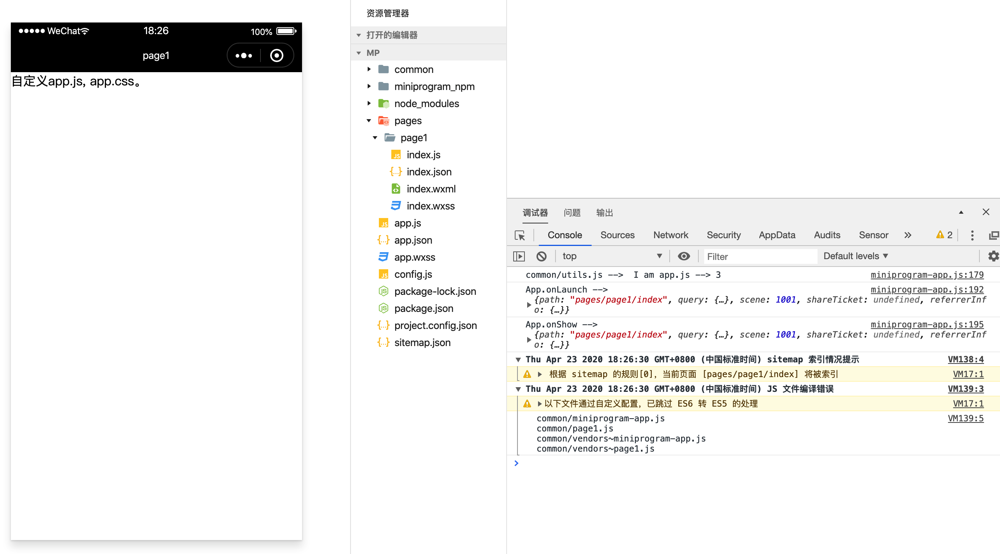

# 自定义 app.js 和 app.css

在开发过程中，可能需要监听 app 的生命周期，这就需要开发者自定义 app.js。

### 1、用法

#### 1.1 修改 webpack 配置

首先需要在 webpack 配置中补上 app.js 的构建入口，比如下面代码的 miniprogram-app 入口：

```js
// webpack.mp.config.js
module.exports = {
  entry: {
    'miniprogram-app': path.resolve(__dirname, '../src/app.js'),

    page1: path.resolve(__dirname, '../src/page1/main.mp.js'),
    page2: path.resolve(__dirname, '../src/page2/main.mp.js'),
  },
  // ... other options
}
```
#### 1.2 修改 webpack 插件配置

在 webpack 配置补完入口，还需要在 mp-webpack-plugin 这个插件的配置中补充说明，不然 kbone 会将 miniprgram-app 入口作为页面处理。

```js
module.exports = {
  generate: {
    appEntry: 'miniprogram-app',
  },
  // ... other options
}
```

如上，将 webpack 构建中的入口名称设置在插件配置的 generate.app 字段上，那么构建时 kbone 会将这个入口的构建作为 app.js 处理。

#### 1.3 补充 src/app.js

```js
// 自定义 app.wxss
import './app.css'

App({
  onLaunch(options) {},
  onShow(options) {
    // 获取当前页面实例
    const pages = getCurrentPages() || []
    const currentPage = pages[pages.length - 1]

    // 获取当前页面的 window 对象和 document 对象
    if (currentPage) {
      console.log(currentPage.window)
      console.log(currentPage.document)
    }
  },
  onHide() {},
  onError(err) {},
  onPageNotFound(options) {},
})
```

>PS：app.js 不属于任何页面，所以没有真正的 window 和 document 对象，所有依赖这两个对象实现的代码在这里无法被直接使用。

### 2、案例

在 `kbone-advanced` 目录下创建 `06-custom-app.js-app.css` 目录，本案例在这个目录下完成。

#### 2.1 创建 package.json

```
cd 06-custom-app.js-app.css
npm init -y
```

编辑 package.json：

```json
{
  "scripts": {
    "mp": "cross-env NODE_ENV=production webpack --config build/webpack.mp.config.js --progress --hide-modules"
  },
  "dependencies": {
    "add": "^2.0.6",
    "vue": "^2.5.11"
  },
  "browserslist": [
    "> 1%",
    "last 2 versions",
    "not ie <= 8"
  ],
  "devDependencies": {
    "babel-core": "^6.26.0",
    "babel-loader": "^7.1.2",
    "babel-preset-env": "^1.6.0",
    "babel-preset-stage-3": "^6.24.1",
    "cross-env": "^5.0.5",
    "css-loader": "^0.28.7",
    "extract-text-webpack-plugin": "^3.0.2",
    "file-loader": "^1.1.4",
    "html-webpack-plugin": "^4.0.0-beta.5",
    "mini-css-extract-plugin": "^0.5.0",
    "optimize-css-assets-webpack-plugin": "^5.0.1",
    "stylehacks": "^4.0.3",
    "vue-loader": "^15.7.0",
    "vue-template-compiler": "^2.6.10",
    "webpack": "^4.29.6",
    "webpack-cli": "^3.2.3",
    "mp-webpack-plugin": "latest"
  }
}
```

安装依赖包：

```
npm install
```

#### 2.2 配置 webpack

在 06-custom-app.js-app.css/build 目录下创建 webpack.mp.config.js，内容如下：

```js
const path = require('path')
const webpack = require('webpack')
const MiniCssExtractPlugin = require('mini-css-extract-plugin')
const { VueLoaderPlugin } = require('vue-loader')
const OptimizeCSSAssetsPlugin = require('optimize-css-assets-webpack-plugin');
const TerserPlugin = require('terser-webpack-plugin')
const MpPlugin = require('mp-webpack-plugin') // 用于构建小程序代码的 webpack 插件

const isOptimize = false // 是否压缩业务代码，开发者工具可能无法完美支持业务代码使用到的 es 特性，建议自己做代码压缩

module.exports = {
  mode: 'production',
  entry: {
    'miniprogram-app': path.resolve(__dirname, '../src/app.js'),

    page1: path.resolve(__dirname, '../src/page1/main.mp.js')
  },
  output: {
    path: path.resolve(__dirname, '../dist/mp/common'), // 放到小程序代码目录中的 common 目录下
    filename: '[name].js', // 必需字段，不能修改
    library: 'createApp', // 必需字段，不能修改
    libraryExport: 'default', // 必需字段，不能修改
    libraryTarget: 'window', // 必需字段，不能修改
  },
  target: 'web', // 必需字段，不能修改
  optimization: {
    runtimeChunk: false, // 必需字段，不能修改
    splitChunks: { // 代码分隔配置，不建议修改
      chunks: 'all',
      minSize: 1000,
      maxSize: 0,
      minChunks: 1,
      maxAsyncRequests: 100,
      maxInitialRequests: 100,
      automaticNameDelimiter: '~',
      name: true,
      cacheGroups: {
        vendors: {
          test: /[\\/]node_modules[\\/]/,
          priority: -10
        },
        default: {
          minChunks: 2,
          priority: -20,
          reuseExistingChunk: true
        }
      }
    },

    minimizer: isOptimize ? [
      // 压缩CSS
      new OptimizeCSSAssetsPlugin({
        assetNameRegExp: /\.(css|wxss)$/g,
        cssProcessor: require('cssnano'),
        cssProcessorPluginOptions: {
          preset: ['default', {
            discardComments: {
              removeAll: true,
            },
            minifySelectors: false, // 因为 wxss 编译器不支持 .some>:first-child 这样格式的代码，所以暂时禁掉这个
          }],
        },
        canPrint: false
      }),
      // 压缩 js
      new TerserPlugin({
        test: /\.js(\?.*)?$/i,
        parallel: true,
      })
    ] : [],
  },
  module: {
    rules: [
      {
        test: /\.css$/,
        use: [
          MiniCssExtractPlugin.loader,
          'css-loader'
        ],
      },
      {
        test: /\.vue$/,
        loader: [
          'vue-loader',
        ],
      },
      {
        test: /\.js$/,
        use: [
          'babel-loader'
        ],
        exclude: /node_modules/
      },
      {
        test: /\.(png|jpg|gif|svg)$/,
        loader: 'file-loader',
        options: {
          name: '[name].[ext]?[hash]'
        }
      }
    ]
  },
  resolve: {
    extensions: ['*', '.js', '.vue', '.json']
  },
  plugins: [
    new webpack.DefinePlugin({
      'process.env.isMiniprogram': process.env.isMiniprogram, // 注入环境变量，用于业务代码判断
    }),
    new MiniCssExtractPlugin({
      filename: '[name].wxss',
    }),
    new VueLoaderPlugin(),
    new MpPlugin(require('./miniprogram.config.js')),
  ],
}
```

在 06-custom-app.js-app.css/build 目录下创建 miniprogram.config.js，内容如下：

```js
module.exports = {	
	origin: 'https://test.miniprogram.com',	
	entry: '/',	
	router: {		
		page1: ['/a']
	},	
	redirect: {		
		notFound: 'page1',		
		accessDenied: 'page1',
	},
	generate: {
    appEntry: 'miniprogram-app',
    // 构建完成后是否自动安装小程序依赖。'npm'：使用 npm 自动安装依赖
		autoBuildNpm: 'npm'
	},
	runtime: {
		cookieStore: 'memory',
	},
	app: {
		navigationBarTitleText: 'miniprogram-project',
	},
	global: {
		share: true,
	},
	pages: {
		page1: {
			extra: {
				navigationBarTitleText: 'page1',
			},
		},
	},
	projectConfig: {
		appid: '',
    projectname: 'custom-app.js-app.css',
	},
	packageConfig: {
		author: 'wechat-miniprogram',
	},
}
```

#### 2.3 创建 app.js 相关文件

在 `/src/` 下创建 `app.js` 文件，内容如下：

```js
import add from 'add'
import {printf} from './common/utils.js'
import './app.css'

App({
  onLaunch(options) {
    printf('I am app.js --> ' + add([1, 2]))
    console.log('App.onLaunch --> ', options)
  },
  onShow(options) {
    console.log('App.onShow --> ', options)
    const pages = getCurrentPages() || []
    const currentPage = pages[pages.length - 1]
    if (currentPage) console.log('currentPage --> ', currentPage.pageId)
  },
  onHide() {
    console.log('App.onHide --> ')
    const pages = getCurrentPages() || []
    const currentPage = pages[pages.length - 1]
    if (currentPage) console.log('currentPage --> ', currentPage.pageId)
  },
  onError(err) {
    console.log('App.onError --> ', err)
  },
  onPageNotFound(options) {
    console.log('App.onPageNotFound --> ', options)
  },
})
```

在 `/src/` 下创建 `app.css` 文件，内容如下：

```css
.header {
  color: #888;    
}
```

在 `/src/common` 下创建 `utils.js` 文件，内容如下：

```js
export function printf(str) {
  console.log('common/utils.js --> ', str)
}
```

#### 2.4 创建 page1 相关文件

在 `/src/page1` 下创建 `main.mp.js` 文件，内容如下：

```js
import Vue from 'vue'
import App from './App.vue'

export default function createApp() {
  const container = document.createElement('div')
  container.id = 'app'
  document.body.appendChild(container)

  return new Vue({
    el: '#app',
    render: h => h(App)
  })
}
```

在 `/src/page1` 下创建 `App.vue` 文件，内容如下：

```vue
<template>
  <div class="cnt">
    自定义app.js, app.css。
  </div>
</template>
```

#### 2.5 小程序端效果预览

```
npm run mp
```

