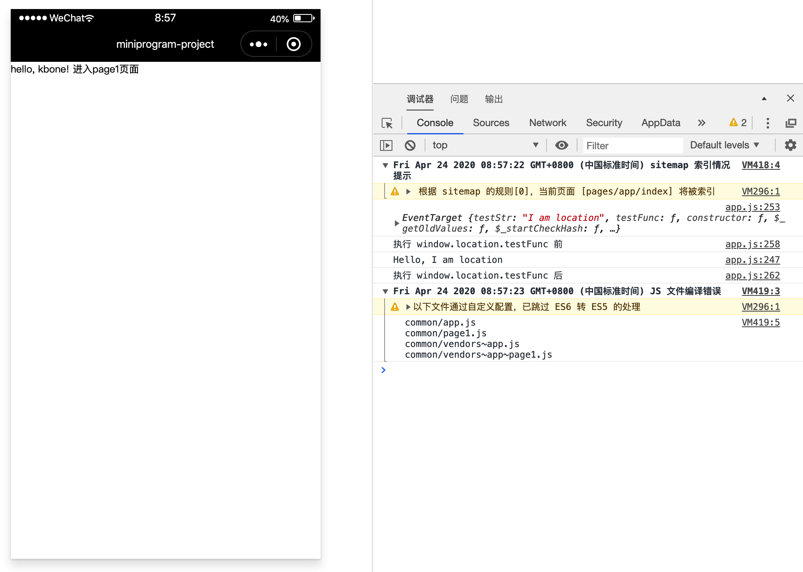
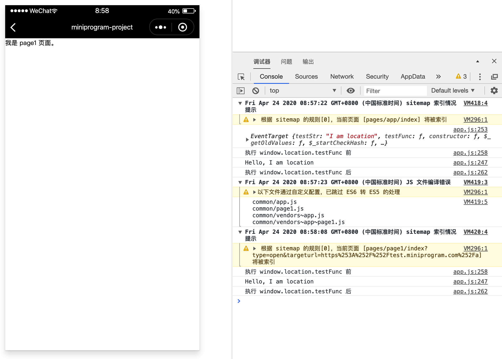

# 扩展 dom/bom 对象和 API

kbone 能够满足大多数常见的开发场景，但是当遇到当前 dom/bom 接口不能满足的情况时，kbone 也提供了一系列 API 来扩展 dom/bom 对象和接口。

这里需要注意的是，下述所有对于 dom/bom 对象的扩展都是针对所有页面的，也就是说有一个页面对其进行了扩展，所有页面都会生效，因此在使用扩展时建议做好处理标志，然后判断是否已经被扩展过。

### 1、用法

#### 1.1 使用 window.$$extend 对 dom/bom 对象追加属性/方法

举个例子，假设需要对 window.location 对象追加一个属性 testStr 和一个方法 testFunc，可以编写如下代码：

```
window.$$extend('window.location', {
    testStr: 'I am location',
    testFunc() {
        return `Hello, ${this.testStr}`
    },
})
```

这样便可以通过 `window.location.testStr` 获取新追加的属性，同时可以通过 `window.location.testFunc()` 调用新追加的方法。

#### 1.2 使用 window.$$getPrototype 获取 dom/bom 对象的原型

如果遇到追加属性和追加方法都无法满足需求的情况下，可以获取到对应对象的原型进行操作：

```
const locationPrototype = window.$$getPrototype('window.location')
```

如上例子，locationPrototype 便是 window.location 对象的原型。

#### 1.3 对 dom/bom 对象方法追加前置/后置处理

除了上述的给对象新增和覆盖方法，还可以对已有的方法进行前置/后置处理。

前置处理即表示此方法会在执行原始方法之前执行，后置处理则是在之后执行。前置处理方法接收到的参数和原始方法接收到的参数一致，后置处理方法接收到的参数则是原始方法执行后返回的结果。下面给一个简单的例子：

```js
const beforeAspect = function(...args) {
  // 在执行 window.location.testFunc 前被调用，args 为调用该方法时传入的参数
}
const afterAspect = function(res) {
  // 在执行 window.location.testFunc 后被调用，res 为该方法返回结果
}
window.$$addAspect('window.location.testFunc.before', beforeAspect)
window.$$addAspect('window.location.testFunc.after', afterAspect)

window.location.testFunc('abc', 123) // 会执行 beforeAspect，再调用 testFunc，最后再执行 afterAspect
```

>PS：具体 API 可参考 [dom/bom 扩展 API](https://wechat-miniprogram.github.io/kbone/docs/domextend/#window-%E5%AF%B9%E8%B1%A1) 文档。

### 2、案例

在 `kbone-advanced` 目录下创建 `07-extend-dom-bom` 目录，本案例在这个目录下完成。

#### 2.1 创建 package.json

```
cd 07-extend-dom-bom
npm init -y
```

编辑 package.json：

```json
{
  "name": "07-extend-dom-bom",
  "version": "1.0.0",
  "description": "",
  "main": "index.js",
  "scripts": {
    "build": "rimraf dist/web && cross-env NODE_ENV=production webpack --config build/webpack.config.js --progress --hide-modules",
    "mp": "cross-env NODE_ENV=production webpack --config build/webpack.mp.config.js --progress --hide-modules"
  },
  "dependencies": {
    "add": "^2.0.6",
    "vue": "^2.5.11"
  },
  "browserslist": [
    "> 1%",
    "last 2 versions",
    "not ie <= 8"
  ],
  "devDependencies": {
    "babel-core": "^6.26.0",
    "babel-loader": "^7.1.2",
    "babel-preset-env": "^1.6.0",
    "cross-env": "^5.0.5",
    "css-loader": "^0.28.7",
    "file-loader": "^1.1.4",
    "html-webpack-plugin": "^4.0.0-beta.5",
    "mini-css-extract-plugin": "^0.5.0",
    "optimize-css-assets-webpack-plugin": "^5.0.1",
    "stylehacks": "^4.0.3",
    "vue-loader": "^15.7.0",
    "vue-template-compiler": "^2.6.10",
    "webpack": "^4.29.6",
    "webpack-cli": "^3.2.3",
    "mp-webpack-plugin": "latest"
  },
  "keywords": [],
  "author": "",
  "license": "ISC"
}
```

安装依赖包：

```
npm install
```

#### 2.2 配置 webpack

在 07-extend-dom-bom/build 目录下创建 webpack.mp.config.js，内容如下：

```js
const path = require('path')
const webpack = require('webpack')
const MiniCssExtractPlugin = require('mini-css-extract-plugin')
const { VueLoaderPlugin } = require('vue-loader')
const OptimizeCSSAssetsPlugin = require('optimize-css-assets-webpack-plugin');
const TerserPlugin = require('terser-webpack-plugin')
const MpPlugin = require('mp-webpack-plugin') // 用于构建小程序代码的 webpack 插件

const isOptimize = false // 是否压缩业务代码，开发者工具可能无法完美支持业务代码使用到的 es 特性，建议自己做代码压缩

module.exports = {
  mode: 'production',
  entry: {
    app: path.resolve(__dirname, '../src/main.mp.js'),
    page1: path.resolve(__dirname, '../src/page1/main.mp.js')
  },
  output: {
    path: path.resolve(__dirname, '../dist/mp/common'), // 放到小程序代码目录中的 common 目录下
    filename: '[name].js', // 必需字段，不能修改
    library: 'createApp', // 必需字段，不能修改
    libraryExport: 'default', // 必需字段，不能修改
    libraryTarget: 'window', // 必需字段，不能修改
  },
  target: 'web', // 必需字段，不能修改
  optimization: {
    runtimeChunk: false, // 必需字段，不能修改
    splitChunks: { // 代码分隔配置，不建议修改
      chunks: 'all',
      minSize: 1000,
      maxSize: 0,
      minChunks: 1,
      maxAsyncRequests: 100,
      maxInitialRequests: 100,
      automaticNameDelimiter: '~',
      name: true,
      cacheGroups: {
        vendors: {
          test: /[\\/]node_modules[\\/]/,
          priority: -10
        },
        default: {
          minChunks: 2,
          priority: -20,
          reuseExistingChunk: true
        }
      }
    },

    minimizer: isOptimize ? [
      // 压缩CSS
      new OptimizeCSSAssetsPlugin({
        assetNameRegExp: /\.(css|wxss)$/g,
        cssProcessor: require('cssnano'),
        cssProcessorPluginOptions: {
          preset: ['default', {
            discardComments: {
              removeAll: true,
            },
            minifySelectors: false, // 因为 wxss 编译器不支持 .some>:first-child 这样格式的代码，所以暂时禁掉这个
          }],
        },
        canPrint: false
      }),
      // 压缩 js
      new TerserPlugin({
        test: /\.js(\?.*)?$/i,
        parallel: true,
      })
    ] : [],
  },
  module: {
    rules: [
      {
        test: /\.css$/,
        use: [
          MiniCssExtractPlugin.loader,
          'css-loader'
        ],
      },
      {
        test: /\.vue$/,
        loader: [
          'vue-loader',
        ],
      },
      {
        test: /\.js$/,
        use: {
          loader: 'babel-loader',
          options: {
            presets: ['env']
          }
        },
        exclude: /node_modules/
      },
      {
        test: /\.(png|jpg|gif|svg)$/,
        loader: 'file-loader',
        options: {
          name: '[name].[ext]?[hash]'
        }
      }
    ]
  },

  resolve: {
    extensions: ['*', '.js', '.vue', '.json']
  },

  plugins: [
    new webpack.DefinePlugin({
      'process.env.isMiniprogram': true, // 注入环境变量，用于业务代码判断
    }),
    new MiniCssExtractPlugin({
      filename: '[name].wxss',
    }),
    new VueLoaderPlugin(),
    new MpPlugin(require('./miniprogram.config.js')),
  ],
}
```

在 07-extend-dom-bom/build 目录下创建 miniprogram.config.js，内容如下：

```js
module.exports = {	
  origin: 'https://test.miniprogram.com',	
  entry: '/',	
	router: {		
		page1: ['/a']
	},	
	redirect: {		
		notFound: 'page1',		
		accessDenied: 'page1',
	},
	generate: {
		// 构建完成后是否自动安装小程序依赖。'npm'：使用 npm 自动安装依赖
		autoBuildNpm: 'npm'
	},
	app: {
		navigationBarTitleText: 'miniprogram-project',
	},
	global: {
    share: true,
    rem: true
	},
	projectConfig: {
		appid: '',
    projectname: 'miniprogram-project',
	},
	packageConfig: {
		author: 'Felixlu',
	}
}
```

#### 2.3 创建入口页面

在 `/src/` 下创建 `main.mp.js` 文件，内容如下：

```js
import Vue from 'vue'
import App from './App'

export default function createApp() {
  const container = document.createElement('div')
  container.id = 'app'
  document.body.appendChild(container)

  // 例子一：使用 window.$$extend 对 dom/bom 对象追加属性/方法
  window.$$extend('window.location', {
    testStr: 'I am location',
    testFunc() {
      console.log(`Hello, ${this.testStr}`)
    },
  })

  // 例子二：使用 window.$$getPrototype 获取 dom/bom 对象的原型
  const locationPrototype = window.$$getPrototype('window.location')
  console.log(locationPrototype)

  // 例子三：对 dom/bom 对象方法追加前置/后置处理
  const beforeAspect = function(...args) {
    // 在执行 window.location.testFunc 前被调用，args 为调用该方法时传入的参数
    console.log('执行 window.location.testFunc 前')
  }
  const afterAspect = function(res) {
    // 在执行 window.location.testFunc 后被调用，res 为该方法返回结果
    console.log('执行 window.location.testFunc 后')
  }
  window.$$addAspect('window.location.testFunc.before', beforeAspect)
  window.$$addAspect('window.location.testFunc.after', afterAspect)

  return new Vue({
    el: '#app',
    render: h => h(App)
  })
}
```

在 `/src/` 下创建 `App.vue` 文件，内容如下：

```vue
<template>
  <div>
    我是 page1 页面。
  </div>
</template>

<script>
export default {
  mounted() {
    window.location.testFunc()
  }
}
</script>
```

#### 2.4 创建 page1 相关文件

在 `/src/page1` 下创建 `main.mp.js` 文件，内容如下：

```js
import Vue from 'vue'
import App from './App.vue'

export default function createApp() {
  const container = document.createElement('div')
  container.id = 'app'
  document.body.appendChild(container)

  return new Vue({
    el: '#app',
    render: h => h(App)
  })
}
```

在 `/src/page1` 下创建 `App.vue` 文件，内容如下：

```html
<template>
  <div>
    我是 page1 页面。
  </div>
</template>

<script>
export default {
  mounted() {
    window.location.testFunc()
  }
}
</script>
```

#### 2.5 小程序端效果预览

```
npm run mp
```
主页面：


点击“进入page1页面”：
