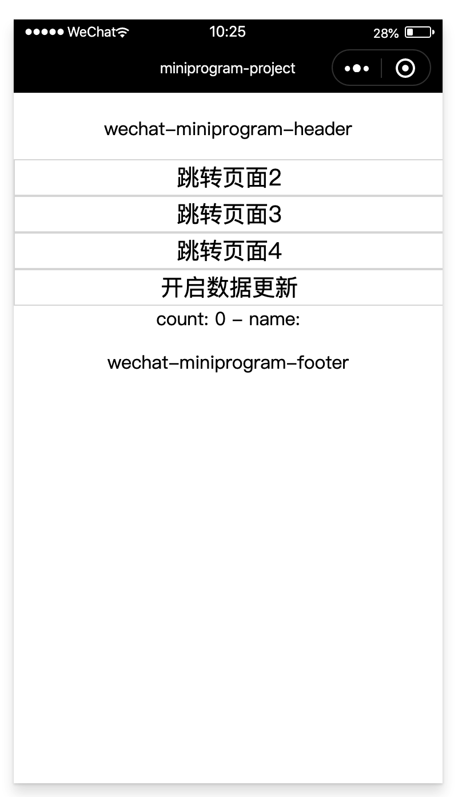

# 跨页面通信和跨页面数据共享

在 kbone 中，每个页面拥有独立的 window 对象，页面与页面间是相互隔离的，为此需要一个跨页面通信和跨页面数据共享的方式。

### 1、用法

#### 1.1 在页面中订阅广播消息

```
// 页面1
window.$$subscribe('hello', data => {
    console.log('receive a msg: ', data)
})
```

#### 1.2 在其他页面中发布广播消息

```
// 页面2
window.$$publish('hello', 'I am june')
```

在订阅了此消息的页面则会输出 receive a msg: I am june。

>PS：如果需要取消订阅消息，可以使用 window.$$unsubscribe 接口进行取消。

>PS：页面关闭后，会取消该页面所有的订阅。

如果需要跨页面数据进行共享，可以使用 window.$$global 对象，所有页面的 window.$$global 均会指向同一个对象：

```
// 页面1
window.$$global.name = 'june'

// 页面2
console.log(window.$$global.name) // 输出 june
```

>PS：具体 API 可参考 dom/bom 扩展 API 文档。

### 2、案例

在 `kbone-advanced` 目录下创建 `08-share-message` 目录，本案例在这个目录下完成。

#### 2.1 创建 package.json

```
cd 08-share-message
npm init -y
```

编辑 package.json：

```json
{
  "scripts": {
    "mp": "cross-env NODE_ENV=production webpack --config build/webpack.mp.config.js --progress --hide-modules"
  },
  "dependencies": {
    "vue": "^2.5.11",
    "vuex": "^3.1.3"
  },
  "browserslist": [
    "> 1%",
    "last 2 versions",
    "not ie <= 8"
  ],
  "devDependencies": {
    "babel-core": "^6.26.0",
    "babel-loader": "^7.1.2",
    "babel-preset-env": "^1.6.0",
    "babel-preset-stage-3": "^6.24.1",
    "cross-env": "^5.0.5",
    "css-loader": "^0.28.7",
    "extract-text-webpack-plugin": "^3.0.2",
    "file-loader": "^1.1.4",
    "html-webpack-plugin": "^4.0.0-beta.5",
    "mini-css-extract-plugin": "^0.5.0",
    "optimize-css-assets-webpack-plugin": "^5.0.1",
    "stylehacks": "^4.0.3",
    "vue-loader": "^15.7.0",
    "vue-template-compiler": "^2.6.10",
    "webpack": "^4.29.6",
    "webpack-cli": "^3.2.3",
    "mp-webpack-plugin": "latest"
  }
}
```

安装依赖包：

```
npm install
```

#### 2.2 配置 webpack

在 08-share-message/build 目录下创建 webpack.mp.config.js，内容如下：

```js
const path = require('path')
const webpack = require('webpack')
const MiniCssExtractPlugin = require('mini-css-extract-plugin')
const { VueLoaderPlugin } = require('vue-loader')
const OptimizeCSSAssetsPlugin = require('optimize-css-assets-webpack-plugin');
const TerserPlugin = require('terser-webpack-plugin')
const MpPlugin = require('mp-webpack-plugin') // 用于构建小程序代码的 webpack 插件

const isOptimize = false // 是否压缩业务代码，开发者工具可能无法完美支持业务代码使用到的 es 特性，建议自己做代码压缩

module.exports = {
  mode: 'production',
  entry: {
    page1: path.resolve(__dirname, '../src/page1/main.mp.js'),
    page2: path.resolve(__dirname, '../src/page2/main.mp.js'),
    page3: path.resolve(__dirname, '../src/page3/main.mp.js'),
    page4: path.resolve(__dirname, '../src/page4/main.mp.js'),
  },
  output: {
    path: path.resolve(__dirname, '../dist/mp/common'), // 放到小程序代码目录中的 common 目录下
    filename: '[name].js', // 必需字段，不能修改
    library: 'createApp', // 必需字段，不能修改
    libraryExport: 'default', // 必需字段，不能修改
    libraryTarget: 'window', // 必需字段，不能修改
  },
  target: 'web', // 必需字段，不能修改
  optimization: {
    runtimeChunk: false, // 必需字段，不能修改
    splitChunks: { // 代码分隔配置，不建议修改
      chunks: 'all',
      minSize: 1000,
      maxSize: 0,
      minChunks: 1,
      maxAsyncRequests: 100,
      maxInitialRequests: 100,
      automaticNameDelimiter: '~',
      name: true,
      cacheGroups: {
        vendors: {
          test: /[\\/]node_modules[\\/]/,
          priority: -10
        },
        default: {
          minChunks: 2,
          priority: -20,
          reuseExistingChunk: true
        }
      }
    },

    minimizer: isOptimize ? [
      // 压缩CSS
      new OptimizeCSSAssetsPlugin({
        assetNameRegExp: /\.(css|wxss)$/g,
        cssProcessor: require('cssnano'),
        cssProcessorPluginOptions: {
          preset: ['default', {
            discardComments: {
              removeAll: true,
            },
            minifySelectors: false, // 因为 wxss 编译器不支持 .some>:first-child 这样格式的代码，所以暂时禁掉这个
          }],
        },
        canPrint: false
      }),
      // 压缩 js
      new TerserPlugin({
        test: /\.js(\?.*)?$/i,
        parallel: true,
      })
    ] : [],
  },
  module: {
    rules: [
      {
        test: /\.css$/,
        use: [
          MiniCssExtractPlugin.loader,
          'css-loader'
        ],
      },
      {
        test: /\.vue$/,
        loader: [
          'vue-loader',
        ],
      },
      {
        test: /\.js$/,
        use: [{
          loader: 'babel-loader',
          options: {
            presets: ['env', 'stage-3'],
          },
        }],
        exclude: /node_modules/
      },
      {
        test: /\.(png|jpg|gif|svg)$/,
        loader: 'file-loader',
        options: {
          name: '[name].[ext]?[hash]'
        }
      }
    ]
  },
  resolve: {
    extensions: ['*', '.js', '.vue', '.json']
  },
  plugins: [
    new webpack.DefinePlugin({
      'process.env.isMiniprogram': process.env.isMiniprogram, // 注入环境变量，用于业务代码判断
    }),
    new MiniCssExtractPlugin({
      filename: '[name].wxss',
    }),
    new VueLoaderPlugin(),
    new MpPlugin(require('./miniprogram.config.js')),
  ],
}
```

在 08-share-message/build 目录下创建 miniprogram.config.js，内容如下：

```js
module.exports = {	
	origin: 'https://test.miniprogram.com',	
	entry: '/',	
	router: {		
		page1: ['/'],
		page2: ['/page2'],
		page3: ['/page3'],
		page4: ['/page4'],
	},	
	redirect: {		
		notFound: 'page1',		
		accessDenied: 'page1',
  },
  generate: {
		// 构建完成后是否自动安装小程序依赖。'npm'：使用 npm 自动安装依赖
		autoBuildNpm: 'npm'
	},
	app: {
		navigationBarTitleText: 'miniprogram-project',
	},
	projectConfig: {
		appid: '',
    projectname: 'kbone-demo22',
	},
	packageConfig: {
		author: 'wechat-miniprogram',
	},
}
```

#### 2.3 创建page1页面

在 `/src/` 下创建 `page1` 文件夹，在 page1 下创建 `main.mp.js` 文件，内容如下：

```js
import Vue from 'vue'
import {createStore} from '../store'
import App from './App.vue'

export default function createApp() {
  const container = document.createElement('div')
  container.id = 'app'
  document.body.appendChild(container)

  return new Vue({
    el: '#app',
    store: createStore(),
    render: h => h(App)
  })
}
```

在 `/src/` 下创建 `store` 文件夹，在 store 下创建 `index.js` 文件，内容如下：

```js
import Vue from 'vue'
import Vuex from 'vuex'

Vue.use(Vuex)

export function createStore() {
  const state = window.$$global.state || {
    count: 0,
    data: {},
  }
  window.$$global.state = state

  return new Vuex.Store({
    state,
    actions: {
      FETCH_DATA: ({commit}, data) => {
        setTimeout(() => {
          commit('SET_DATA', data)
        }, 100)
      },
    },
    mutations: {
      SET_DATA: (state, data) => {
        state.count++
        Vue.set(state.data, 'name', data.name)
      },
    },
  });
}
```

在 `/src/page1` 下创建 `App.vue` 文件，内容如下：

```vue
<template>
  <div class="cnt">
    <Header></Header>
    <a href="/page2" target="_blank">跳转页面2</a>
    <a href="/page3" target="_blank">跳转页面3</a>
    <a href="/page4" target="_blank">跳转页面4</a>
    <button @click="startFetchData">开启数据更新</button>
    <div>count: {{count}} - name: {{data.name || ''}}</div>
    <Footer></Footer>
  </div>
</template>

<script>
import {mapState, mapActions} from 'vuex'
import Header from '../common/Header.vue'
import Footer from '../common/Footer.vue'

export default {
  name: 'App',
  components: {
    Header,
    Footer
  },
  computed: {
    ...mapState(['count', 'data'])
  },
  mounted() {
    let count = 0
    setInterval(() => {
      console.log('开始发送轮询消息，10s一次')
      window.$$publish('polling', ++count)
    }, 10000)
    window.$$subscribe('page1', data => console.log('首页收到来自其他页面的消息', data))
  },
  methods: {
    startFetchData() {
      const nameList = ['june', 'green']
      let count = 0
      let name = nameList[count % 2]

      setInterval(() => {
        count++
        name = nameList[count % 2]

        this.FETCH_DATA({
          count,
          name,
        })
      }, 1000)
    },

    ...mapActions(['FETCH_DATA'])
  },
}
</script>

<style>
.cnt {
  margin-top: 20px;
  text-align: center;
}
a, button {
  display: block;
  width: 100%;
  height: 30px;
  line-height: 30px;
  text-align: center;
  font-size: 20px;
  border: 1px solid #ddd;
}
</style>
```

在 `/src/` 下创建 `common` 文件夹，在 common 下创建 `Header.vue` 文件，内容如下：

```vue
<template>
  <div class="header">
    <p>wechat-miniprogram-header</p>
  </div>
</template>

<script>
export default {}
</script>

<style>
.header {
  margin-bottom: 10px;
  width: 100%;
  text-align: center;
}
</style>
```

在 `/src/common` 下创建 `Footer.vue` 文件，内容如下：

```vue
<template>
  <div class="footer">
    <p>wechat-miniprogram-footer</p>
  </div>
</template>

<script>
export default {}
</script>

<style>
.footer {
  margin-top: 10px;
  width: 100%;
  text-align: center;
}
</style>
```

#### 2.4 创建page2页面

在 `/src/` 下创建 `page2` 文件夹，在 page2 下创建 `main.mp.js` 文件，内容如下：

```js
import Vue from 'vue'
import {createStore} from '../store'
import App from './App.vue'

export default function createApp() {
  const container = document.createElement('div')
  container.id = 'app'
  document.body.appendChild(container)

  return new Vue({
    el: '#app',
    store: createStore(),
    render: h => h(App)
  })
}
```

在 `/src/page2` 下创建 `App.js` 文件，内容如下：

```vue
<template>
  <div class="cnt">
    <Header></Header>
    <a href="/page3" target="_blank">跳转页面3</a>
    <a href="/page4" target="_blank">跳转页面4</a>
    <button @click="onClickBack">回到上一页</button>
    <button @click="sendPage1">发布消息给首页</button>
    <div>count: {{count}} - name: {{data.name || ''}}</div>
    <Footer></Footer>
  </div>
</template>

<script>
import {mapState} from 'vuex'
import Header from '../common/Header.vue'
import Footer from '../common/Footer.vue'

export default {
  name: 'App',
  components: {
    Header,
    Footer
  },
  computed: {
    ...mapState(['count', 'data'])
  },
  mounted() {
    window.$$subscribe('polling', count => console.log('页面2收到来自首页的轮询消息 --> ' + count))
    window.$$subscribe('page2', data => console.log('页面2收到来自页面3的消息', data))
    window.$$subscribe('page23', data => console.log('页面2收到来自页面4的消息', data))
  },
  methods: {
    onClickBack() {
      if (process.env.isMiniprogram) {
        wx.navigateBack()
      }
    },

    sendPage1() {
      window.$$publish('page1', {from: '页面2', to: '首页'})
    },
  },
}
</script>

<style>
.cnt {
  margin-top: 20px;
  text-align: center;
}
a, button {
  display: block;
  width: 100%;
  height: 30px;
  line-height: 30px;
  text-align: center;
  font-size: 20px;
  border: 1px solid #ddd;
}
</style>
```

#### 2.5 创建page3页面

在 `/src/` 下创建 `page3` 文件夹，在 page3 下创建 `main.mp.js` 文件，内容如下：

```js
import Vue from 'vue'
import {createStore} from '../store'
import App from './App.vue'

export default function createApp() {
  const container = document.createElement('div')
  container.id = 'app'
  document.body.appendChild(container)

  return new Vue({
    el: '#app',
    store: createStore(),
    render: h => h(App)
  })
}
```

在 `/src/page3` 下创建 `App.js` 文件，内容如下：

```vue
<template>
  <div class="cnt">
    <Header></Header>
    <a href="/page4" target="_blank">跳转页面4</a>
    <button @click="onClickBack">回到上一页</button>
    <button @click="sendPage1">发布消息给首页</button>
    <button @click="sendPage2">发布消息给页面2</button>
    <div>count: {{count}} - name: {{data.name || ''}}</div>
    <Footer></Footer>
  </div>
</template>

<script>
import {mapState} from 'vuex'
import Header from '../common/Header.vue'
import Footer from '../common/Footer.vue'

export default {
  name: 'App',
  components: {
    Header,
    Footer
  },
  computed: {
    ...mapState(['count', 'data'])
  },
  mounted() {
    window.$$subscribe('polling', count => console.log('页面3收到来自首页的轮询消息 --> ' + count))
    window.$$subscribe('page23', data => console.log('页面3收到来自页面4的消息', data))
  },
  methods: {
    onClickBack() {
      if (process.env.isMiniprogram) {
        wx.navigateBack()
      }
    },

    sendPage1() {
      window.$$publish('page1', {from: '页面3', to: '首页'})
    },

    sendPage2() {
      window.$$publish('page2', {from: '页面3', to: '页面2'})
    },
  },
}
</script>

<style>
.cnt {
  margin-top: 20px;
  text-align: center;
}
a, button {
  display: block;
  width: 100%;
  height: 30px;
  line-height: 30px;
  text-align: center;
  font-size: 20px;
  border: 1px solid #ddd;
}
</style>
```


#### 2.6 创建page4页面

在 `/src/` 下创建 `page4` 文件夹，在 page4 下创建 `main.mp.js` 文件，内容如下：

```js
import Vue from 'vue'
import {createStore} from '../store'
import App from './App.vue'

export default function createApp() {
  const container = document.createElement('div')
  container.id = 'app'
  document.body.appendChild(container)

  return new Vue({
    el: '#app',
    store: createStore(),
    render: h => h(App)
  })
}
```

在 `/src/page4` 下创建 `App.js` 文件，内容如下：

```vue
<template>
  <div class="cnt">
    <Header></Header>
    <button @click="onClickBack">回到上一页</button>
    <button @click="sendPage1">发布消息给首页</button>
    <button @click="sendPage23">发布消息给页面2和页面3</button>
    <div>count: {{count}} - name: {{data.name || ''}}</div>
    <Footer></Footer>
  </div>
</template>

<script>
import {mapState} from 'vuex'
import Header from '../common/Header.vue'
import Footer from '../common/Footer.vue'

export default {
  name: 'App',
  components: {
    Header,
    Footer
  },
  computed: {
    ...mapState(['count', 'data'])
  },
  mounted() {
    window.$$subscribe('polling', count => console.log('页面4收到来自首页的轮询消息 --> ' + count))
  },
  methods: {
    onClickBack() {
      if (process.env.isMiniprogram) {
        wx.navigateBack()
      }
    },

    sendPage1() {
      window.$$publish('page1', {from: '页面4', to: '首页'})
    },

    sendPage23() {
      window.$$publish('page23', {from: '页面4', to: '页面2、页面3'})
    },

  },
}
</script>

<style>
.cnt {
  margin-top: 20px;
  text-align: center;
}
a, button {
  display: block;
  width: 100%;
  height: 30px;
  line-height: 30px;
  text-align: center;
  font-size: 20px;
  border: 1px solid #ddd;
}
</style>
```

#### 2.7 小程序端效果预览

```
npm run mp
```
