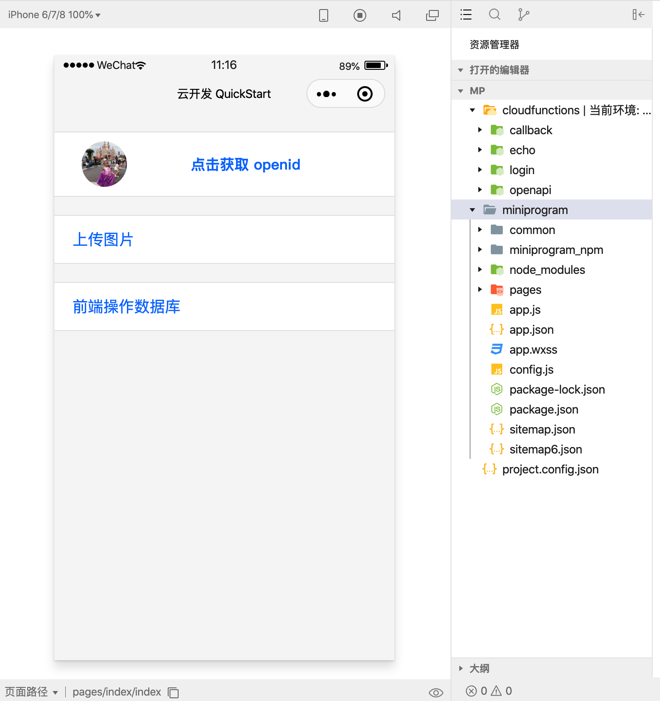

# 云开发

云开发是小程序官方提供的一种云端能力使用方案，在 kbone 中使用云开发能力可按以下步骤进行即可。

### 1、用法

假设下述例子的目录结构如下：

```
├─ build
│  ├─ miniprogram.config.js // mp-webpack-plugin 配置
│  └─ webpack.mp.config.js // 小程序端构建配置
│ 
├─ src // 源码目录
├─ cloudfunctions // 云函数源码目录
│ 
└─ dist
   └─ mp // 生成小程序项目
      ├─ miniprogram // 小程序根目录
      ├─ cloudfunctions // 云函数根目录
      └─ project.config.json
```
其中 dist/mp 目录是我们需要生成的目录，对比普通的 kbone 项目主要调整点有三个：

#### 1.1 创建云函数目录

即上述目录结构中的 `/cloudfunctions`，这个目录在构建中要被完整拷贝到 `/dist/mp/cloudfunctions` 下.

#### 1.2 修改 webpack 配置

调整小程序代码输出路径，即 output.path 配置，下述例子是将原本的 `/dist/mp/common` 调整为 `/dist/mp/miniprogram/common`。

同时引入了 `copy-webpack-plugin` 插件，将云函数目录拷贝到小程序项目下。

```js
// webpack.mp.config.js
const CopyPlugin = require('copy-webpack-plugin')

module.exports = {
  output: {
    path: path.resolve(__dirname, '../dist/mp/miniprogram/common'), // 放到小程序代码目录中的 common 目录下
    // ... other options
  },
  plugins: [
    // other plugins
    new CopyPlugin([{from: path.join(__dirname, '../cloudfunctions'), to: path.join(__dirname, '../dist/mp/cloudfunctions')}]),
  ],
  // ... other options
}
```

#### 1.3 修改 webpack 插件配置

调整 project.config.json 的生成目录路径，让其生成到小程序代码输出目录的上一级，即 /dist/mp 目录。

同时还需要补充 `miniprogramRoot` 和 `cloudfunctionRoot` 两项配置到 project.config.json 中。

```js
module.exports = {
  generate: {
		projectConfig: path.join(__dirname, '../dist/mp'),
  },
  projectConfig: {
		miniprogramRoot: 'miniprogram/', // 小程序根目录
		cloudfunctionRoot: 'cloudfunctions/', // 云函数根目录
	},
  // ... other options
}
```

后续按照正常方式进行构建即可。构建完成后的操作和原生的云开发模式一样，具体可参考[官方提供的云开发文档](https://developers.weixin.qq.com/miniprogram/dev/wxcloud/basis/getting-started.html)。

### 2、案例

在 `kbone-advanced` 目录下创建 `09-cloud` 目录，本案例在这个目录下完成。

#### 2.1 创建 package.json

```
cd 09-cloud
npm init -y
```

编辑 package.json：

```json
{
  "scripts": {
    "mp": "cross-env NODE_ENV=production webpack --config build/webpack.mp.config.js --progress --hide-modules"
  },
  "dependencies": {
    "vue": "^2.5.11"
  },
  "browserslist": [
    "> 1%",
    "last 2 versions",
    "not ie <= 8"
  ],
  "devDependencies": {
    "babel-core": "^6.26.0",
    "babel-loader": "^7.1.2",
    "babel-preset-env": "^1.6.0",
    "babel-preset-stage-3": "^6.24.1",
    "copy-webpack-plugin": "^5.1.1",
    "cross-env": "^5.0.5",
    "css-loader": "^0.28.7",
    "extract-text-webpack-plugin": "^3.0.2",
    "file-loader": "^5.1.0",
    "html-webpack-plugin": "^4.0.0-beta.5",
    "less": "^3.11.1",
    "less-loader": "^5.0.0",
    "mini-css-extract-plugin": "^0.5.0",
    "mp-webpack-plugin": "latest",
    "optimize-css-assets-webpack-plugin": "^5.0.1",
    "stylehacks": "^4.0.3",
    "url-loader": "^3.0.0",
    "vue-loader": "^15.7.0",
    "vue-template-compiler": "^2.6.10",
    "webpack": "^4.29.6",
    "webpack-cli": "^3.2.3"
  }
}
```

安装依赖包：

```
npm install
```

#### 2.2 配置 webpack

在 09-cloud/build 目录下创建 webpack.mp.config.js，内容如下：

```js
const path = require('path')
const webpack = require('webpack')
const MiniCssExtractPlugin = require('mini-css-extract-plugin')
const { VueLoaderPlugin } = require('vue-loader')
const OptimizeCSSAssetsPlugin = require('optimize-css-assets-webpack-plugin');
const TerserPlugin = require('terser-webpack-plugin')
const CopyPlugin = require('copy-webpack-plugin')
const MpPlugin = require('mp-webpack-plugin') // 用于构建小程序代码的 webpack 插件

const isOptimize = false // 是否压缩业务代码，开发者工具可能无法完美支持业务代码使用到的 es 特性，建议自己做代码压缩

module.exports = {
  mode: 'production',
  entry: {
    'miniprogram-app': path.resolve(__dirname, '../src/app.js'),
    
    index: path.resolve(__dirname, '../src/index/main.mp.js'),
    userconsole: path.resolve(__dirname, '../src/userconsole/main.mp.js'),
    storageconsole: path.resolve(__dirname, '../src/storageconsole/main.mp.js'),
    databaseguide: path.resolve(__dirname, '../src/databaseguide/main.mp.js'),
    deployfunctions: path.resolve(__dirname, '../src/deployfunctions/main.mp.js'),
    chooselib: path.resolve(__dirname, '../src/chooselib/main.mp.js'),
  },
  output: {
    path: path.resolve(__dirname, '../dist/mp/miniprogram/common'), // 放到小程序代码目录中的 common 目录下
    filename: '[name].js', // 必需字段，不能修改
    library: 'createApp', // 必需字段，不能修改
    libraryExport: 'default', // 必需字段，不能修改
    libraryTarget: 'window', // 必需字段，不能修改
  },
  target: 'web', // 必需字段，不能修改
  optimization: {
    runtimeChunk: false, // 必需字段，不能修改
    splitChunks: { // 代码分隔配置，不建议修改
      chunks: 'all',
      minSize: 1000,
      maxSize: 0,
      minChunks: 1,
      maxAsyncRequests: 100,
      maxInitialRequests: 100,
      automaticNameDelimiter: '~',
      name: true,
      cacheGroups: {
        vendors: {
          test: /[\\/]node_modules[\\/]/,
          priority: -10
        },
        default: {
          minChunks: 2,
          priority: -20,
          reuseExistingChunk: true
        }
      }
    },

    minimizer: isOptimize ? [
      // 压缩CSS
      new OptimizeCSSAssetsPlugin({
        assetNameRegExp: /\.(css|wxss)$/g,
        cssProcessor: require('cssnano'),
        cssProcessorPluginOptions: {
          preset: ['default', {
            discardComments: {
              removeAll: true,
            },
            minifySelectors: false, // 因为 wxss 编译器不支持 .some>:first-child 这样格式的代码，所以暂时禁掉这个
          }],
        },
        canPrint: false
      }),
      // 压缩 js
      new TerserPlugin({
        test: /\.js(\?.*)?$/i,
        parallel: true,
      })
    ] : [],
  },
  module: {
    rules: [
      {
        test: /\.(less|css)$/,
        use: [
          MiniCssExtractPlugin.loader,
          'css-loader',
          'less-loader',
        ],
      },
      {
        test: /\.vue$/,
        loader: [
          'vue-loader',
        ],
      },
      {
        test: /\.js$/,
        use: [
          'babel-loader'
        ],
        exclude: /node_modules/
      },
      {
        test: /\.(png|jpg|gif|svg)$/,
        use: [{
          loader: 'url-loader',
          options: {
            esModule: false,
            limit: true,
            emitFile: false,
          },
        }],
      }
    ]
  },
  resolve: {
    extensions: ['*', '.js', '.vue', '.json']
  },
  plugins: [
    new webpack.DefinePlugin({
      'process.env.isMiniprogram': process.env.isMiniprogram, // 注入环境变量，用于业务代码判断
    }),
    new MiniCssExtractPlugin({
      filename: '[name].wxss',
    }),
    new VueLoaderPlugin(),
    new MpPlugin(require('./miniprogram.config.js')),
    new CopyPlugin([{from: path.join(__dirname, '../cloudfunctions'), to: path.join(__dirname, '../dist/mp/cloudfunctions')}]),
  ],
}
```

在 09-cloud/build 目录下创建 miniprogram.config.js，内容如下：

```js
const path = require('path')

module.exports = {	
	origin: 'https://test.miniprogram.com',	
	entry: '/index',	
	router: {		
		inde: ['/index'],
		userconsole: ['/userconsole'],
		storageconsole: ['/storageconsole'],
		databaseguide: ['/databaseguide'],
		deployfunctions: ['/deployfunctions'],
		chooselib: ['/chooselib'],
	},	
	redirect: {		
		notFound: 'index',		
		accessDenied: 'index',
	},
	generate: {
		appEntry: 'miniprogram-app',
		appWxss: 'display',
    projectConfig: path.join(__dirname, '../dist/mp'),
    // 构建完成后是否自动安装小程序依赖。'npm'：使用 npm 自动安装依赖
		autoBuildNpm: 'npm'
	},
	app: {
		navigationBarTitleText: 'miniprogram-project',
	},
	pages: {
		userconsole: {
			extra: {
				navigationBarTitleText: '用户管理指引',
			},
		},
		storageconsole: {
			extra: {
				navigationBarTitleText: '文件存储指引',
			},
		},
		databaseguide: {
			extra: {
				navigationBarTitleText: '数据库指引',
			},
		},
		deployfunctions: {
			extra: {
				navigationBarTitleText: '部署云函数',
			},
		},
		chooselib: {
			extra: {
				navigationBarTitleText: '选择基础库',
			},
		},
	},
	app: {
		backgroundColor: '#F6F6F6',
		backgroundTextStyle: 'light',
		navigationBarBackgroundColor: '#F6F6F6',
		navigationBarTitleText: '云开发 QuickStart',
		navigationBarTextStyle: 'black',
	},
	appExtraConfig: {
		style: 'v2',
	},
	projectConfig: {
		appid: '',
		projectname: '09-cloud',
		miniprogramRoot: 'miniprogram/',
		cloudfunctionRoot: 'cloudfunctions/',
	},
	packageConfig: {
		author: 'wechat-miniprogram',
	},
}
```

#### 2.3 创建 app.js 相关文件

在 `/src/` 下创建 `app.js` 文件，内容如下：

```js
import './app.css'

App({
  onLaunch(options) {
    if (!wx.cloud) {
      console.error('请使用 2.2.3 或以上的基础库以使用云能力')
    } else {
      wx.cloud.init({
        // env 参数说明：
        //   env 参数决定接下来小程序发起的云开发调用（wx.cloud.xxx）会默认请求到哪个云环境的资源
        //   此处请填入环境 ID, 环境 ID 可打开云控制台查看
        //   如不填则使用默认环境（第一个创建的环境）
        // env: 'my-env-id',
        traceUser: true,
      })
    }
    
    this.globalData = {}
  },
})
```

在 `/src/` 下创建 `app.css` 文件，内容如下：

```css
.container {
  display: flex;
  flex-direction: column;
  align-items: center;
  box-sizing: border-box;
} 

button {
  background: initial;
}

button:focus{
  outline: 0;
}

button::after{
  border: none;
}

html {
  background: #f6f6f6;
  display: flex;
  flex-direction: column;
  justify-content: flex-start;
}

.userinfo, .uploader, .tunnel {
  margin-top: 40rpx;
  height: 140rpx;
  width: 100%;
  background: #fff;
  border: 1px solid rgba(0, 0, 0, 0.1);
  border-left: none;
  border-right: none;
  display: flex;
  flex-direction: row;
  align-items: center;
  transition: all 300ms ease;
}

.userinfo-avatar {
  width: 100rpx;
  height: 100rpx;
  margin: 20rpx;
  border-radius: 50%;
  background-size: cover;
  background-color: white;
}

.userinfo-avatar:after {
  border: none;
}

.userinfo-nickname {
  font-size: 32rpx;
  color: #007aff;
  background-color: white;
  background-size: cover;
}

.userinfo-nickname::after {
  border: none;
}

.uploader, .tunnel {
  height: auto;
  padding: 0 0 0 40rpx;
  flex-direction: column;
  align-items: flex-start;
  box-sizing: border-box;
}

.uploader-text, .tunnel-text {
  width: 100%;
  line-height: 52px;
  font-size: 34rpx;
  color: #007aff;
}

.uploader-container {
  width: 100%;
  height: 400rpx;
  padding: 20rpx 20rpx 20rpx 0;
  display: flex;
  align-content: center;
  justify-content: center;
  box-sizing: border-box;
  border-top: 1px solid rgba(0, 0, 0, 0.1);
}

.uploader-image {
  width: 100%;
  height: 360rpx;
}

.tunnel {
  padding: 0 0 0 40rpx;
}

.tunnel-text {
  position: relative;
  color: #222;
  display: flex;
  flex-direction: row;
  align-content: center;
  justify-content: space-between;
  box-sizing: border-box;
  border-top: 1px solid rgba(0, 0, 0, 0.1);
}

.tunnel-text:first-child {
  border-top: none;
}

.tunnel-switch {
  position: absolute;
  right: 20rpx;
  top: -2rpx;
}

.disable {
  color: #888;
}

.service {
  position: fixed;
  right: 40rpx;
  bottom: 40rpx;
  width: 140rpx;
  height: 140rpx;
  border-radius: 50%;
  background: linear-gradient(#007aff, #0063ce);
  box-shadow: 0 5px 10px rgba(0, 0, 0, 0.3);
  display: flex;
  align-content: center;
  justify-content: center;
  transition: all 300ms ease;
}

.service-button {
  position: absolute;
  top: 40rpx;
}

.service:active {
  box-shadow: none;
}

.request-text {
  padding: 20rpx 0;
  font-size: 24rpx;
  line-height: 36rpx;
  word-break: break-all;
}
```

#### 2.4 创建 index 入口页面

在 `/src/` 下创建 `index` 文件夹，在这个文件夹下创建 `main.mp.js`，内容为：

```js
import Vue from 'vue'
import App from './App.vue'

export default function createApp() {
  const container = document.createElement('div')
  container.id = 'app'
  document.body.appendChild(container)

  return new Vue({
    el: '#app',
    render: h => h(App)
  })
}
```

在 `/src/index` 下创建 `App.vue`，内容为：

```vue
<template>
  <div class="container">
    <!-- 用户 openid -->
    <div class="userinfo">
      <wx-button 
        open-type="getUserInfo" 
        @getuserinfo="onGetUserInfo"
        class="userinfo-avatar"
        :style="{backgroundImage: `url(${avatarUrl})`}"
        size="default"
      ></wx-button>
      <div class="userinfo-nickname-wrapper">
        <wx-button class="userinfo-nickname" @click="onGetOpenid">点击获取 openid</wx-button>
      </div>
    </div>

    <!-- 上传图片 -->
    <div class="uploader">
      <div class="uploader-text" @click="doUpload">
        <span>上传图片</span>
      </div>
      <div class="uploader-container" v-if="imgUrl">
        
      </div>
    </div>

    <!-- 操作数据库 -->
    <div class="uploader">
      <a href="/databaseguide" target="_blank" class="uploader-text">
        <span>前端操作数据库</span>
      </a>
    </div>
  </div>
</template>

<script>
const app = getApp()

export default {
  name: 'App',
  data() {
    return {
      avatarUrl: require('../images/user-unlogin.png'),
      userInfo: {},
      logged: false,
      takeSession: false,
      requestResult: '',
    }
  },
  mounted() {
    if (!wx.cloud) {
      location.href = '/chooselib'
      return
    }

    // 获取用户信息
    wx.getSetting({
      success: res => {
        if (res.authSetting['scope.userInfo']) {
          // 已经授权，可以直接调用 getUserInfo 获取头像昵称，不会弹框
          wx.getUserInfo({
            success: res => {
              this.avatarUrl = res.userInfo.avatarUrl
              this.userInfo = res.userInfo
            }
          })
        }
      }
    })
  },
  methods: {
    onGetUserInfo(evt) {
      if (!this.logged && evt.detail.userInfo) {
        this.logged = true
        this.avatarUrl = evt.detail.userInfo.avatarUrl
        this.userInfo = evt.detail.userInfo
      }
    },

    onGetOpenid() {
      // 调用云函数
      wx.cloud.callFunction({
        name: 'login',
        data: {},
        success: res => {
          console.log('[云函数] [login] user openid: ', res.result.openid)
          app.globalData.openid = res.result.openid
          window.open('/userconsole')
        },
        fail: err => {
          console.error('[云函数] [login] 调用失败', err)
          window.open('/deployfunctions')
        }
      })
    },

    /**
     * 上传图片
     */
    doUpload() {
      // 选择图片
      wx.chooseImage({
        count: 1,
        sizeType: ['compressed'],
        sourceType: ['album', 'camera'],
        success: res => {
          wx.showLoading({
            title: '上传中',
          })

          const filePath = res.tempFilePaths[0]
          
          // 上传图片
          const cloudPath = 'my-image' + filePath.match(/\.[^.]+?$/)[0]
          wx.cloud.uploadFile({
            cloudPath,
            filePath,
            success: res => {
              console.log('[上传文件] 成功：', res)

              app.globalData.fileID = res.fileID
              app.globalData.cloudPath = cloudPath
              app.globalData.imagePath = filePath
              
              window.open('/storageconsole')
            },
            fail: err => {
              console.error('[上传文件] 失败：', err)
              wx.showToast({
                icon: 'none',
                title: '上传失败',
              })
            },
            complete: () => {
              wx.hideLoading()
            }
          })
        },
        fail: e => {
          console.error(e)
        }
      })
    },
  },
}
</script>

<style lang="less">
html {
  background: #f6f6f6;
  display: flex;
  flex-direction: column;
  justify-content: flex-start;
}

.userinfo, .uploader, .tunnel {
  margin-top: 40rpx;
  height: 140rpx;
  width: 100%;
  background: #fff;
  border: 1px solid rgba(0, 0, 0, 0.1);
  border-left: none;
  border-right: none;
  display: flex;
  flex-direction: row;
  align-items: center;
  transition: all 300ms ease;
}

.userinfo {
  padding-left: 120rpx;
}

wx-button.userinfo-avatar {
  width: 100rpx;
  height: 100rpx;
  margin: 20rpx;
  padding: 0;
  border-radius: 50%;
  background-size: cover;
  background-color: white;
}

.userinfo-avatar[size] {
  width: 100rpx;
}


.userinfo-avatar:after {
  border: none;
}

wx-button.userinfo-nickname {
  font-size: 32rpx;
  color: #007aff;
  background-color: white;
  background-size: cover;
  text-align: left;
  padding-left: 0;
  margin-left: 10px;
}

.userinfo-nickname::after {
  border: none;
}

.userinfo-nickname-wrapper {
  flex: 1;
}

.uploader, .tunnel {
  height: auto;
  padding: 0 0 0 40rpx;
  flex-direction: column;
  align-items: flex-start;
  box-sizing: border-box;
}

.uploader-text, .tunnel-text {
  width: 100%;
  line-height: 52px;
  font-size: 34rpx;
  color: #007aff;
}

.uploader-container {
  width: 100%;
  height: 400rpx;
  padding: 20rpx 20rpx 20rpx 0;
  display: flex;
  align-content: center;
  justify-content: center;
  box-sizing: border-box;
  border-top: 1px solid rgba(0, 0, 0, 0.1);
}

.uploader-image {
  width: 100%;
  height: 360rpx;
}

.tunnel {
  padding: 0 0 0 40rpx;
}

.tunnel-text {
  position: relative;
  color: #222;
  display: flex;
  flex-direction: row;
  align-content: center;
  justify-content: space-between;
  box-sizing: border-box;
  border-top: 1px solid rgba(0, 0, 0, 0.1);
}

.tunnel-text:first-child {
  border-top: none;
}

.tunnel-switch {
  position: absolute;
  right: 20rpx;
  top: -2rpx;
}

.disable {
  color: #888;
}

.service {
  position: fixed;
  right: 40rpx;
  bottom: 40rpx;
  width: 140rpx;
  height: 140rpx;
  border-radius: 50%;
  background: linear-gradient(#007aff, #0063ce);
  box-shadow: 0 5px 10px rgba(0, 0, 0, 0.3);
  display: flex;
  align-content: center;
  justify-content: center;
  transition: all 300ms ease;
}

.service-button {
  position: absolute;
  top: 40rpx;
}

.service:active {
  box-shadow: none;
}

.request-text {
  padding: 20rpx 0;
  font-size: 24rpx;
  line-height: 36rpx;
  word-break: break-all;
}
</style>
```

#### 2.5 创建 chooselib 组件

在 `/src/` 下创建 `chooselib` 文件夹，在这个文件夹下创建 `main.mp.js`，内容为：

```js
import Vue from 'vue'
import App from './App.vue'

export default function createApp() {
  const container = document.createElement('div')
  container.id = 'app'
  document.body.appendChild(container)

  return new Vue({
    el: '#app',
    render: h => h(App)
  })
}
```

在 `/src/chooselib` 下创建 `App.vue`，内容为：

```vue
<template>
  <div class="container">
    <div class="list">
      <div class="list-item">
        <span class="black">初始化失败</span>
      </div>
      <div class="list-item">
        <span class="request-text">请使用 2.2.3 或以上的基础库以使用云能力</span>
      </div>
    </div>
  </div>
</template>

<script>
export default {}
</script>

<style lang="less">
@import "../style/guide";

.black {
  color: black;
}
</style>
```

在 `/src` 下创建 `style` 文件夹，在此文件夹下创建 `guide.less`文件，内容为：

```less
html {
  background: #f6f6f6;
  display: flex;
  flex-direction: column;
  justify-content: flex-start;
}

.list {
  margin-top: 40rpx;
  height: auto;
  width: 100%;
  background: #fff;
  padding: 0 40rpx;
  border: 1px solid rgba(0, 0, 0, 0.1);
  border-left: none;
  border-right: none;
  transition: all 300ms ease;
  display: flex;
  flex-direction: column;
  align-items: stretch;
  box-sizing: border-box;
}

.list-item {
  width: 100%;
  padding: 0;
  line-height: 104rpx;
  font-size: 34rpx;
  color: #007aff;
  border-top: 1px solid rgba(0, 0, 0, 0.1);
  display: flex;
  flex-direction: row;
  align-content: center;
  justify-content: space-between;
  box-sizing: border-box;
}

.list-item:first-child {
  border-top: none;
}

.list-item image {
  max-width: 100%;
  max-height: 20vh;
  margin: 20rpx 0;
}

.request-text {
  color: #222;
  padding: 20rpx 0;
  font-size: 24rpx;
  line-height: 36rpx;
  word-break: break-all;
}

.guide {
  width: 100%;
  padding: 40rpx;
  box-sizing: border-box;
  display: flex;
  flex-direction: column;
}

.guide > .h5-wx-component {
  display: flex;
  flex-direction: column;
}

.guide .headline {
  font-size: 34rpx;
  font-weight: bold;
  color: #555;
  line-height: 40rpx;
}

.guide .p {
  margin-top: 20rpx;
  font-size: 28rpx;
  line-height: 36rpx;
  color: #666;
}

.guide .code {
  margin-top: 20rpx;
  font-size: 28rpx;
  line-height: 36rpx;
  color: #666;
  background: white;
  white-space: pre;
}

.guide .code-dark {
  margin-top: 20rpx;
  background: rgba(0, 0, 0, 0.8);
  padding: 20rpx;
  font-size: 28rpx;
  line-height: 36rpx;
  border-radius: 6rpx;
  color: #fff;
  white-space: pre
}

.guide image {
  max-width: 100%;
}

.guide .image1 {
  margin-top: 20rpx;
  max-width: 100%;
  width: 356px;
  height: 47px;
}

.guide .image2 {
  margin-top: 20rpx;
  width: 264px;
  height: 100px;
}

.guide .flat-image {
  height: 100px;
}

.guide .code-image {
  max-width: 100%;
}

.guide .copyBtn {
  width: 180rpx;
  font-size: 20rpx;
  margin-top: 16rpx;
  margin-left: 0;
}

.guide .nav {
  margin-top: 50rpx;
  display: flex;
  flex-direction: row;
  align-content: space-between;
}

.guide .nav .h5-wx-component {
  flex: 1;
  display: flex;
}

.guide .nav .prev {
  margin-left: unset;
}

.guide .nav .next {
  margin-right: unset;
}
```

#### 2.5 获取 openid

点击 “点击获取 openid” 按钮，调用 `login` 云函数。需要在项目根目录下创建 `/src/cloudfunctions/login` 文件夹，在这个文件夹下创建 `package.json`，`config.json`，`index.js` 三个文件：

##### 2.5.1 package.json

```json
{
  "name": "login",
  "version": "1.0.0",
  "description": "",
  "main": "index.js",
  "scripts": {
    "test": "echo \"Error: no test specified\" && exit 1"
  },
  "author": "",
  "license": "ISC",
  "dependencies": {
    "wx-server-sdk": "latest"
  }
}
```

##### 2.5.2 config.json

```json
{
  "permissions": {
    "openapi": []
  }
}
```

##### 2.5.3 index.js

```js
// 云函数模板
// 部署：在 cloud-functions/login 文件夹右击选择 “上传并部署”

const cloud = require('wx-server-sdk')

// 初始化 cloud
cloud.init({
  // API 调用都保持和云函数当前所在环境一致
  env: cloud.DYNAMIC_CURRENT_ENV
})

/**
 * 这个示例将经自动鉴权过的小程序用户 openid 返回给小程序端
 * 
 * event 参数包含小程序端调用传入的 data
 * 
 */
exports.main = (event, context) => {
  console.log(event)
  console.log(context)

  // 可执行其他自定义逻辑
  // console.log 的内容可以在云开发云函数调用日志查看

  // 获取 WX Context (微信调用上下文)，包括 OPENID、APPID、及 UNIONID（需满足 UNIONID 获取条件）等信息
  const wxContext = cloud.getWXContext()

  return {
    event,
    openid: wxContext.OPENID,
    appid: wxContext.APPID,
    unionid: wxContext.UNIONID,
    env: wxContext.ENV,
  }
}
```

#### 2.6 创建 userconsole 组件

在 `/src` 下创建 `userconsole` 文件夹，在此文件夹下创建 `main.mp.js`文件，内容为：

```js
import Vue from 'vue'
import App from './App.vue'

export default function createApp() {
  const container = document.createElement('div')
  container.id = 'app'
  document.body.appendChild(container)

  return new Vue({
    el: '#app',
    render: h => h(App)
  })
}
```

在 `/src/userconsole` 下创建 `App.vue`文件，内容为：

```vue
<template>
  <div class="container">
    <div class="list">
      <div class="list-item">
        <span class="request-text">用户 openid 获取成功</span>
      </div>
      <div class="list-item">
        <span class="request-text">{{openid}}</span>
      </div>
    </div>

    <!-- 云开发用户管理指引 -->
    <div class="guide">
      <span class="headline">云开发管理用户</span>
      <span class="p">1. 打开云开发控制台</span>
      
      <span class="p">2. 切换到 "用户管理" 标签页</span>
      <span class="p">3. 查看访问小程序的用户列表</span>
    </div>
  </div>
</template>

<script>
export default {
  name: 'App',
  data() {
    return {
      openid: '',
    }
  },
  mounted() {
    this.openid = getApp().globalData.openid
  },
}
</script>

<style lang="less">
@import "../style/guide";
</style>
```

#### 2.7 创建 deployfunctions 组件

在 `/src` 下创建 `deployfunctions` 文件夹，在此文件夹下创建 `main.mp.js`文件，内容为：

```js
import Vue from 'vue'
import App from './App.vue'

export default function createApp() {
  const container = document.createElement('div')
  container.id = 'app'
  document.body.appendChild(container)

  return new Vue({
    el: '#app',
    render: h => h(App)
  })
}
```

在 `/src/deployfunctions` 下创建 `App.vue`文件，内容为：

```vue
<template>
  <div class="container">
    <div class="list">
      <div class="list-item">
        <span class="black">调用失败</span>
      </div>
      <div class="list-item">
        <span class="request-text">请检查 login 云函数是否已部署</span>
      </div>
    </div>

    <div class="guide">
      <span class="headline">部署 login 云函数</span>
      <span class="p">1. 确保已通过工具栏云开发入口开通云开发</span>
      <span class="p">2. 在 cloudfunctions/login 目录上右键上传并部署</span>
      <span class="p">3. 回到首页，重新点击获取 openid</span>
    </div>
  </div>
</template>

<script>
export default {}
</script>

<style lang="less">
@import "../style/guide";

.black {
  color: black;
}
</style>
```

#### 2.8 上传图片

点击 “上传图片” 按钮，构建上传成功后的组件。在 `/src` 下创建 `storageconsole` 文件夹，在这个文件夹下创建 `main.mp.js` 文件，内容为：

```js
import Vue from 'vue'
import App from './App.vue'

export default function createApp() {
  const container = document.createElement('div')
  container.id = 'app'
  document.body.appendChild(container)

  return new Vue({
    el: '#app',
    render: h => h(App)
  })
}
```

在 `/src/storageconsole` 目录下创建 `App.vue` 文件，内容为：

```vue
<template>
  <div class="container">
    <div class="list">
      <div class="list-item">
        <span class="black">上传成功</span>
      </div>
      <div class="list-item">
        <span class="request-text">文件 ID：{{fileID}}</span>
      </div>
      <div class="list-item">
        <span class="request-text">云文件路径：{{cloudPath}}</span>
      </div>
      <div class="list-item">
        
      </div>
    </div>

    <div class="guide">
      <span class="headline">云开发控制台中管理文件</span>
      <span class="p">1. 打开云开发控制台</span>
      
      <span class="p">2. 切换到文件管理标签页</span>
      <span class="p">3. 可查看文件列表、管理权限</span>
      <span class="p">4. 详细的教程和 API 文件，可点击调试器中打印的链接查看</span>
    </div>
  </div>
</template>

<script>
const app = getApp()

export default {
  name: 'App',
  data() {
    return {
      fileID: '',
      cloudPath: '',
      imagePath: '',
    }
  },
  mounted() {
    const {
      fileID,
      cloudPath,
      imagePath,
    } = app.globalData

    this.fileID = fileID
    this.cloudPath = cloudPath
    this.imagePath = imagePath

    console.group('文件存储文档')
    console.log('https://developers.weixin.qq.com/miniprogram/dev/wxcloud/guide/storage.html')
    console.groupEnd()
  },
}
</script>

<style lang="less">
@import "../style/guide";

.black {
  color: black;
}
</style>
```


#### 2.9 前端操作数据库

点击 “前端操作数据库” 按钮，进入前端操作数据的流程，这个流程通过几个步骤完成。在 `/src` 下创建 `databaseguide` 目录，在这个目录下创建 `main.mp.js` 文件，内容如下：

```js
import Vue from 'vue'
import App from './App.vue'

export default function createApp() {
  const container = document.createElement('div')
  container.id = 'app'
  document.body.appendChild(container)

  return new Vue({
    el: '#app',
    render: h => h(App)
  })
}
```

在 `/src/databaseguide` 目录下创建 `App.vue` 文件，内容如下：

```vue
<template>
  <div class="container">
    <!-- 导航 -->
    <div class="list">
      <div class="list-item">
        <span class="request-text">数据库指引</span>
      </div>
      <div class="list-item">
        <span class="request-text" v-for="(item, index) in 7" :key="item" :style="{color: step === index + 1 ? 'red': 'black'}">{{index + 1}}</span>
      </div>
      <div class="list-item" v-if="openid">
        <span class="request-text">openid：{{openid}}</span>
      </div>
      <div class="list-item" v-if="counterId">
        <span class="request-text">当前记录 ID：{{counterId}}</span>
      </div>
    </div>

    <!-- 快速操作数据库指引 -->

    <!-- 简介 -->
    <div class="guide" v-if="step === 1">
      <span class="headline">示例介绍</span>
      <span class="p">1. 以计数器为例，在此演示如何操作数据库</span>
      <span class="p">2. 数据库操作大多需要用户 openid，需先配置好 login 云函数，如已配置好，点击下一步，获取用户 openid 并开始我们的指引</span>
      <div class="nav">
        <wx-button class="next" size="mini" type="default" @click="nextStep">下一步</wx-button>
      </div>
    </div>

    <!-- 新建集合 -->
    <div class="guide" v-if="step === 2">
      <span class="headline">新建集合</span>
      <span class="p">1. 打开云开发控制台，进入到数据库管理页</span>
      
      <span class="p">2. 选择添加集合，集合名为 counters</span>
      
      <span class="p">3. 可以看到 counters 集合出现在左侧集合列表中</span>
      <span class="p">注：集合必须在云开发控制台中创建</span>

      <div class="nav">
        <wx-button class="prev" size="mini" type="default" @click="prevStep">上一步</wx-button>
        <wx-button class="next" size="mini" type="default" @click="nextStep">下一步</wx-button>
      </div>
    </div>

    <!-- 新增记录 -->
    <div class="guide" v-if="step === 3">
      <span class="headline">新增记录</span>
      <span class="p">1. onAdd 方法会往 counters 集合新增一个记录，新增如下格式的一个 JSON 记录</span>
      <span class="code">
      {
        "_id": "数据库自动生成记录 ID 字段",
        "_openid": "数据库自动插入记录创建者的 openid",
        "count": 1
      }
      </span>
      <span class="p">2. 点击按钮</span>
      <wx-button size="mini" type="default" @click="onAdd">新增记录</wx-button>
      <span class="p" v-if="counterId">新增的记录 _id 为：{{counterId}}</span>
      <span class="p">3. 在云开发 -> 数据库 -> counters 集合中可以看到新增的记录</span>

      <div class="nav">
        <wx-button class="prev" size="mini" type="default" @click="prevStep">上一步</wx-button>
        <wx-button class="next" size="mini" type="default" @click="nextStep" v-if="counterId">下一步</wx-button>
      </div>
    </div>

    <!-- 查询记录 -->
    <div class="guide" v-if="step === 4">
      <span class="headline">查询记录</span>
      <span class="p">点击按钮</span>
      <wx-button size="mini" type="default" @click="onQuery">查询记录</wx-button>
      <span class="code" v-if="queryResult">{{queryResult}}</span>

      <div class="nav">
        <wx-button class="prev" size="mini" type="default" @click="prevStep">上一步</wx-button>
        <wx-button class="next" size="mini" type="default" @click="nextStep">下一步</wx-button>
      </div>
    </div>

    <!-- 更新记录 -->
    <div class="guide" v-if="step === 5">
      <span class="headline">更新记录</span>
      <span class="p">点击下方按钮更新计数器</span>
      <div class="counter">
        <wx-button class="minus" size="mini" type="default" @click="onCounterDec">-</wx-button>
        <span class="p">{{count}}</span>
        <wx-button class="plus" size="mini" type="default" @click="onCounterInc">+</wx-button>
      </div>

      <div class="nav">
        <wx-button class="prev" size="mini" type="default" @click="prevStep">上一步</wx-button>
        <wx-button class="next" size="mini" type="default" @click="nextStep">下一步</wx-button>
      </div>
    </div>

    <!-- 删除记录 -->
    <div class="guide" v-if="step === 6">
      <span class="headline">删除记录</span>
      <span class="p">点击下方按钮删除计数器</span>
      <wx-button size="mini" type="default" @click="onRemove">删除记录</wx-button>

      <div class="nav">
        <wx-button class="prev" size="mini" type="default" @click="prevStep" v-if="counterId">上一步</wx-button>
        <wx-button class="next" size="mini" type="default" @click="nextStep">下一步</wx-button>
      </div>
    </div>

    <!-- 结语 -->
    <div class="guide" v-if="step === 7">
      <span class="headline">完成指引 !</span>
      <span class="p">恭喜你，至此已完成数据库操作入门基础，可以点击调试器中的链接，查看详尽的数据库文档</span>

      <div class="nav">
        <wx-button class="prev" size="mini" type="default" @click="prevStep">上一步</wx-button>
        <wx-button class="next" size="mini" type="default" @click="goHome">回到首页</wx-button>
      </div>
    </div>
  </div>
</template>

<script>
const app = getApp()

export default {
  name: 'App',
  data() {
    return {
      step: 1,
      counterId: '',
      openid: '',
      count: null,
      queryResult: '',
    }
  },
  mounted() {
    if (app.globalData.openid) {
      this.openid = app.globalData.openid
    }
  },
  methods: {
    onAdd() {
      const db = wx.cloud.database()
      db.collection('counters').add({
        data: {
          count: 1
        },
        success: res => {
          // 在返回结果中会包含新创建的记录的 _id
          this.counterId = res._id
          this.count = 1
          wx.showToast({
            title: '新增记录成功',
          })
          console.log('[数据库] [新增记录] 成功，记录 _id: ', res._id)
        },
        fail: err => {
          wx.showToast({
            icon: 'none',
            title: '新增记录失败'
          })
          console.error('[数据库] [新增记录] 失败：', err)
        }
      })
    },

    onQuery() {
      const db = wx.cloud.database()
      // 查询当前用户所有的 counters
      db.collection('counters').where({
        _openid: this.openid
      }).get({
        success: res => {
          this.queryResult = JSON.stringify(res.data, null, 2)
          console.log('[数据库] [查询记录] 成功: ', res)
        },
        fail: err => {
          wx.showToast({
            icon: 'none',
            title: '查询记录失败'
          })
          console.error('[数据库] [查询记录] 失败：', err)
        }
      })
    },

    onCounterInc() {
      const db = wx.cloud.database()
      const newCount = this.count + 1
      db.collection('counters').doc(this.counterId).update({
        data: {
          count: newCount
        },
        success: res => {
          this.count = newCount
        },
        fail: err => {
          wx.showToast({
            icon: 'none',
            title: '更新记录失败'
          })
          console.error('[数据库] [更新记录] 失败：', err)
        }
      })
    },

    onCounterDec() {
      const db = wx.cloud.database()
      const newCount = this.count - 1
      db.collection('counters').doc(this.counterId).update({
        data: {
          count: newCount
        },
        success: res => {
          this.count = newCount
        },
        fail: err => {
          wx.showToast({
            icon: 'none',
            title: '更新记录失败'
          })
          console.error('[数据库] [更新记录] 失败：', err)
        }
      })
    },

    onRemove() {
      if (this.counterId) {
        const db = wx.cloud.database()
        db.collection('counters').doc(this.counterId).remove({
          success: res => {
            wx.showToast({
              title: '删除成功',
            })
            this.counterId = ''
            this.count = null
          },
          fail: err => {
            wx.showToast({
              icon: 'none',
              title: '删除失败',
            })
            console.error('[数据库] [删除记录] 失败：', err)
          }
        })
      } else {
        wx.showToast({
          title: '无记录可删，请见创建一个记录',
        })
      }
    },

    nextStep() {
      // 在第一步，需检查是否有 openid，如无需获取
      if (this.step === 1 && !this.openid) {
        wx.cloud.callFunction({
          name: 'login',
          data: {},
          success: res => {
            app.globalData.openid = res.result.openid
            this.step = 2
            this.openid = res.result.openid
          },
          fail: err => {
            wx.showToast({
              icon: 'none',
              title: '获取 openid 失败，请检查是否有部署 login 云函数',
            })
            console.log('[云函数] [login] 获取 openid 失败，请检查是否有部署云函数，错误信息：', err)
          }
        })
      } else {
        const callback = this.step !== 6 ? function() {} : function() {
          console.group('数据库文档')
          console.log('https://developers.weixin.qq.com/miniprogram/dev/wxcloud/guide/database.html')
          console.groupEnd()
        }

        this.step = this.step + 1
        this.$nextTick(callback)
      }
    },

    prevStep() {
      this.step = this.step - 1
    },

    goHome() {
      const pages = getCurrentPages()
      if (pages.length === 2) {
        wx.navigateBack()
      } else if (pages.length === 1) {
        location.href = '/index'
      } else {
        wx.reLaunch({
          url: 'pages/index/index',
        })
      }
    },
  },
}
</script>

<style lang="less">
@import "../style/guide";

.guide .counter {
  margin-top: 50rpx;
  display: flex;
  flex-direction: row;
  align-content: space-between;
}
</style>
```

#### 2.10 小程序端效果预览

```
npm run mp
```

