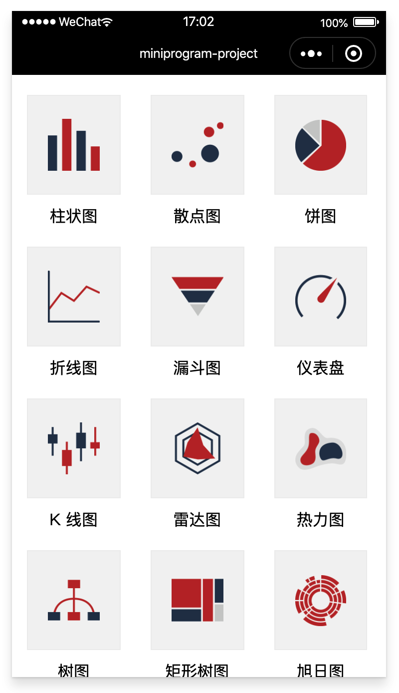
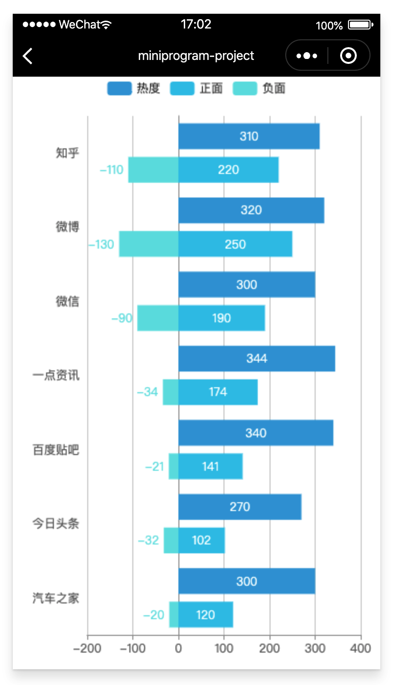

# echarts

ECharts，一个使用 JavaScript 实现的开源可视化库，可以流畅的运行在 PC 和移动设备上，兼容当前绝大部分浏览器（IE8/9/10/11，Chrome，Firefox，Safari等），底层依赖轻量级的矢量图形库 ZRender，提供直观，交互丰富，可高度个性化定制的数据可视化图表。

ECharts 提供了常规的折线图、柱状图、散点图、饼图、K线图，用于统计的盒形图，用于地理数据可视化的地图、热力图、线图，用于关系数据可视化的关系图、旭日图，多维数据可视化的平行坐标，还有用于 BI 的漏斗图，仪表盘，并且支持图与图之间的混搭。

2018年3月全球著名开源社区Apache宣布百度ECharts进入Apache孵化器。

### 1、用法

在kbone里应用ECharts需要注意的是：为了拿到正确的 zrX/zrY，不走正常的 touch 事件，需要自己定义 canvas 的事件监听。

### 2、案例

在 `kbone-advanced` 目录下创建 `10-kbone-echarts` 目录，本案例在这个目录下完成。

#### 2.1 创建 package.json

```
cd 10-kbone-echarts
npm init -y
```

编辑 package.json：

```json
{
  "scripts": {
    "mp": "cross-env NODE_ENV=production webpack --config build/webpack.mp.config.js --progress --hide-modules"
  },
  "dependencies": {
    "echarts": "^4.6.0",
    "vue": "^2.5.11"
  },
  "browserslist": [
    "> 1%",
    "last 2 versions",
    "not ie <= 8"
  ],
  "devDependencies": {
    "babel-core": "^6.26.0",
    "babel-loader": "^7.1.2",
    "babel-preset-env": "^1.6.0",
    "babel-preset-stage-3": "^6.24.1",
    "cross-env": "^5.0.5",
    "css-loader": "^0.28.7",
    "extract-text-webpack-plugin": "^3.0.2",
    "file-loader": "^1.1.4",
    "html-webpack-plugin": "^4.0.0-beta.5",
    "mini-css-extract-plugin": "^0.5.0",
    "optimize-css-assets-webpack-plugin": "^5.0.1",
    "stylehacks": "^4.0.3",
    "url-loader": "^3.0.0",
    "vue-loader": "^15.7.0",
    "vue-template-compiler": "^2.6.10",
    "webpack": "^4.29.6",
    "webpack-cli": "^3.2.3",
    "mp-webpack-plugin": "latest"
  }
}
```

安装依赖包：

```
npm install
```

#### 2.2 配置 webpack

在 `10-kbone-echarts/build` 目录下创建 webpack.mp.config.js，内容如下：

```js
const path = require('path')
const webpack = require('webpack')
const MiniCssExtractPlugin = require('mini-css-extract-plugin')
const { VueLoaderPlugin } = require('vue-loader')
const OptimizeCSSAssetsPlugin = require('optimize-css-assets-webpack-plugin');
const TerserPlugin = require('terser-webpack-plugin')
const MpPlugin = require('mp-webpack-plugin') // 用于构建小程序代码的 webpack 插件

const isOptimize = true // 是否压缩业务代码，开发者工具可能无法完美支持业务代码使用到的 es 特性，建议自己做代码压缩

module.exports = {
  mode: 'production',
  entry: {
    index: path.resolve(__dirname, '../src/index/main.mp.js'),
    bar: path.resolve(__dirname, '../src/bar/main.mp.js'),
    scatter: path.resolve(__dirname, '../src/scatter/main.mp.js'),
    pie: path.resolve(__dirname, '../src/pie/main.mp.js'),
    line: path.resolve(__dirname, '../src/line/main.mp.js'),
    funnel: path.resolve(__dirname, '../src/funnel/main.mp.js'),
    gauge: path.resolve(__dirname, '../src/gauge/main.mp.js'),
    k: path.resolve(__dirname, '../src/k/main.mp.js'),
    radar: path.resolve(__dirname, '../src/radar/main.mp.js'),
    heatmap: path.resolve(__dirname, '../src/heatmap/main.mp.js'),
    tree: path.resolve(__dirname, '../src/tree/main.mp.js'),
    treemap: path.resolve(__dirname, '../src/treemap/main.mp.js'),
    sunburst: path.resolve(__dirname, '../src/sunburst/main.mp.js'),
    map: path.resolve(__dirname, '../src/map/main.mp.js'),
    graph: path.resolve(__dirname, '../src/graph/main.mp.js'),
    boxplot: path.resolve(__dirname, '../src/boxplot/main.mp.js'),
    parallel: path.resolve(__dirname, '../src/parallel/main.mp.js'),
    sankey: path.resolve(__dirname, '../src/sankey/main.mp.js'),
    themeriver: path.resolve(__dirname, '../src/themeriver/main.mp.js'),
  },
  output: {
    path: path.resolve(__dirname, '../dist/mp/common'), // 放到小程序代码目录中的 common 目录下
    filename: '[name].js', // 必需字段，不能修改
    library: 'createApp', // 必需字段，不能修改
    libraryExport: 'default', // 必需字段，不能修改
    libraryTarget: 'window', // 必需字段，不能修改
  },
  target: 'web', // 必需字段，不能修改
  optimization: {
    runtimeChunk: false, // 必需字段，不能修改
    splitChunks: { // 代码分隔配置，不建议修改
      chunks: 'all',
      minSize: 1000,
      maxSize: 0,
      minChunks: 1,
      maxAsyncRequests: 100,
      maxInitialRequests: 100,
      automaticNameDelimiter: '~',
      name: true,
      cacheGroups: {
        vendors: {
          test: /[\\/]node_modules[\\/]/,
          priority: -10
        },
        default: {
          minChunks: 2,
          priority: -20,
          reuseExistingChunk: true
        }
      }
    },

    minimizer: isOptimize ? [
      // 压缩CSS
      new OptimizeCSSAssetsPlugin({
        assetNameRegExp: /\.(css|wxss)$/g,
        cssProcessor: require('cssnano'),
        cssProcessorPluginOptions: {
          preset: ['default', {
            discardComments: {
              removeAll: true,
            },
            minifySelectors: false, // 因为 wxss 编译器不支持 .some>:first-child 这样格式的代码，所以暂时禁掉这个
          }],
        },
        canPrint: false
      }),
      // 压缩 js
      new TerserPlugin({
        test: /\.js(\?.*)?$/i,
        parallel: true,
      })
    ] : [],
  },
  module: {
    rules: [
      {
        test: /\.css$/,
        use: [
          MiniCssExtractPlugin.loader,
          'css-loader'
        ],
      },
      {
        test: /\.vue$/,
        loader: [
          'vue-loader',
        ],
      },
      {
        test: /\.js$/,
        use: [
          'babel-loader'
        ],
        exclude: /node_modules/
      },
      {
        test: /\.(png|jpg|gif|svg)$/,
        use: [{
          loader: 'url-loader',
          options: {
            esModule: false,
            limit: true,
            emitFile: false,
          },
        }],
      },
    ]
  },
  resolve: {
    extensions: ['*', '.js', '.vue', '.json']
  },
  plugins: [
    new webpack.DefinePlugin({
      'process.env.isMiniprogram': process.env.isMiniprogram, // 注入环境变量，用于业务代码判断
    }),
    new MiniCssExtractPlugin({
      filename: '[name].wxss',
    }),
    new VueLoaderPlugin(),
    new MpPlugin(require('./miniprogram.config.js')),
  ],
}
```

在 `10-kbone-echarts/build` 目录下创建 miniprogram.config.js，内容如下：

```js
module.exports = {	
	origin: 'https://test.miniprogram.com',	
	entry: '/',	
	router: {		
		index: ['/'],
		bar: ['/bar'],
		scatter: ['/scatter'],
		pie: ['/pie'],
		line: ['/line'],
		funnel: ['/funnel'],
		gauge: ['/gauge'],
		k: ['/k'],
		radar: ['/radar'],
		heatmap: ['/heatmap'],
		tree: ['/tree'],
		treemap: ['/treemap'],
		sunburst: ['/sunburst'],
		map: ['/map'],
		graph: ['/graph'],
		boxplot: ['/boxplot'],
		parallel: ['/parallel'],
		sankey: ['/sankey'],
		themeriver: ['/themeriver'],
	},
	redirect: {		
		notFound: 'index',		
		accessDenied: 'index',
  },
  generate: {
    // 构建完成后是否自动安装小程序依赖。'npm'：使用 npm 自动安装依赖
		autoBuildNpm: 'npm'
	},
	app: {
		navigationBarTitleText: 'miniprogram-project',
	},
	projectConfig: {
		appid: '',
    projectname: 'kbone-echarts',
	},
	packageConfig: {
		author: 'wechat-miniprogram',
	},
}
```

#### 2.3 创建入口组件

在 `10-kbone-echarts/src/index` 下创建 `main.mp.js` 文件，内容如下：

```js
import Vue from 'vue'
import App from './App.vue'

export default function createApp() {
  const container = document.createElement('div')
  container.id = 'app'
  document.body.appendChild(container)

  return new Vue({
    el: '#app',
    render: h => h(App)
  })
}
```

在 `10-kbone-echarts/src/index` 下创建 `App.js` 文件，内容如下：

```vue
<template>
  <div class="panel">
    <div class="chart-with-img" v-for="chart in charts" :key="chart.id">
      
      {{chart.name}}
    </div>
  </div>
</template>

<script>
export default {
  name: 'App',
  data() {
    return {
      charts: [
        {id: 'bar', name: '柱状图', icon: require(`../images/bar.png`)},
        {id: 'scatter', name: '散点图', icon: require(`../images/scatter.png`)},
        {id: 'pie', name: '饼图', icon: require(`../images/pie.png`)},
        {id: 'line', name: '折线图', icon: require(`../images/line.png`)},
        {id: 'funnel', name: '漏斗图', icon: require(`../images/funnel.png`)},
        {id: 'gauge', name: '仪表盘', icon: require(`../images/gauge.png`)},
        {id: 'k', name: 'K 线图', icon: require(`../images/k.png`)},
        {id: 'radar', name: '雷达图', icon: require(`../images/radar.png`)},
        {id: 'heatmap', name: '热力图', icon: require(`../images/heatmap.png`)},
        {id: 'tree', name: '树图', icon: require(`../images/tree.png`)},
        {id: 'treemap', name: '矩形树图', icon: require(`../images/treemap.png`)},
        {id: 'sunburst', name: '旭日图', icon: require(`../images/sunburst.png`)},
        {id: 'map', name: '地图', icon: require(`../images/map.png`)},
        {id: 'graph', name: '关系图', icon: require(`../images/graph.png`)},
        {id: 'boxplot', name: '箱型图', icon: require(`../images/boxplot.png`)},
        {id: 'parallel', name: '平行坐标图', icon: require(`../images/parallel.png`)},
        {id: 'sankey', name: '桑基图', icon: require(`../images/sankey.png`)},
        {id: 'themeRiver', name: '主题河流图', icon: require(`../images/themeRiver.png`)}
      ],
    }
  },
  methods: {
    open(chart) {
      window.open(`/${chart.id}`);
    },
  },
}
</script>

<style>
.panel {
  display: block;
  margin-top: 10px;
}

.panel .chart-with-img {
  display: inline-block;
  width: 25%;
  margin: 10px 4%;
  text-align: center;
}

.chart-with-img image {
  box-sizing: border-box;
  width: 100%;
  height: 100px; 
  padding: 20px;
  background-color: #f3f3f3;
  border: 1px solid #eee;
  display: block;
  margin: 0 auto;
  margin-bottom: 10px;
}
</style>
```

#### 2.4 创建 bar 组件

由于篇幅原因，这里只给一个bar的例子。在 `10-kbone-echarts/src/bar` 下创建 `main.mp.js` 文件，内容如下：

```js
import Vue from 'vue'
import App from './App.vue'

export default function createApp() {
  const container = document.createElement('div')
  container.id = 'app'
  document.body.appendChild(container)

  return new Vue({
    el: '#app',
    render: h => h(App)
  })
}
```

在 `10-kbone-echarts/src/bar` 下创建 `App.vue` 文件，内容如下：

```vue
<template>
  <div class="container">
    <canvas
      ref="canvas"
      type="2d"
      :width="width"
      :height="height"
    >
    </canvas>
  </div>
</template>

<script>
import echarts from 'echarts'
import {getChart} from '../chart'

const systemInfo = wx.getSystemInfoSync()

export default {
  name: 'App',
  data() {
    return {
      width: systemInfo.windowWidth,
      height: systemInfo.windowHeight,
    }
  },
  mounted() {
    getChart(this.$refs.canvas, echarts, {
      width: this.width,
      height: this.height,
    }).then(this.initChart)
  },
  methods: {
    initChart(chart) {      
      chart.setOption({
        color: ['#37a2da', '#32c5e9', '#67e0e3'],
        tooltip: {
          trigger: 'axis',
          axisPointer: { // 坐标轴指示器，坐标轴触发有效
            type: 'shadow', // 默认为直线，可选为：'line' | 'shadow'
          },
          confine: true,
        },
        legend: {
          data: ['热度', '正面', '负面'],
        },
        grid: {
          left: 20,
          right: 20,
          bottom: 15,
          top: 40,
          containLabel: true,
        },
        xAxis: [{
          type: 'value',
          axisLine: {
            lineStyle: {
              color: '#999',
            },
          },
          axisLabel: {
            color: '#666',
          },
        }],
        yAxis: [{
          type: 'category',
          axisTick: { show: false },
          data: ['汽车之家', '今日头条', '百度贴吧', '一点资讯', '微信', '微博', '知乎'],
          axisLine: {
            lineStyle: {
              color: '#999',
            },
          },
          axisLabel: {
            color: '#666',
          },
        }],
        series: [{
          name: '热度',
          type: 'bar',
          label: {
            normal: {
              show: true,
              position: 'inside',
            },
          },
          data: [300, 270, 340, 344, 300, 320, 310],
          itemStyle: {
            // emphasis: {
            //   color: '#37a2da',
            // },
          },
        }, {
          name: '正面',
          type: 'bar',
          stack: '总量',
          label: {
            normal: {
              show: true,
            },
          },
          data: [120, 102, 141, 174, 190, 250, 220],
          itemStyle: {
            // emphasis: {
            //   color: '#32c5e9',
            // },
          },
        }, {
          name: '负面',
          type: 'bar',
          stack: '总量',
          label: {
            normal: {
              show: true,
              position: 'left',
            },
          },
          data: [-20, -32, -21, -34, -90, -130, -110],
          itemStyle: {
            // emphasis: {
            //   color: '#67e0e3',
            // },
          },
        }],
      })
    },
  },
}
</script>

<style>
.container {
  position: absolute;
  top: 0;
  bottom: 0;
  left: 0;
  right: 0;

  display: flex;
  flex-direction: column;
  align-items: center;
  justify-content: space-between;
  box-sizing: border-box;
}
</style>
```

#### 2.5 定制canvas

在Kbone中应用echarts，需要重新定制一下canvas。在 `/src` 下创建 `chart.js` 文件，内容如下：

```js
function wrapTouch(evt) {
  for (let i = 0, len = evt.touches.length; i < len; ++i) {
    const touch = evt.touches[i]
    touch.offsetX = touch.x
    touch.offsetY = touch.y
  }
  return evt
}

export function getChart(canvas, echarts, options) {
  return new Promise((resolve, reject) => {
    // 使用新的 canvas 接口：https://developers.weixin.qq.com/miniprogram/dev/component/canvas.html
    canvas.$$prepare().then(canvas => {
      // 避免走 document.createElement('canvas') 接口
      echarts.setCanvasCreator(() => canvas)
      
      // echarts.env.wxa = false // 去除小程序环境判断，为了走正常的 tooltip 创建逻辑
      // echarts.env.domSupported = true // 补充 dom 支持判断，让其走正常的 touch 事件处理，但是此处因为没有同步 getBoundingClientRect，会导致 zrX/zrY 计算错误，故注释

      canvas.addEventListener('canvastouchstart', evt => {
        if (chart && evt.touches.length > 0) {
          const touch = evt.touches[0]
          const handler = chart.getZr().handler
          handler.dispatch('mousedown', {
            zrX: touch.x,
            zrY: touch.y,
          })
          handler.dispatch('mousemove', {
            zrX: touch.x,
            zrY: touch.y,
          })
          handler.processGesture(wrapTouch(evt), 'start')
        }
      })

      canvas.addEventListener('canvastouchmove', evt => {
        if (chart && evt.touches.length > 0) {
          const touch = evt.touches[0]
          const handler = chart.getZr().handler
          handler.dispatch('mousemove', {
            zrX: touch.x,
            zrY: touch.y,
          })
          handler.processGesture(wrapTouch(evt), 'change')
        }
      })

      canvas.addEventListener('canvastouchend', evt => {
        if (chart) {
          const touch = evt.changedTouches ? evt.changedTouches[0] : {}
          const handler = chart.getZr().handler
          handler.dispatch('mouseup', {
            zrX: touch.x,
            zrY: touch.y,
          })
          handler.dispatch('click', {
            zrX: touch.x,
            zrY: touch.y,
          })
          handler.processGesture(wrapTouch(evt), 'end')
        }
      })

      // 为了拿到正确的 zrX/zrY，不走正常的 touch 事件
      canvas.addEventListener = () => {}

      const chart = echarts.init(canvas, null, {
        width: options.width || 300,
        height: options.height || 150,
      })

      resolve(chart)
    }).catch(reject)
  })
}
```

#### 2.6 小程序端效果预览

```
npm run mp
```


