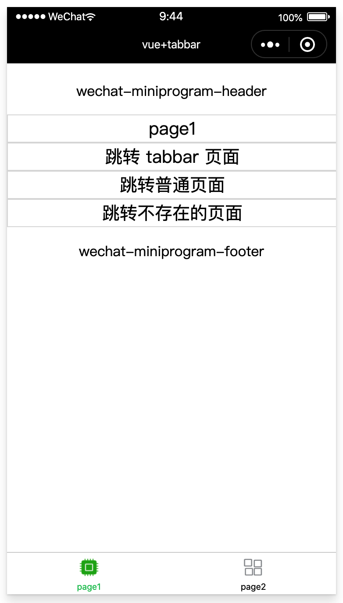
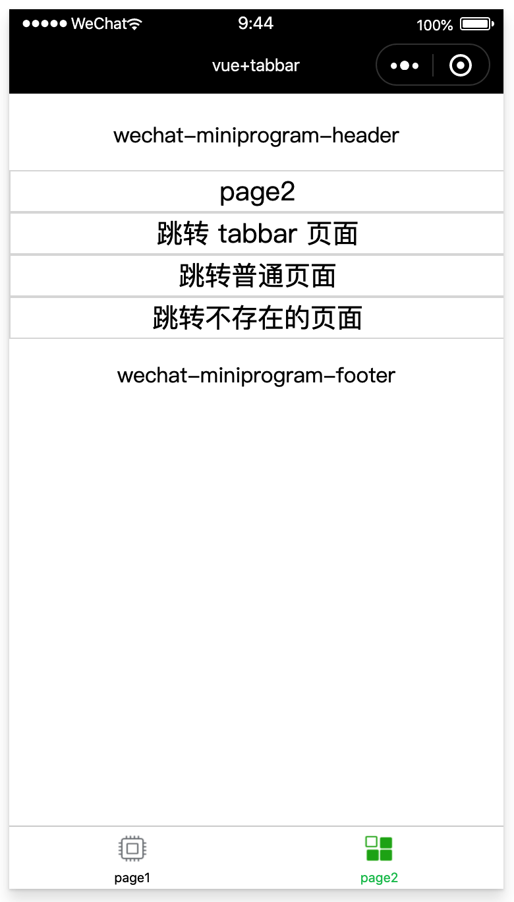
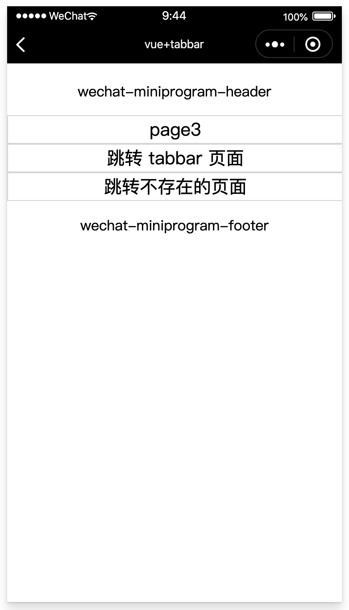

# vue+tabbar

如果小程序是一个多 tab 应用（客户端窗口的底部或顶部有 tab 栏可以切换页面），可以通过 tabBar 配置项指定 tab 栏的表现，以及 tab 切换时显示的对应页面。详见[小程序 tabbar](https://developers.weixin.qq.com/miniprogram/dev/reference/configuration/app.html)

### 1、用法

在 kbone 中定制原生小程序的 tabbar, 需要配置 `miniprogram.config` 的 generate.tabBar，具体如下：

```js
generate: {
  tabBar: {
    color: '#000000',
    selectedColor: '#07c160',
    backgroundColor: '#ffffff',
    list: [{
      pageName: 'page1',
      text: 'page1',
      iconPath: path.resolve(__dirname, '../src/img/page1.png'),
      selectedIconPath: path.resolve(__dirname, '../src/img/page1-sel.png'),
    }, {
      pageName: 'page2',
      text: 'page2',
      iconPath: path.resolve(__dirname, '../src/img/page2.png'),
      selectedIconPath: path.resolve(__dirname, '../src/img/page2-sel.png'),
    }],
  },
},
```

### 2、案例

在 `kbone-advanced` 目录下创建 `11-vue-tabbar` 目录，本案例在这个目录下完成。

#### 2.1 创建 package.json

```
cd 11-vue-tabbar
npm init -y
```

编辑 package.json：

```json
{
  "scripts": {
    "mp": "cross-env NODE_ENV=production webpack --config build/webpack.mp.config.js --progress --hide-modules"
  },
  "dependencies": {
    "vue": "^2.5.11"
  },
  "browserslist": [
    "> 1%",
    "last 2 versions",
    "not ie <= 8"
  ],
  "devDependencies": {
    "babel-core": "^6.26.0",
    "babel-loader": "^7.1.2",
    "babel-preset-env": "^1.6.0",
    "babel-preset-stage-3": "^6.24.1",
    "cross-env": "^5.0.5",
    "css-loader": "^0.28.7",
    "extract-text-webpack-plugin": "^3.0.2",
    "file-loader": "^1.1.4",
    "html-webpack-plugin": "^4.0.0-beta.5",
    "mini-css-extract-plugin": "^0.5.0",
    "optimize-css-assets-webpack-plugin": "^5.0.1",
    "stylehacks": "^4.0.3",
    "vue-loader": "^15.7.0",
    "vue-template-compiler": "^2.6.10",
    "webpack": "^4.29.6",
    "webpack-cli": "^3.2.3",
    "mp-webpack-plugin": "latest"
  }
}
```

安装依赖包：

```
npm install
```

#### 2.2 配置 webpack

在 11-vue-tabbar/build 目录下创建 webpack.mp.config.js，内容如下：

```js
const path = require('path')
const webpack = require('webpack')
const MiniCssExtractPlugin = require('mini-css-extract-plugin')
const { VueLoaderPlugin } = require('vue-loader')
const OptimizeCSSAssetsPlugin = require('optimize-css-assets-webpack-plugin');
const TerserPlugin = require('terser-webpack-plugin')
const MpPlugin = require('mp-webpack-plugin') // 用于构建小程序代码的 webpack 插件

const isOptimize = false // 是否压缩业务代码，开发者工具可能无法完美支持业务代码使用到的 es 特性，建议自己做代码压缩

module.exports = {
  mode: 'production',
  entry: {
    page1: path.resolve(__dirname, '../src/page1/main.mp.js'),
    page2: path.resolve(__dirname, '../src/page2/main.mp.js'),
    page3: path.resolve(__dirname, '../src/page3/main.mp.js'),
  },
  output: {
    path: path.resolve(__dirname, '../dist/mp/common'), // 放到小程序代码目录中的 common 目录下
    filename: '[name].js', // 必需字段，不能修改
    library: 'createApp', // 必需字段，不能修改
    libraryExport: 'default', // 必需字段，不能修改
    libraryTarget: 'window', // 必需字段，不能修改
  },
  target: 'web', // 必需字段，不能修改
  optimization: {
    runtimeChunk: false, // 必需字段，不能修改
    splitChunks: { // 代码分隔配置，不建议修改
      chunks: 'all',
      minSize: 1000,
      maxSize: 0,
      minChunks: 1,
      maxAsyncRequests: 100,
      maxInitialRequests: 100,
      automaticNameDelimiter: '~',
      name: true,
      cacheGroups: {
        vendors: {
          test: /[\\/]node_modules[\\/]/,
          priority: -10
        },
        default: {
          minChunks: 2,
          priority: -20,
          reuseExistingChunk: true
        }
      }
    },

    minimizer: isOptimize ? [
      // 压缩CSS
      new OptimizeCSSAssetsPlugin({
        assetNameRegExp: /\.(css|wxss)$/g,
        cssProcessor: require('cssnano'),
        cssProcessorPluginOptions: {
          preset: ['default', {
            discardComments: {
              removeAll: true,
            },
            minifySelectors: false, // 因为 wxss 编译器不支持 .some>:first-child 这样格式的代码，所以暂时禁掉这个
          }],
        },
        canPrint: false
      }),
      // 压缩 js
      new TerserPlugin({
        test: /\.js(\?.*)?$/i,
        parallel: true,
      })
    ] : [],
  },
  module: {
    rules: [
      {
        test: /\.css$/,
        use: [
          MiniCssExtractPlugin.loader,
          'css-loader'
        ],
      },
      {
        test: /\.vue$/,
        loader: [
          'vue-loader',
        ],
      },
      {
        test: /\.js$/,
        use: [
          'babel-loader'
        ],
        exclude: /node_modules/
      },
      {
        test: /\.(png|jpg|gif|svg)$/,
        loader: 'file-loader',
        options: {
          name: '[name].[ext]?[hash]'
        }
      }
    ]
  },
  resolve: {
    extensions: ['*', '.js', '.vue', '.json']
  },
  plugins: [
    new webpack.DefinePlugin({
      'process.env.isMiniprogram': process.env.isMiniprogram, // 注入环境变量，用于业务代码判断
    }),
    new MiniCssExtractPlugin({
      filename: '[name].wxss',
    }),
    new VueLoaderPlugin(),
    new MpPlugin(require('./miniprogram.config.js')),
  ],
}
```

在 11-vue-tabbar/build 目录下创建 miniprogram.config.js，内容如下：

```js
const path = require('path')

module.exports = {	
	origin: 'https://test.miniprogram.com',	
	entry: '/',	
	router: {		
		page1: ['/a'],
		page2: ['/b'],
		page3: ['/c'],
	},	
	redirect: {		
		notFound: 'page1',		
		accessDenied: 'page1',
	},
	generate: {
		tabBar: {
      color: '#000000',
      selectedColor: '#07c160',
      backgroundColor: '#ffffff',
      list: [{
        pageName: 'page1',
        text: 'page1',
        iconPath: path.resolve(__dirname, '../src/img/page1.png'),
        selectedIconPath: path.resolve(__dirname, '../src/img/page1-sel.png'),
      }, {
        pageName: 'page2',
        text: 'page2',
        iconPath: path.resolve(__dirname, '../src/img/page2.png'),
        selectedIconPath: path.resolve(__dirname, '../src/img/page2-sel.png'),
      }],
    },
    autoBuildNpm: 'npm'
	},
	app: {
		navigationBarTitleText: 'vue+tabbar',
	},
	projectConfig: {
		appid: '',
    projectname: 'vue+tabbar',
	},
	packageConfig: {
		author: 'wechat-miniprogram',
	},
}
```

#### 2.3 创建 page1 组件

在 `/src/` 下创建 `page1` 文件夹，在这个文件夹下创建 `main.mp.js` 文件，内容如下：

```js
import Vue from 'vue'
import App from './App.vue'

export default function createApp() {
  const container = document.createElement('div')
  container.id = 'app'
  document.body.appendChild(container)

  return new Vue({
    el: '#app',
    render: h => h(App)
  })
}
```

在 `/src/page1` 下创建 `App.vue` 文件，内容如下：

```vue
<template>
  <div class="cnt">
    <Header></Header>
    <div class="content">page1</div>
    <a href="/b">跳转 tabbar 页面</a>
    <a href="/c" target="_blank">跳转普通页面</a>
    <a href="/d">跳转不存在的页面</a>
    <Footer></Footer>
  </div>
</template>

<script>
import Header from '../common/Header.vue'
import Footer from '../common/Footer.vue'

export default {
  name: 'App',
  components: {
    Header,
    Footer,
  },
}
</script>

<style>
.cnt {
  margin-top: 20px;
}

a, button, .content {
  display: block;
  width: 100%;
  height: 30px;
  line-height: 30px;
  text-align: center;
  font-size: 20px;
  border: 1px solid #ddd;
}
</style>
```

#### 2.4 创建 page2 组件

在 `/src/` 下创建 `page2` 文件夹，在这个文件夹下创建 `main.mp.js` 文件，内容如下：

```js
import Vue from 'vue'
import App from './App.vue'

export default function createApp() {
  const container = document.createElement('div')
  container.id = 'app'
  document.body.appendChild(container)

  return new Vue({
    el: '#app',
    render: h => h(App)
  })
}
```

在 `/src/page2` 下创建 `App.vue` 文件，内容如下：

```vue
<template>
  <div class="cnt">
    <Header></Header>
    <div class="content">page2</div>
    <a href="/a" target="_blank">跳转 tabbar 页面</a>
    <a href="/c" target="_blank">跳转普通页面</a>
    <a href="/d">跳转不存在的页面</a>
    <Footer></Footer>
  </div>
</template>

<script>
import Header from '../common/Header.vue'
import Footer from '../common/Footer.vue'

export default {
  name: 'App',
  components: {
    Header,
    Footer,
  },
}
</script>
```

#### 2.5 创建 page3 组件

在 `/src/` 下创建 `page3` 文件夹，在这个文件夹下创建 `main.mp.js` 文件，内容如下：

```js
import Vue from 'vue'
import App from './App.vue'

export default function createApp() {
  const container = document.createElement('div')
  container.id = 'app'
  document.body.appendChild(container)

  return new Vue({
    el: '#app',
    render: h => h(App)
  })
}
```

在 `/src/page3` 下创建 `App.vue` 文件，内容如下：

```vue
<template>
  <div class="cnt">
    <Header></Header>
    <div class="content">page3</div>
    <a href="/a">跳转 tabbar 页面</a>
    <a href="/d" target="_blank">跳转不存在的页面</a>
    <Footer></Footer>
  </div>
</template>

<script>
import Header from '../common/Header.vue'
import Footer from '../common/Footer.vue'

export default {
  name: 'App',
  components: {
    Header,
    Footer,
  },
}
</script>

<style>
.cnt {
  margin-top: 20px;
}

a, .content {
  display: block;
  width: 100%;
  height: 30px;
  line-height: 30px;
  text-align: center;
  font-size: 20px;
  border: 1px solid #ddd;
}
</style>
```

#### 2.6 小程序端效果预览

```
npm run mp
```



