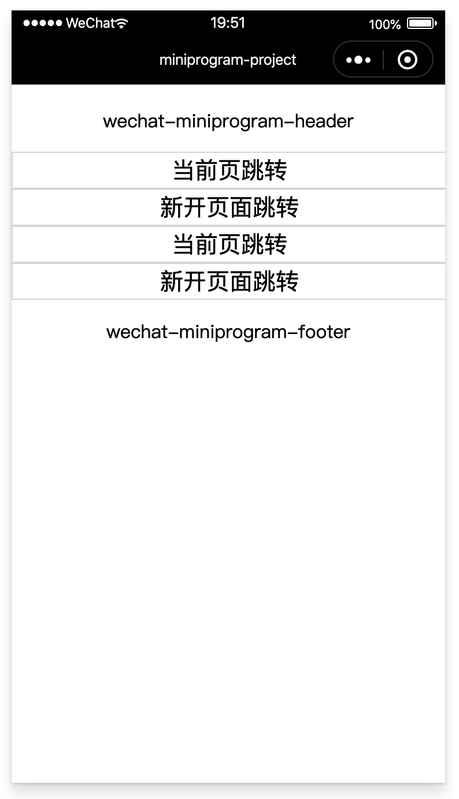

# Vue + 多页 + 分包

### 1、使用分包 

#### 1.1 配置方法

假设支持分包的小程序目录结构如下：

```
├── app.js
├── app.json
├── app.wxss
├── packageA
│   └── pages
│       ├── cat
│       └── dog
├── packageB
│   └── pages
│       ├── apple
│       └── banana
├── pages
│   ├── index
│   └── logs
└── utils
```

开发者通过在 app.json subpackages 字段声明项目分包结构：

> 写成 subPackages 也支持。

```json
{
  "pages":[
    "pages/index",
    "pages/logs"
  ],
  "subpackages": [
    {
      "root": "packageA",
      "pages": [
        "pages/cat",
        "pages/dog"
      ]
    }, {
      "root": "packageB",
      "name": "pack2",
      "pages": [
        "pages/apple",
        "pages/banana"
      ]
    }
  ]
}
```

subpackages 中，每个分包的配置有以下几项：

| 字段 |	类型 | 说明 |
| ---- | ---- | ---- |
| root | String | 分包根目录 |
| name | String | 分包别名，分包预下载时可以使用 |
| pages | StringArray |	分包页面路径，相对与分包根目录 |
| independent | Boolean |	分包是否是独立分包 |

#### 1.2 打包原则

- 声明 subpackages 后，将按 subpackages 配置路径进行打包，subpackages 配置路径外的目录将被打包到 app（主包） 中
- app（主包）也可以有自己的 pages（即最外层的 pages 字段）
- subpackage 的根目录不能是另外一个 subpackage 内的子目录
- tabBar 页面必须在 app（主包）内

#### 1.3 引用原则

- packageA 无法 require packageB JS 文件，但可以 require app、自己 package 内的 JS 文件
- packageA 无法 import packageB 的 template，但可以 require app、自己 package 内的 template
- packageA 无法使用 packageB 的资源，但可以使用 app、自己 package 内的资源

#### 1.4 低版本兼容
由微信后台编译来处理旧版本客户端的兼容，后台会编译两份代码包，一份是分包后代码，另外一份是整包的兼容代码。 新客户端用分包，老客户端还是用的整包，完整包会把各个 subpackage 里面的路径放到 pages 中。

### 2、分包预下载

>基础库 2.3.0 开始支持，低版本需做兼容处理。 开发者工具请使用 1.02.1808300 及以上版本，可点此下载。

开发者可以通过配置，在进入小程序某个页面时，由框架自动预下载可能需要的分包，提升进入后续分包页面时的启动速度。对于独立分包，也可以预下载主包。

分包预下载目前只支持通过配置方式使用，暂不支持通过调用API完成。

>vConsole 里有preloadSubpackages开头的日志信息，可以用来验证预下载的情况。

#### 2.1 配置方法

预下载分包行为在进入某个页面时触发，通过在 app.json 增加 preloadRule 配置来控制。

```
{
  "pages": ["pages/index"],
  "subpackages": [
    {
      "root": "important",
      "pages": ["index"],
    },
    {
      "root": "sub1",
      "pages": ["index"],
    },
    {
      "name": "hello",
      "root": "path/to",
      "pages": ["index"]
    },
    {
      "root": "sub3",
      "pages": ["index"]
    },
    {
      "root": "indep",
      "pages": ["index"],
      "independent": true
    }
  ],
  "preloadRule": {
    "pages/index": {
      "network": "all",
      "packages": ["important"]
    },
    "sub1/index": {
      "packages": ["hello", "sub3"]
    },
    "sub3/index": {
      "packages": ["path/to"]
    },
    "indep/index": {
      "packages": ["__APP__"]
    }
  }
}
```

preloadRule 中，key 是页面路径，value 是进入此页面的预下载配置，每个配置有以下几项：

| 字段 | 类型 | 必填 | 默认值 | 说明 |
| ---- | ---- | ---- | ---- | ---- |
| packages | StringArray | 是 | 无 | 进入页面后预下载分包的 root 或 name。__APP__ 表示主包。|
| network | String | 否 | wifi | 在指定网络下预下载，可选值为：all: 不限网络 wifi: 仅wifi下预下载 |

#### 2.2 限制

同一个分包中的页面享有共同的预下载大小限额 2M，限额会在工具中打包时校验。

如，页面 A 和 B 都在同一个分包中，A 中预下载总大小 0.5M 的分包，B中最多只能预下载总大小 1.5M 的分包。

### 3、案例

在 `kbone-advanced` 目录下创建 `12-subpackages` 目录，本案例在这个目录下完成。

#### 2.1 创建 package.json

```
cd 12-subpackages
npm init -y
```

编辑 package.json：

```json
{
  "scripts": {
    "mp": "cross-env NODE_ENV=production webpack --config build/webpack.mp.config.js --progress --hide-modules"
  },
  "dependencies": {
    "vue": "^2.5.11"
  },
  "browserslist": [
    "> 1%",
    "last 2 versions",
    "not ie <= 8"
  ],
  "devDependencies": {
    "babel-core": "^6.26.0",
    "babel-loader": "^7.1.2",
    "babel-preset-env": "^1.6.0",
    "babel-preset-stage-3": "^6.24.1",
    "cross-env": "^5.0.5",
    "css-loader": "^0.28.7",
    "extract-text-webpack-plugin": "^3.0.2",
    "file-loader": "^1.1.4",
    "html-webpack-plugin": "^4.0.0-beta.5",
    "mini-css-extract-plugin": "^0.5.0",
    "optimize-css-assets-webpack-plugin": "^5.0.1",
    "stylehacks": "^4.0.3",
    "vue-loader": "^15.7.0",
    "vue-template-compiler": "^2.6.10",
    "webpack": "^4.29.6",
    "webpack-cli": "^3.2.3",
    "mp-webpack-plugin": "latest"
  }
}
```

安装依赖包：

```
npm install
```

#### 2.2 配置 webpack

在 12-subpackages/build 目录下创建 webpack.mp.config.js，内容如下：

```js
const path = require('path')
const webpack = require('webpack')
const MiniCssExtractPlugin = require('mini-css-extract-plugin')
const {
  VueLoaderPlugin
} = require('vue-loader')
const OptimizeCSSAssetsPlugin = require('optimize-css-assets-webpack-plugin');
const TerserPlugin = require('terser-webpack-plugin')
const MpPlugin = require('mp-webpack-plugin') // 用于构建小程序代码的 webpack 插件

const isOptimize = false // 是否压缩业务代码，开发者工具可能无法完美支持业务代码使用到的 es 特性，建议自己做代码压缩

module.exports = {
  mode: 'production',
  entry: {
    page1: path.resolve(__dirname, '../src/page1/main.mp.js'),
    page2: path.resolve(__dirname, '../src/page2/main.mp.js'),
    page3: path.resolve(__dirname, '../src/page3/main.mp.js'),
    page4: path.resolve(__dirname, '../src/page4/main.mp.js'),
  },
  output: {
    path: path.resolve(__dirname, '../dist/mp/common'), // 放到小程序代码目录中的 common 目录下
    filename: '[name].js', // 必需字段，不能修改
    library: 'createApp', // 必需字段，不能修改
    libraryExport: 'default', // 必需字段，不能修改
    libraryTarget: 'window', // 必需字段，不能修改
  },
  target: 'web', // 必需字段，不能修改
  optimization: {
    runtimeChunk: false, // 必需字段，不能修改
    splitChunks: { // 代码分隔配置，不建议修改
      chunks: 'all',
      minSize: 1000,
      maxSize: 0,
      minChunks: 1,
      maxAsyncRequests: 100,
      maxInitialRequests: 100,
      automaticNameDelimiter: '~',
      name: true,
      cacheGroups: {
        vendors: {
          test: /[\\/]node_modules[\\/]/,
          priority: -10
        },
        default: {
          minChunks: 2,
          priority: -20,
          reuseExistingChunk: true
        }
      }
    },

    minimizer: isOptimize ? [
      // 压缩CSS
      new OptimizeCSSAssetsPlugin({
        assetNameRegExp: /\.(css|wxss)$/g,
        cssProcessor: require('cssnano'),
        cssProcessorPluginOptions: {
          preset: ['default', {
            discardComments: {
              removeAll: true,
            },
            minifySelectors: false, // 因为 wxss 编译器不支持 .some>:first-child 这样格式的代码，所以暂时禁掉这个
          }],
        },
        canPrint: false
      }),
      // 压缩 js
      new TerserPlugin({
        test: /\.js(\?.*)?$/i,
        parallel: true,
      })
    ] : [],
  },
  module: {
    rules: [{
        test: /\.css$/,
        use: [
          MiniCssExtractPlugin.loader,
          'css-loader'
        ],
      },
      {
        test: /\.vue$/,
        loader: [
          'vue-loader',
        ],
      },
      {
        test: /\.js$/,
        use: [
          'babel-loader'
        ],
        exclude: /node_modules/
      },
      {
        test: /\.(png|jpg|gif|svg)$/,
        loader: 'file-loader',
        options: {
          name: '[name].[ext]?[hash]'
        }
      }
    ]
  },
  resolve: {
    extensions: ['*', '.js', '.vue', '.json']
  },
  plugins: [
    new webpack.DefinePlugin({
      'process.env.isMiniprogram': process.env.isMiniprogram, // 注入环境变量，用于业务代码判断
    }),
    new MiniCssExtractPlugin({
      filename: '[name].wxss',
    }),
    new VueLoaderPlugin(),
    new MpPlugin(require('./miniprogram.config.js')),
  ],
}
```

在 12-subpackages/build 目录下创建 miniprogram.config.js，内容如下：

```js
module.exports = {
  origin: 'https://test.miniprogram.com',
  entry: '/',
  router: {
    page1: ['/a'],
    page2: ['/b'],
    page3: ['/c'],
    page4: ['/d/:id'],
  },
  redirect: {
    notFound: 'page1',
    accessDenied: 'page1',
  },
  generate: {
    // 分包
    subpackages: {
      package1: ['page2'],
      package2: ['page3', 'page4'],
    },
    // 分包预下载规则
    preloadRule: {
      page2: {
        network: 'all',
        packages: ['package2'],
      },
    },
    autoBuildNpm: 'npm'
  },
  app: {
    navigationBarTitleText: 'miniprogram-project',
  },
  projectConfig: {
    appid: '',
    projectname: 'kbone-demo7',
  },
  packageConfig: {
    author: 'wechat-miniprogram',
  },
}
```

#### 2.3 创建 page1 组件

在 `/src/` 下创建 `page1` 文件夹，在这个文件夹下创建 `main.mp.js` 文件，内容如下：

```js
import Vue from 'vue'
import App from './App.vue'

export default function createApp() {
  const container = document.createElement('div')
  container.id = 'app'
  document.body.appendChild(container)

  return new Vue({
    el: '#app',
    render: h => h(App)
  })
}
```

在 `/src/page1` 下创建 `App.vue` 文件，内容如下：

```vue
<template>
  <div class="cnt">
    <Header></Header>
    <a href="/b">当前页跳转</a>
    <a href="/c" target="_blank">新开页面跳转</a>
    <button @click="onClickJump">当前页跳转</button>
    <button @click="onClickOpen">新开页面跳转</button>
    <Footer></Footer>
  </div>
</template>

<script>
import Header from '../common/Header.vue'
import Footer from '../common/Footer.vue'

export default {
  name: 'App',
  components: {
    Header,
    Footer
  },
  created() {
    window.addEventListener('wxload', query => console.log('page1 wxload', query))
    window.addEventListener('wxshow', () => console.log('page1 wxshow'))
    window.addEventListener('wxready', () => console.log('page1 wxready'))
    window.addEventListener('wxhide', () => console.log('page1 wxhide'))
    window.addEventListener('wxunload', () => console.log('page1 wxunload'))
  },
  methods: {
    onClickJump() {
      window.location.href = '/b'
    },

    onClickOpen() {
      window.open('/c')
    },
  },
}
</script>

<style>
.cnt {
  margin-top: 20px;
}
a, button {
  display: block;
  width: 100%;
  height: 30px;
  line-height: 30px;
  text-align: center;
  font-size: 20px;
  border: 1px solid #ddd;
}
</style>
```

#### 2.4 创建 page2 组件

在 `/src/` 下创建 `page2` 文件夹，在这个文件夹下创建 `main.mp.js` 文件，内容如下：

```js
import Vue from 'vue'
import App from './App.vue'

export default function createApp() {
  const container = document.createElement('div')
  container.id = 'app'
  document.body.appendChild(container)

  return new Vue({
    el: '#app',
    render: h => h(App)
  })
}
```

在 `/src/page2` 下创建 `App.vue` 文件，内容如下：

```vue
<template>
  <div class="cnt">
    <Header></Header>
    <a href="/a">回到首页</a>
    <a href="/d/123" target="_blank">下一页</a>
    <button @click="onClickJump">回到首页</button>
    <Footer></Footer>
  </div>
</template>

<script>
import Header from '../common/Header.vue'
import Footer from '../common/Footer.vue'

export default {
  name: 'App',
  components: {
    Header,
    Footer
  },
  created() {
    window.addEventListener('wxload', query => console.log('page2 wxload', query))
    window.addEventListener('wxshow', () => console.log('page2 wxshow'))
    window.addEventListener('wxready', () => console.log('page2 wxready'))
    window.addEventListener('wxhide', () => console.log('page2 wxhide'))
    window.addEventListener('wxunload', () => console.log('page2 wxunload'))
  },
  methods: {
    onClickJump() {
      window.location.href = '/a'
    },
  },
}
</script>

<style>
.cnt {
  margin-top: 20px;
}
a, button {
  display: block;
  width: 100%;
  height: 30px;
  line-height: 30px;
  text-align: center;
  font-size: 20px;
  border: 1px solid #ddd;
}
</style>
```


#### 2.5 创建 page3 组件

在 `/src/` 下创建 `page3` 文件夹，在这个文件夹下创建 `main.mp.js` 文件，内容如下：

```js
import Vue from 'vue'
import App from './App.vue'

export default function createApp() {
  const container = document.createElement('div')
  container.id = 'app'
  document.body.appendChild(container)

  return new Vue({
    el: '#app',
    render: h => h(App)
  })
}
```

在 `/src/page3` 下创建 `App.vue` 文件，内容如下：

```vue
<template>
  <div class="cnt">
    <Header></Header>
    <button @click="onClickBack">回到上一页</button>
    <Footer></Footer>
  </div>
</template>

<script>
import Header from '../common/Header.vue'
import Footer from '../common/Footer.vue'

export default {
  name: 'App',
  components: {
    Header,
    Footer
  },
  created() {
    window.addEventListener('wxload', query => console.log('page3 wxload', query))
    window.addEventListener('wxshow', () => console.log('page3 wxshow'))
    window.addEventListener('wxready', () => console.log('page3 wxready'))
    window.addEventListener('wxhide', () => console.log('page3 wxhide'))
    window.addEventListener('wxunload', () => console.log('page3 wxunload'))
  },
  methods: {
    onClickBack() {
      if (process.env.isMiniprogram) {
        wx.navigateBack()
      }
    },
  },
}
</script>

<style>
.cnt {
  margin-top: 20px;
}
a, button {
  display: block;
  width: 100%;
  height: 30px;
  line-height: 30px;
  text-align: center;
  font-size: 20px;
  border: 1px solid #ddd;
}
</style>
```

#### 2.6 创建 page4 组件

在 `/src/` 下创建 `page4` 文件夹，在这个文件夹下创建 `main.mp.js` 文件，内容如下：

```js
import Vue from 'vue'
import App from './App.vue'

export default function createApp() {
  const container = document.createElement('div')
  container.id = 'app'
  document.body.appendChild(container)

  return new Vue({
    el: '#app',
    render: h => h(App)
  })
}
```

在 `/src/page4` 下创建 `App.vue` 文件，内容如下：

```vue
<template>
  <div class="cnt">
    <Header></Header>
    <div>url: {{url}}</div>
    <button @click="onClickBack">回到上一页</button>
    <Footer></Footer>
  </div>
</template>

<script>
import Header from '../common/Header.vue'
import Footer from '../common/Footer.vue'

export default {
  name: 'App',
  components: {
    Header,
    Footer
  },
  data() {
    return {
      url: '',
    }
  },
  created() {
    window.addEventListener('wxload', query => console.log('page4 wxload', query))
    window.addEventListener('wxshow', () => console.log('page4 wxshow'))
    window.addEventListener('wxready', () => console.log('page4 wxready'))
    window.addEventListener('wxhide', () => console.log('page4 wxhide'))
    window.addEventListener('wxunload', () => console.log('page4 wxunload'))
  },
  mounted() {
    this.url = window.location.href
  },
  methods: {
    onClickBack() {
      if (process.env.isMiniprogram) {
        wx.navigateBack()
      }
    },
  },
}
</script>

<style>
.cnt {
  margin-top: 20px;
}
a, button {
  display: block;
  width: 100%;
  height: 30px;
  line-height: 30px;
  text-align: center;
  font-size: 20px;
  border: 1px solid #ddd;
}
</style>
```

#### 2.7 小程序端效果预览

```
npm run mp
```

