# 一、微信开放社区实现方案

### 1、问题分析

在基础部分提到了[Kbone的诞生背景](../basics/01-Kbone简介.md)，接下来就来探讨下具体方案的实现。

社区 Web 端是基于 Vue 实现的，使用了 Vue-router、Vuex 等插件。Vue 想必大家挺熟悉的了，它是市面上一款非常流行的 Web 框架，提供组件化等特性，其原理大致如下：

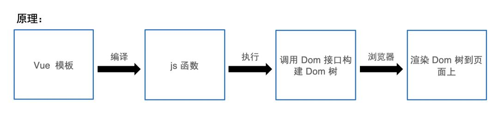

Vue 模板可以认为是一种附加了一些特殊语法的 HTML 片段，一般来说一份 Vue 模板对应一个组件，在构建阶段编译成调用 Dom 接口的 JS 函数，调用此 JS 函数就会创建出组件对应的 Dom 树片段进而渲染到浏览器上。小程序里是支持运行 JS 的，但是**这里用到的 Dom 接口和渲染到浏览器上的功能小程序不具备，所以无法直接将 Web 端社区代码移植到小程序中。原因就在于小程序**为了安全和性能而采用了双线程的架构，运行用户 JS 代码的逻辑层是一个纯粹的 JSCore，没有任何浏览器相关的实现，这里得想办法将 Web 端代码转成小程序代码。

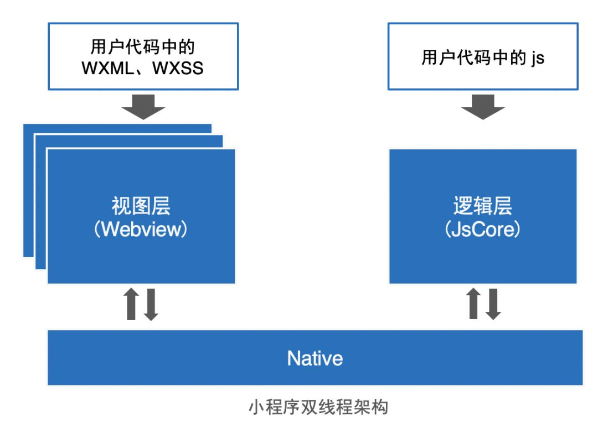

**业界常见做法：将 Vue 模板或 React JSX 直接转成小程序的 WXML 模板**

那么问题来了，如何将 Vue 代码转成小程序代码？这里先看下业界常见的做法：将 Vue 模板直接转成小程序的 WXML 模板。

使用做法相当于抛弃了浏览器中建 Dom 树的过程，而是直接交由小程序来对模板进行编译创建出小程序的模板树，进而渲染到小程序页面中。

一般来说这个做法对于普通场景是够用的，但是对于一些更复杂的场景就很不好处理了，比如社区中的一个简单例子：社区帖子详情展示富文本内容，点击内容中的图片可预览。

这主要是因为 Vue 模板和 WXML 模板的语法并不是直接对等的，Vue 的特性设计也和小程序的设计无法划等号，这自然就导致了部分 Vue 特性的丢失。比如像 Vue 中的 v-html 指令、ref 获取 Dom 节点、过滤器等就通通用不了。当然不止是 Vue 自身的特性，一些原本依赖 Dom/Bom 接口的 Vue 插件也无法使用，比如 Vue-router 等，而这些正是社区高度依赖的，在不对社区代码做大范围改造的话是无法使用此方案的。

下面引自官方的 Taro 架构和 uni-app 功能框架图：

##### (1) Taro 架构

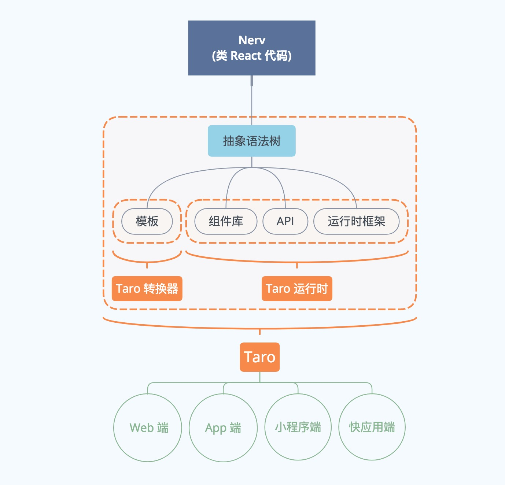

对于微信小程序这样不开放不开源的端，Taro 先把 React 代码分析成一颗抽象语法树，根据这颗树生成小程序支持的模板代码，再做一个小程序运行时框架处理事件和生命周期与小程序框架兼容，然后把业务代码跑在运行时框架就完成了小程序端的适配。

对于 React 已经支持的端，例如 Web、React Native 甚至未来的 React VR，只要包一层组件库再做些许样式支持即可。鉴于时下小程序的热度和 Taro 团队本身的业务侧重程度，组件库的 API 是以小程序为标准，其他端的组件库的 API 都会和小程序端的组件保持一致。 

##### (2) uni-app 功能框架图

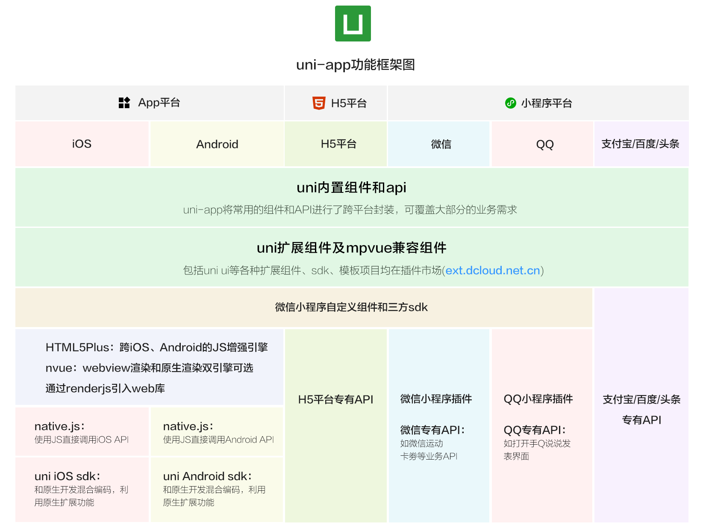

从上面 uni-app 功能框架图可看出，uni-app在跨平台的过程中，不牺牲平台特色，可优雅的调用平台专有能力，真正做到海纳百川、各取所长。

### 2、解决思路

Taro 和 uni-app 方案行不通，那还有其他的方法么？

换个思路：做一个适配层

答案是有的，这里我们就得换一种思路来解决这个问题。回到最初的点上，我们无法将 Web 端代码移植到小程序中是因为小程序没有 Dom 接口，那么我们想办法做出一个适配层，将这个差异给抹掉不就行了么？

有了想法就要实施，仿造出 Dom 接口并不难，事实上在 Nodejs 端就有人做过类似的事，比如 jsDom 这个库的实现，让我们可以在没有真实浏览器环境下可以对一些依赖 Dom 接口的 Web 端代码进行测试。

仿造了 Dom 接口给 Vue 调用，进而创建出了仿造 Dom 树。根据前面提到的小程序架构，用户的 JS 代码是执行在逻辑层的，也就是说我们创建出的 Dom 树也是存在与逻辑层的内存之中，**接下来要解决的难题是如何将这棵 Dom 树渲染到小程序页面中。**

这里需要先简单介绍一下**小程序的渲染原理：**小程序的双线程架构，逻辑层会执行用户的 JS 代码进而产生一组数据，这组数据会发往视图层；视图层接收到数据后，结合用户的 WXML 模板创建出组件树，之后小程序再将组件树渲染出来。这里的组件树和 Dom 树很类似，只是它是由官方内置组件或自定义组件拼接而成而不是 Dom 节点。这里我们能不能将仿造出来的 Dom 树映射到小程序的组件树上？

小程序组件树是根据 WXML 模板创建出来的，而仿造 Dom 树结构是不稳定的，我们无法提前预知它会生成什么样的结构，也就无法提前准备后可以描述任意 Dom 树的 WXML 模板，除非直接将 Vue 模板转换成 WXML 模板，但这样又绕回前面的问题上了。

**小程序组件树中的组件有两种：内置组件和自定义组件**，内置组件是由官方提供的如 video、map 这样的组件，而自定义组件是一种支持由用户利用现有组件自行组装的组件，能否利用它来做些什么？

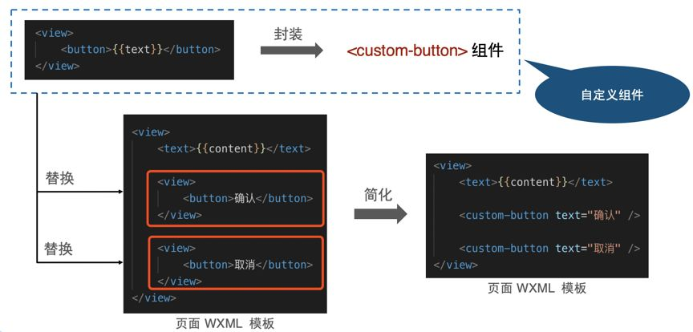

比如上图的例子，我们封装了一个 custom-dom 组件，这个组件里面也使用了 custom-dom 组件用于渲染子组件。那么只要我们执行一下 setData，把 children 数据传递过去就可以创建出子组件，子组件本身也是 custom-dom 组件，它同样可以执行这个逻辑把各自的子组件创建出来，这样就实现了组件的递归创建，只要我们拥有完整的 Dom 树结构，就可以创建出相对应的一棵组件树。

这里递归的终止条件是遇到特定节点、文本节点或者孩子节点为空。然后在创建出组件树后，将 Dom 节点和自定义组件实例进行绑定以便后续的 Dom 更新和操作即可。

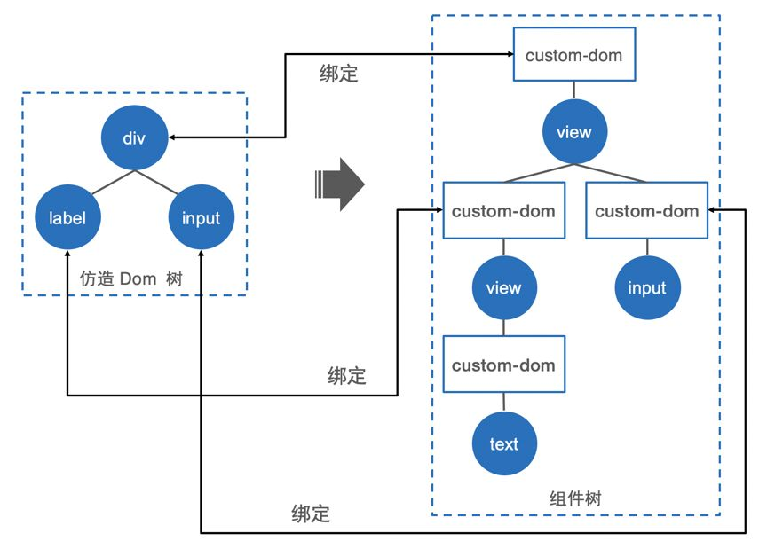

**如何监听用户操作？**

接下来，如果用户在界面上进行了操作，触发了一些事件的话，那么代码中要如何监听这些事件呢？小程序本身有自己的事件系统，它和 Web 端事件系统类似，但是出于以下几个原因导致我们无法直接使用小程序的事件系统：

- 小程序支持的事件表现和 Web 端不一致，比如 input 事件在小程序中不可冒泡。

- 小程序的捕获冒泡是在 Webview 端，因此逻辑层在整个捕获冒泡流程中各个节点接收到的事件不是同一个对象。

- 小程序事件对象和 Web 端事件对象结构不一样。

- 小程序事件的捕获冒泡以及阻止冒泡等操作必须在 WXML 模板中声明，无法使用接口实现。

- 小程序本身是基于 Web Component 特性来实现的组件体系，其事件来源只能判定来自于当前 shadow tree 下的哪个节点，而不能跨 shadow tree 判断。

综上所述，最好的解决方法就是把事件系统也仿造一份，在仿造 Dom 树上进行捕获冒泡。当自定义组件监听到用户的操作后，就将事件发往仿造 Dom 树，后续自定义组件监听到的同一个事件的冒泡就直接忽略。而 Dom 树接收到事件后，再进行捕获和冒泡，让事件在各个节点触发，这样的话整套体系都可以按照 Web 端的方式进行实现，对于用户来说，只管按照 Web 端的用法来进行事件监听即可。

**重要细节一：如何将 Dom 树传递给视图层？**

整套方案的大致思路便是如此，接下来介绍几个实现过程中比较重要的细节，其一：如何将 Dom 树传递给视图层？

这其实就是自定义组件要如何做 setData 的问题。我们一开始想到的方式是直接将整棵 Dom 树传递给自定义组件，然后自定义组件在递归创建子组件时一步步透传下去。这个做法的好处是一劳永逸，只有在最顶层的自定义组件需要管理 Dom 树和 setData，其他自定义组件只管接收数据进行渲染即可，但是这样也带了问题：每次更新需要做大范围的 diff，因为 setData 是从根组件发起的；当遇到一些局部更新时可能需要 setData 大量的数据，也就是会传输一些不必要的数据。

那么自然而然的，我们便想到让每个自定义组件只 setData 当前节点的数据，每个自定义组件只考虑当前绑定的 Dom 节点，然后创建出子节点，这样虽然会增加 setData 的数量，但是带来的好处便是可以做到最小范围 diff，同时每次 setData 的数据量也可以降到最小。

**细节其二：自定义组件实例的创建其实是会有比较大开销的，有没有办法减少一些自定义组件实例的创建？**

按照先前的构想，一个自定义组件绑定一个 Dom 节点，所以自定义组件实例数量等于 Dom 节点数量。

其中一个思路是对 Dom 节点进行删减，这个实现比较简单，只要是不展示在页面上的节点，直接从 Dom 树上干掉就可以了，这样自定义组件数量也会相应减少。

另一个思路是调整映射关系，让一个自定义组件绑定多个 Dom 节点。我们可以对 Dom 树按照一定规则进行裁剪，拆分成多棵子树，然后每个自定义组件管理一棵子树，这样的话也可以减少大部分自定义组件的创建。

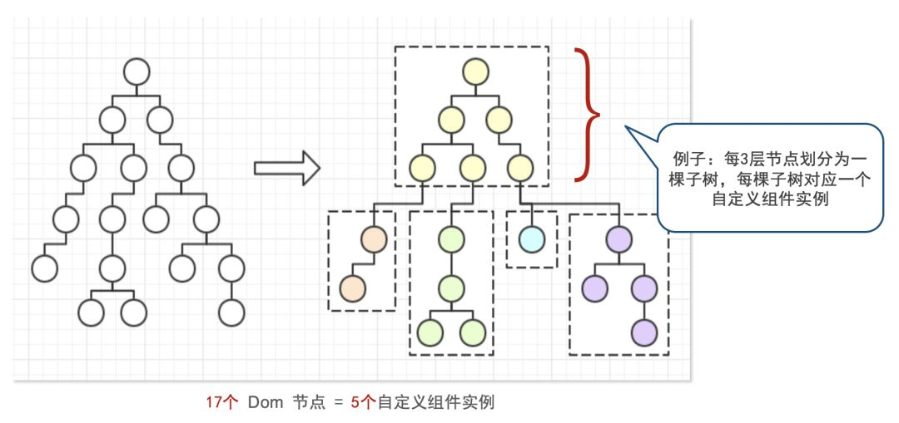

除此之外，我们可以考虑对叶子节点也进行一些处理。我们使用自定义组件来渲染的初衷就是为了可以动态递归创建出子节点，而当一个节点没有子节点的情况下，我们就不需要使用自定义组件来渲染了，所以叶子节点可以合并到父级棵子树中（如上图的蓝色节点合并到黄色节点所在的子树中），直接使用 view 内置组件来渲染即可。

当然还有其他的一些细节，比如 Dom 对象复用、对象延迟创建等等，这里就不一一展开说明了，有兴趣的朋友可以通过源码来了解。

对于这个方案，性能也需要有一定的保证，我们随机模拟了一些类似社区首页的 Dom 树，对其首次渲染耗时进行测算，其对比如下：

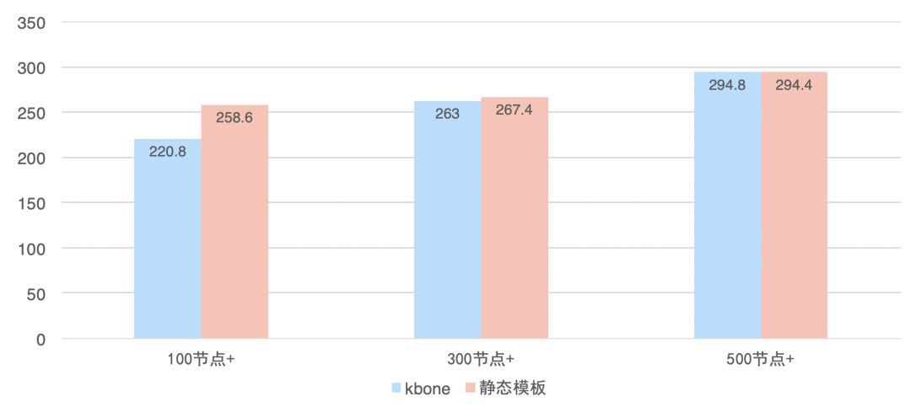

可以看到在 500 节点内的两个方案本身性能差不多，不过因为自定义组件实例创建的开销，在千节点往上的情况下会落后于静态模板方案，因为 Kbone 本身是通过牺牲性能来换取更全面的 Web 端兼容，而通常一个小程序页面的节点数在 100-500 这个区间浮动，因此这个表现是符合预期的。

以上就是 **Kbone 这个适配器方案的大致设计思路，我们将其归纳为两个模块：仿造接口和自定义组件。**正因为这个方案是通过提供适配器的方式来仿造出 Web 环境，所以用户代码不需要做任何修改，大部分特性都可以继续使用不需要被删减，比如 vue-router、window.location 操作等。

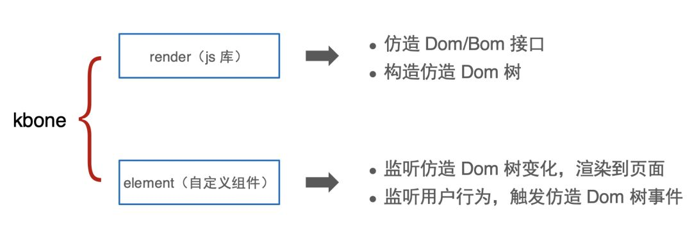

# 二、微信开放社区应用效果

方案部分以已介绍完毕，接下来说说这个方案要如何应用到我们一开始的背景——微信开放社区上。

前面有简单提到，原本 Web 端代码是基于 Vue 来搭建的，其中还用到了诸多插件/库，如 Vue-router、Vuex、Markdown-it 等，同时还支持了服务端渲染。但是不管 Web 端是怎么实现的，底层终究是调浏览器的那些接口，所以**对于用户层面的代码我们不做任何调整，只是将浏览器那一层替换掉即可。**

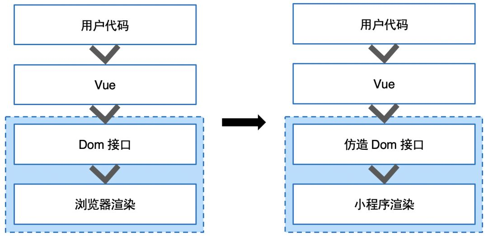

整个构建流程是基于 Webpack 来实现的，使用 Kbone 构建出小程序代码也是基于 Webpack 来实现，只需要在原本 Web 端构建流程上实现一个 Webpack 插件，在构建原本 Web 端代码到小程序端时追加 Kbone 和一些小程序相关的代码即可。

在整套方案应用的过程中，肯定也会有些定制化的需求，比如希望小程序端头部和 H5 端不同，不同端使用不同的交互设计：

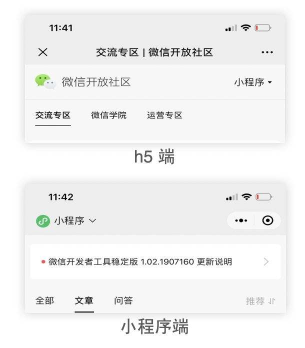

我们可以构建的时候就注入环境变量，在小程序端将 process.env.isMiniprogram 设为 true，这样用户代码层面可以通过判断这个变量来判断不同环境，进而执行不同的逻辑。

**除此之外，还希望使用小程序的一些特性，比如小程序端支持使用小程序的分享，**那么除了上述的环境变量外，还需要用到小程序的 button 内置组件来实现分享按钮。在 Kbone 上可以使用一个特殊的标签 wx-button 来表示 button 内置组件，在调 Kbone 的仿造 Dom 接口时会将其 wx- 前缀的标签识别成内置组件，进而进行特殊处理。

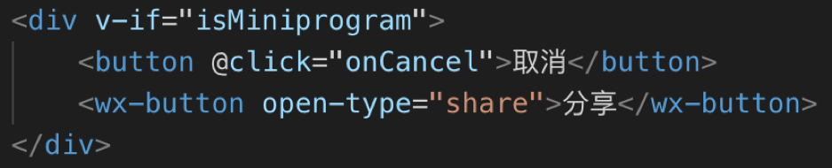

整个社区小程序的**功能完善之后，便要思忖一下代码体积的问题，**因为小程序本身有个 2M 限制。缩减代码体积的方式大家应该都了解了很多了，如：压缩混淆、代码分割和公共代码复用、tree shaking、使用分包等等。

还有就是考虑到小程序端是直接复用 Web 端代码，但是并不是所有 Web 端代码都需要在小程序端做到，那么在处理模块依赖时可以做点手脚。因为都使用的 Webpack 构建，所以可以编写一个 loader，在 import/require 的时候追加上，它可以根据前面注入的环境变量来判断要不要将代码进行打包。

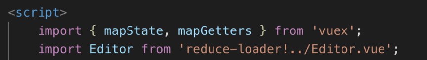

这样就可以很方便地指定哪些代码不要构建到小程序端。

**整体实现出来的效果如下，** 左边是 H5 端，右边是小程序端：

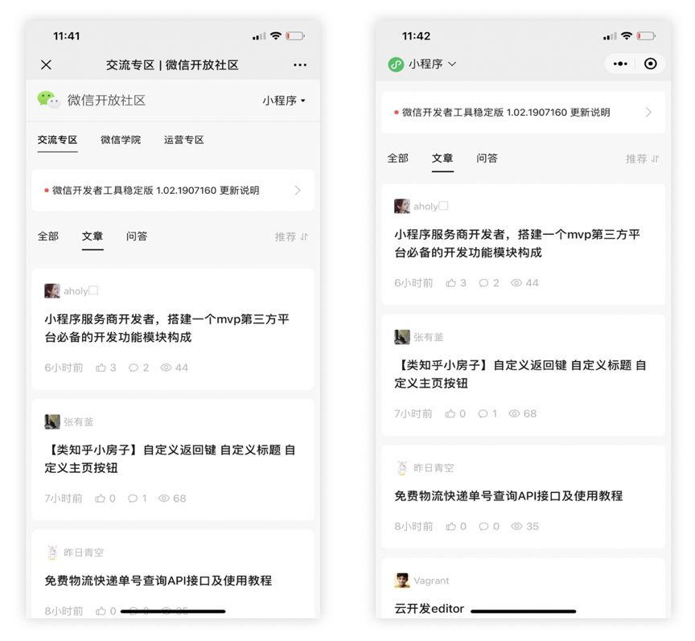

Web 端链接：

https://developers.weixin.qq.com/community/develop/mixflow

小程序码：

# 总结

这一整套方案的实现和应用大致如此，其原理并不算复杂，只是用了另一种思路来实现。目前这一套方案即名为 Kbone，现已整理并开源到 GitHub 上：https://github.com/wechat-miniprogram/Kbone。

考虑到这个方案本身是通过最底层的适配方式来完成同构，那么除了 Vue 外，它其实也可以很轻松地移植到其他的 Web 框架上，比如 React、Preact、Omi 等，下面是一些基于这些框架的简单 demo：

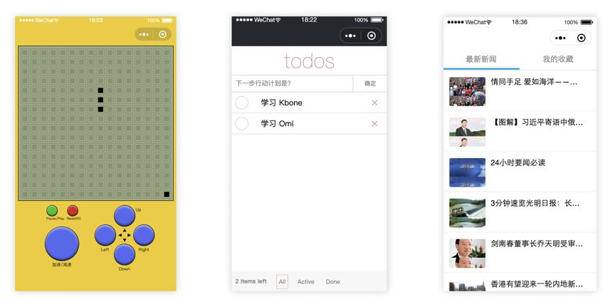

在上述 GitHub 仓库内也可以找到这些框架的 demo，尽管各个 Web 框架的实现、语法都有所不同，但毕竟其本质上是相同的，最终都会转化为 Dom 接口调用来渲染页面。

也正因如此，可以看到 Kbone 这套方案最大的优势：扩展性强、对各个特性的支持全面、对代码编写的要求少以及自由度高、不需要修改 Web 框架的底层实现，这样对于代码的维护、升级也都更为简单方便。

# 参考文献
- https://blog.csdn.net/QcloudCommunity/article/details/103047374?depth_1-utm_source=distribute.pc_relevant.none-task&utm_source=distribute.pc_relevant.none-task

- https://aotu.io/notes/2018/06/07/Taro/

- https://uniapp.dcloud.io/README