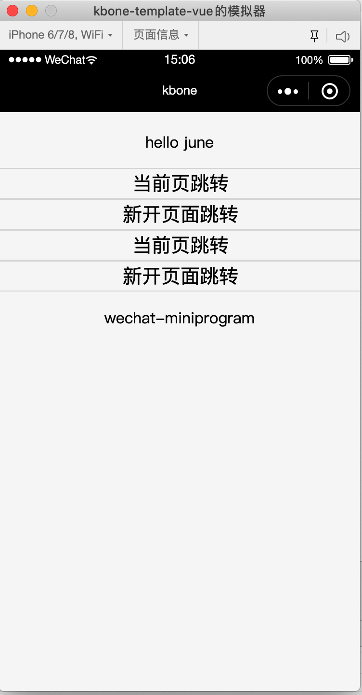
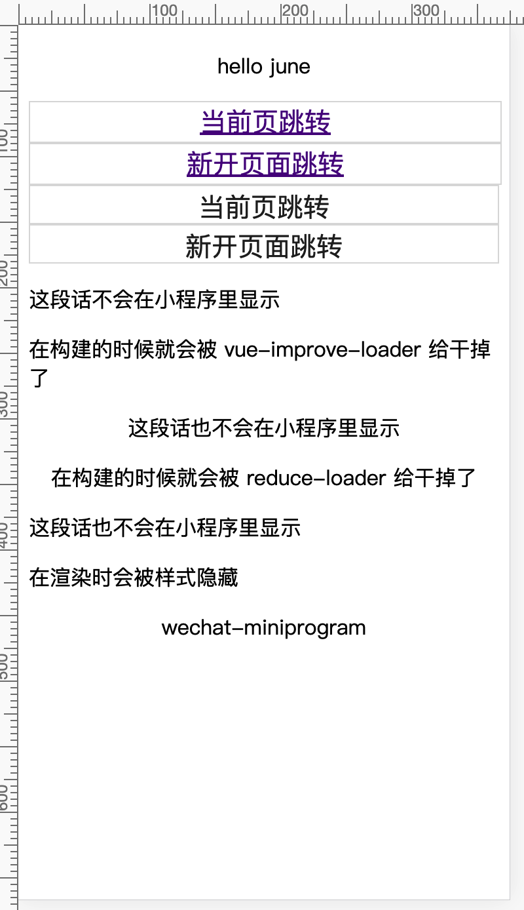

# 使用 kbone-cli 快速开发

**1、对于新项目，可以使用 kbone-cli 来创建项目，首先安装 kbone-cli:**
```
npm install -g kbone-cli
```

**2、创建项目：**

```
kbone init kbone-vue
模板选择 vue
```

**3、进入项目，按照 README.md 的指引进行开发：**

```
// 开发小程序端
npm run mp

// 开发 Web 端
npm run web

// 构建 Web 端
npm run build
```

执行 npm run mp 命令后，[下载安装好微信开发者工具](https://developers.weixin.qq.com/miniprogram/dev/devtools/download.html)，打开工具，导入kbone-basic/dist/mp文件，即可预览项目效果：



执行 npm run web 命令后，在浏览器中预览效果：



执行 npm run build 命令后，会生成 dist/web 文件夹，里面是static静态文件和index.html入口文件。

> PS：项目基于 webpack 构建，关于 webpack 方面的配置可以[点此查看](https://webpack.js.org/configuration/)，而关于小程序构建相关的详细配置细节可以[参考此文档](https://wechat-miniprogram.github.io/kbone/docs/guide/tutorial)。