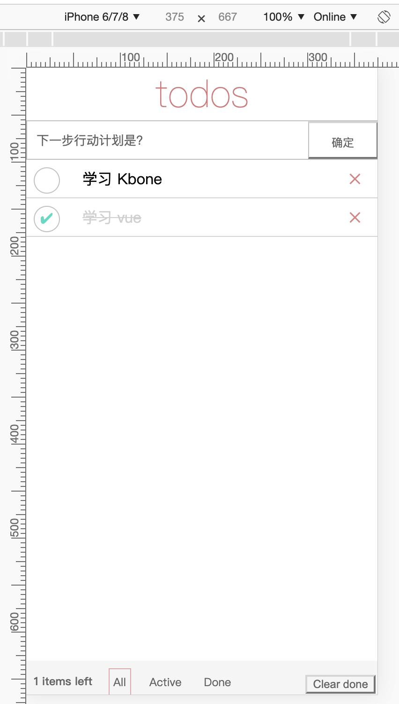
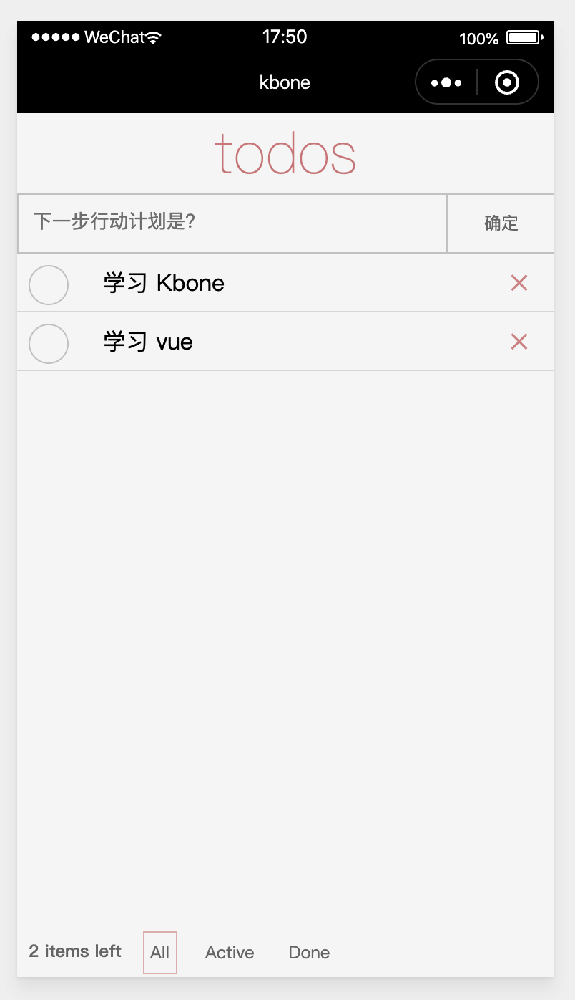

# Vue + Kbone 实现 Todos App

### 1、搭建Vue开发环境

在命令行输入以下命令，创建一个 `vue-todos` 项目：

```
// 在全局安装 @vue/cli
npm install -g @vue/cli

// 在kbone目录下创建vue-todos项目
vue create vue-todos

// 运行项目
cd vue-todos
npm serve
```

### 2、编写Vue todos代码

#### 2.1 改写main.js

将 `main.js` 引入的 `App.vue` 组件替换为 `Todos.vue` 组件：

```js
import Vue from 'vue'
import Todos from './Todos.vue'

Vue.config.productionTip = false

new Vue({
  render: h => h(Todos),
}).$mount('#app')
```

#### 2.2 编写 Todo.vue 组件

在项目 `src` 目录下，创建 `Todos.vue` 文件：

```vue
<template>
  <div class="container">
    <div class="title">todos</div>
    <div class="form">
      <input class="new-todo" v-model="inputText" placeholder="下一步行动计划是？"></input>
      <button class="add-btn" @click="newTodo">确定</button>
    </div>
    <div class="todo-list">
      <div 
        :class="item.done ? 'todo-item done' : 'todo-item'" 
        v-for="item in todo"
        v-if="type === 'all' || (type === 'active' && !item.done) || (type === 'done' && item.done)"
        :key="item.id"
      >
        <div class="toggle" :data-id="item.id" @click="toggle"></div>
        <div >{{ item.text }} </div>
        <div class="delete" :data-id="item.id" @click="deleteItem"></div>
      </div>
    </div>
    <div class="footer">
      <div class="todo-count"><div class="strong">{{ left }} items left</div> </div>
      <div class="filters">
        <div class='ib' data-filter='all' @click="filter">
          <div :class="type === 'all' ? 'selected' : ''" >All</div>
        </div>
        <div class='ib' data-filter='active' @click="filter">
          <div :class="type === 'active' ? 'selected' : ''" >Active</div>
        </div>
        <div class='ib' data-filter='done' @click="filter">
          <div :class="type === 'done' ? 'selected' : ''" >Done</div>
        </div>
      </div>
      <button v-if="done > 0" class="clear-completed" @click="clear">Clear done</button>
    </div>
  </div>
</template>

<script>
export default {
  name: 'todo',
  data() {
    return {
      id: 1,
      todo: [{ text: '学习 Kbone', id: 0, done: false }, { text: '学习 vue', id: 1, done: false }],
      left: 2,
      type: 'all',
      done: 0,
      inputText: ''
    }
  },
  computed: {
    route() {
      return this.$route.path
    }
  },
  methods: {
    toggle(evt) {
      for (let i = 0, len = this.todo.length; i < len; i++) {
        const item = this.todo[i]
        if (item.id === Number(evt.currentTarget.dataset.id)) {
          item.done = !item.done
          this.computeCount()
          break
        }
      }
    },
    newTodo() {
      if (this.inputText.trim() === '') {
        return
      }

      this.todo.unshift({
        text: this.inputText,
        id: ++this.id,
        done: false,
        createTime: new Date()
      })
      this.computeCount()
      this.inputText = ''
    },
    deleteItem(evt) {
      for (let i = 0, len = this.todo.length; i < len; i++) {
        const item = this.todo[i]
        if (item.id === Number(evt.currentTarget.dataset.id)) {
          this.todo.splice(i, 1)
          this.computeCount()
          break
        }
      }
    },
    computeCount() {
      this.left = 0
      this.done = 0
      for (let i = 0, len = this.todo.length; i < len; i++) {
        this.todo[i].done ? this.done++ : this.left++
      }
    },

    filter(evt) {
      this.type = evt.currentTarget.dataset.filter
    },
    clear() {
      for (let i = 0, len = this.todo.length; i < len; i++) {
        const item = this.todo[i]
        if (item.done) {
          this.todo.splice(i, 1)
          len--
          i--
        }
      }
      this.done = 0
    }
  }
}
</script>

<style>
body {
  margin: 0;
}
.userinfo {
  display: flex;
  flex-direction: column;
  align-items: center;
}

.userinfo-nickname {
  color: #aaa;
}

.title{
    width: 100%;
    font-size: 40px;
    font-weight: 100;
    text-align: center;
    color: rgba(175, 47, 47, 0.55);
    -webkit-text-rendering: optimizeLegibility;
    -moz-text-rendering: optimizeLegibility;
    text-rendering: optimizeLegibility;
}

.new-todo{
  height: 38px;
  border: none;
  padding-left: 10px;
  /* background: rgba(0, 0, 0, 0.003); */
  display: inline-block;
  width: 280px;
}
.new-todo:after{
  border: none;
}

.add-btn{
  position: absolute;
  width: 20%;
  min-width: 70px;
  height: 40px;
  right: 0px;
  top:0px;
  border-left: 1px solid #ccc;
  border-radius: 0px;
  outline: none;
  appearance: none;
  -webkit-appearance:none;
  background: none;
  line-height: 40px;
  text-align:center;
}

.add-btn:after {
  border: none;
}

.form{
  position: relative;
  width: 100%;
  height: 40px;
  border: 1px solid #ccc;
}

.todo-list{
  width: 100%;
  padding-bottom: 40px;
}

.todo-item{
  position: relative;
 height: 40px;
 line-height: 40px;
 padding-left: 60px;
 border-bottom: 1px solid #ddd;
}

.toggle{
  position: absolute;
  left:8px;
  width: 26px;
  top:8px;
  height: 26px;
  border-radius: 50%;
  border: 1px solid #ccc;
  display: inline-block;
}

.toggle:after{
  display: none;
}

.done .toggle:after{
  display: block;
  content: '✔';
  position: relative;
  top:-8px;
  left:6px;
  color: #79ddce;
}

.delete{
  position: absolute;
  right: 8px;
  width: 32px;
  height: 32px;
  text-align: center;
  display: inline-block;
  color: rgba(175, 47, 47, 0.5);
  top:0px;
}

.delete:after{
  content: '✕'
}

.done{
    color: #d9d9d9;
    text-decoration: line-through;
}

todo-footer{
  width: 100%;
  position: fixed;
  bottom: 0;
  background-color: white;
}

.add-btn:active{
  background-color: #ddd;
}

button {
  background: none;
  font-size: 12px;
  color: #777;
}

button:after {
  border: none;
}

.todo-count {
  position: absolute;
  left: 8px;
  top: 8px;
  }

.ib {
  display: inline-block;
}

.footer {
  height: 40px;
  line-height: 28px;
  width: 100%;
  font-size: 12px;
  background-color: rgb(247, 247, 247);
  color: #777;
  position: fixed;
  bottom: 0px;
}

.clear-completed {
  position: absolute;
  top: 15px;
  right: 4px;
}

.filters {
  margin-left: 80px;
}

.filters .ib view, .filters .ib div {
  padding:0 4px;
  margin: 8px;
}

.selected{
  border: 1px solid rgba(175, 47, 47, 0.3);
}

.strong{
  font-weight: 500;
}

</style>
```

#### 2.3 项目预览效果

在控制台执行 `npm serve` 命令，浏览器效果如下：



### 3、将vue项目编入Kbone

#### 3.1 改写kbone-vue项目main.js文件

```js
import Vue from 'vue'
import Todos from './Todos.vue'

Vue.config.productionTip = false

new Vue({
  el: '#app',
  render: h => h(Todos),
})
```

#### 3.2 拷贝Totos.vue组件

拷贝 `Todos.vue` 到 `kbone-vue` 项目的 `src` 根目录下。

#### 3.3 编写 todos.mp.js

在 `kbone-vue` 项目的 `src/mp` 根目录下，创建 `todos.mp.js` 文件：

```js
import Vue from 'vue'
import todo from '../Todos.vue'

export default function createApp() {
  const container = document.createElement('div')
  container.id = 'app'
  document.body.appendChild(container)

  return new Vue({
    el: '#app',
    render: h => h(todo)
  })
}
```

#### 3.4 修改kbone-vue项目的webpack.mp.config.js

```js
// ...

module.exports = {
  // ...

  entry: {
    // js 入口
    todos: path.resolve(__dirname, '../src/mp/todos.mp.js'),
    // ...
  },

  // ...
}
```

> 注意：确保 `todos` 在 `entry` 里位于第一个key，这样 `todos` 对应的页面就是小程序的默认打开页面。

#### 3.5 项目预览效果

在控制台执行 `npm run mp` 或者 `npm run build` 命令，在小程序开发工具中导入 `kbone-vue/dist/mp`, 效果如下：

