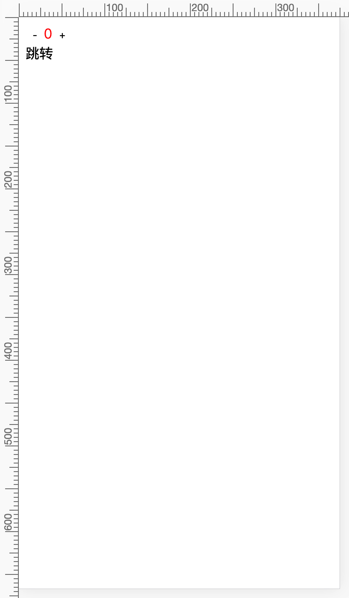
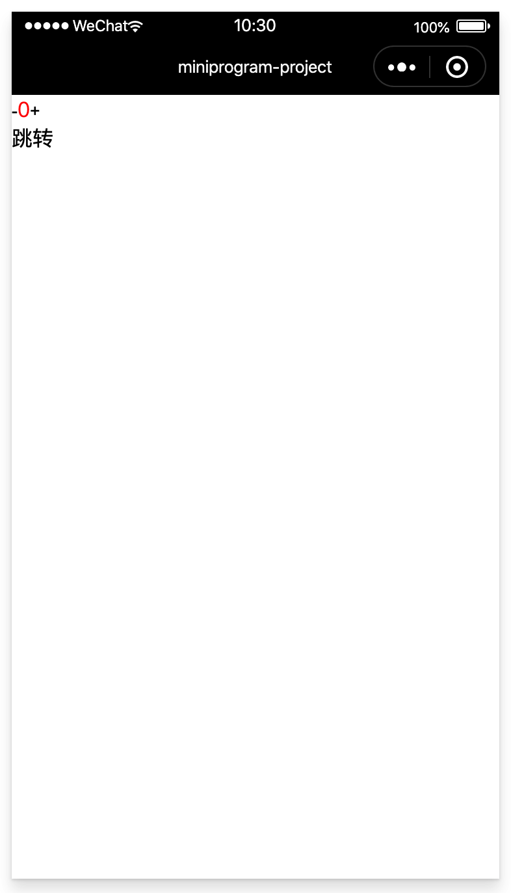
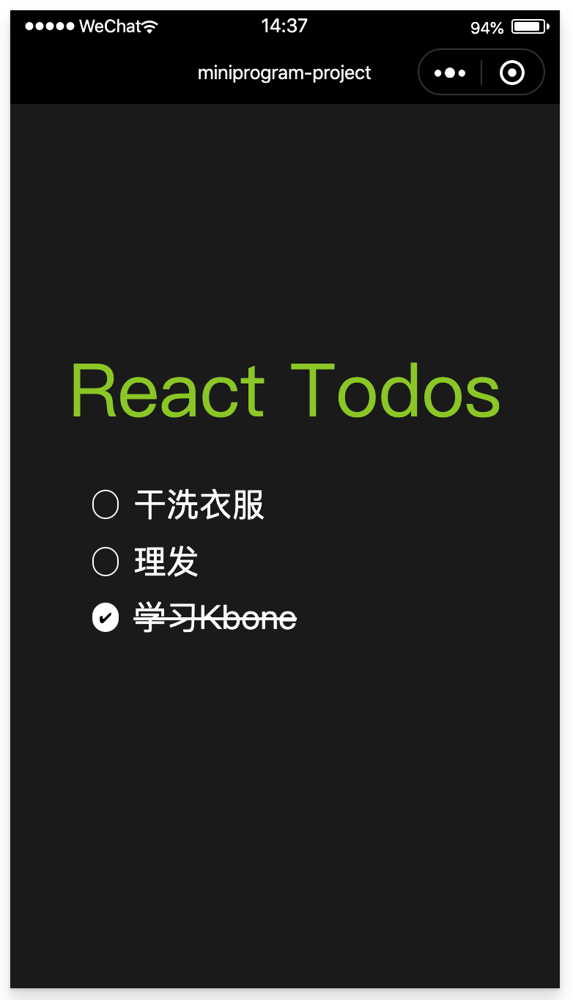

# React + Kbone 实现 Todos App

### 1、搭建React开发环境

在命令行输入以下命令，创建一个 `react-todos` 项目：

```
// 如果全局没有安装create-react-app, 可以使用npx安装
npx create-react-app react-todos

// 运行项目
cd react-todos
npm start
```

### 2、编写React todos代码

#### 2.1 改写index.js

引入组件Todos.js。

```js
// ...

import Todos from './Todos';
// ...

ReactDOM.render(<Todos />, document.getElementById('root'));
// ...
```

#### 2.2 编写 Todos.css

在项目目录 `react-todos/src` 下创建 `Todos.css`：

```css
body {
  background-color: #222222;
  min-height: 100vh;
}

.app {
  padding-top: 10rem;
}

.header {
  display: flex;
  flex-direction: column;
  align-items: center;
  justify-content: center;
  font-size: 50px;
  color: yellowgreen;
}

.logo {
  animation: App-logo-spin infinite 20s linear;
  height: 2vmin;
  pointer-events: none;
}

.todo-list {
  display: flex;
  flex-direction: column;
  align-items: center;
  justify-content: center;
  color: white;
}

.todo {
  display: flex;
  align-items: center;
  margin: 1rem 0;
}

.todo-is-completed .checkbox {
  color: #000;
  background: #fff;
}

.todo-is-completed input {
  text-decoration: line-through;
}

.checkbox {
  width: 18px;
  height: 18px;
  border-radius: 50%;
  margin-right: 10px;
  cursor: pointer;
  font-size: 10px;
  display: flex;
  justify-content: center;
  align-items: center;
  transition: background-color .2s ease-in-out;
  border: 1px solid #fff;
}

.checkbox:hover {
  background: rgba(255, 255, 255, 0.25);
  border: 1px solid rgba(255, 255, 255, 0);
}

.checkbox-checked {
  color: #000;
  background: #fff;
}

ul {
  list-style: none;
  padding: 0;
  line-height: 2rem;
}

input {
  border: none;
  background: transparent;
  color: white;
  font-size: 1.4rem;
  outline: none;
  width: 100%;
}
```

#### 2.3 编写 Todos.js 组件

在项目目录 `react-todos/src` 下创建 `Todos.js`：

```js
import React, { useState } from 'react'
import './Todos.css'

function Todos() {
  const [todos, setTodos] = useState([
    {
      content: '干洗衣服',
      isCompleted: true,
    },
    {
      content: '理发',
      isCompleted: false,
    },
    {
      content: '学习Kbone',
      isCompleted: false,
    }
  ])

  function handleKeyDown(e, i) {
    if (e.key === 'Enter') {
      createTodoAtIndex(e, i)
    }
    if (e.key === 'Backspace' && todos[i].content === '') {
      e.preventDefault();
      return removeTodoAtIndex(i)
    }
  }

  function createTodoAtIndex(e, i) {
    const newTodos = [...todos];
    newTodos.splice(i + 1, 0, {
      content: '',
      isCompleted: false,
    })
    setTodos(newTodos);
    setTimeout(() => {
      document.forms[0].elements[i + 1].focus();
    }, 0)
  }

  function updateTodoAtIndex(e, i) {
    const newTodos = [...todos]
    newTodos[i].content = e.target.value
    setTodos(newTodos)
  }

  function removeTodoAtIndex(i) {
    if (i === 0 && todos.length === 1) return
    setTodos(todos => todos.slice(0, i).concat(todos.slice(i + 1, todos.length)))
    setTimeout(() => {
      document.forms[0].elements[i - 1].focus()
    }, 0)
  }

  function toggleTodoCompleteAtIndex(index) {
    const temporaryTodos = [...todos]
    temporaryTodos[index].isCompleted = !temporaryTodos[index].isCompleted
    setTodos(temporaryTodos)
  }

  return (
    <div className="app">
      <div className="header">
        React Todos
      </div>
      <form className="todo-list">
        <ul>
          {todos.map((todo, i) => (
            <div key={todo+i} className={`todo ${todo.isCompleted && 'todo-is-completed'}`}>
              <div className={'checkbox'} onClick={() => toggleTodoCompleteAtIndex(i)}>
                {todo.isCompleted && (
                  <span>&#x2714;</span>
                )}
              </div>
              <input
                type="text"
                value={todo.content}
                onKeyDown={e => handleKeyDown(e, i)}
                onChange={e => updateTodoAtIndex(e, i)}
              />
            </div>
          ))}
        </ul>
      </form>
    </div>
  )
}

export default Todos
```

#### 2.4 项目预览效果

在控制台执行 `npm start` 命令，浏览器效果如下：


### 3、将 React 项目编入Kbone

#### 3.1 搭建Kbone的React环境

```
kbone init kbone-react
模板选择 react

cd kbone-react
npm run web
npm run mp
```

效果如下图：




#### 3.2 修改 index.js

修改 `kbone-react/src/index.js`：

```js
// ...
// import Counter from './components/counter'
import Todos from './components/todos/Todos'

export default function createApp() {
  // ...

  ReactDOM.render(<Todos />, container)
}

// ...
```

#### 3.3 创建 Todos.js 组件

在 kbone-react/src/components 下创建 todos文件夹，创建Todos.js，内容如下：

```js
import React, { useState } from 'react'
import './Todos.css'

function Todos() {
  const [todos, setTodos] = useState([
    {
      content: '干洗衣服',
      isCompleted: true,
    },
    {
      content: '理发',
      isCompleted: false,
    },
    {
      content: '学习Kbone',
      isCompleted: false,
    }
  ])

  function handleKeyDown(e, i) {
    if (e.key === 'Enter') {
      createTodoAtIndex(e, i)
    }
    if (e.key === 'Backspace' && todos[i].content === '') {
      e.preventDefault();
      return removeTodoAtIndex(i)
    }
  }

  function createTodoAtIndex(e, i) {
    const newTodos = [...todos];
    newTodos.splice(i + 1, 0, {
      content: '',
      isCompleted: false,
    })
    setTodos(newTodos);
    setTimeout(() => {
      document.forms[0].elements[i + 1].focus();
    }, 0)
  }

  function updateTodoAtIndex(e, i) {
    const newTodos = [...todos]
    newTodos[i].content = e.target.value
    setTodos(newTodos)
  }

  function removeTodoAtIndex(i) {
    if (i === 0 && todos.length === 1) return
    setTodos(todos => todos.slice(0, i).concat(todos.slice(i + 1, todos.length)))
    setTimeout(() => {
      document.forms[0].elements[i - 1].focus()
    }, 0)
  }

  function toggleTodoCompleteAtIndex(index) {
    const temporaryTodos = [...todos]
    temporaryTodos[index].isCompleted = !temporaryTodos[index].isCompleted
    setTodos(temporaryTodos)
  }

  return (
    <div className="app">
      <div className="header">
        React Todos
      </div>
      <form className="todo-list">
        <ul>
          {todos.map((todo, i) => (
            <div key={todo+i} className={`todo ${todo.isCompleted && 'todo-is-completed'}`}>
              <div className={'checkbox'} onClick={() => toggleTodoCompleteAtIndex(i)}>
                {todo.isCompleted && (
                  <span>&#x2714;</span>
                )}
              </div>
              <input
                type="text"
                value={todo.content}
                onKeyDown={e => handleKeyDown(e, i)}
                onChange={e => updateTodoAtIndex(e, i)}
              />
            </div>
          ))}
        </ul>
      </form>
    </div>
  )
}

export default Todos
```

#### 3.4 创建 Todos.css 样式

```css
body {
  background-color: #222222;
  min-height: 100vh;
}

.app {
  padding-top: 10rem;
}

.header {
  display: flex;
  flex-direction: column;
  align-items: center;
  justify-content: center;
  font-size: 50px;
  color: yellowgreen;
}

.logo {
  animation: App-logo-spin infinite 20s linear;
  height: 2vmin;
  pointer-events: none;
}

.todo-list {
  display: flex;
  flex-direction: column;
  align-items: center;
  justify-content: center;
  color: white;
}

.todo {
  display: flex;
  align-items: center;
  margin: 1rem 0;
}

.todo-is-completed .checkbox {
  color: #000;
  background: #fff;
}

.todo-is-completed input {
  text-decoration: line-through;
}

.checkbox {
  width: 18px;
  height: 18px;
  border-radius: 50%;
  margin-right: 10px;
  cursor: pointer;
  font-size: 10px;
  display: flex;
  justify-content: center;
  align-items: center;
  transition: background-color .2s ease-in-out;
  border: 1px solid #fff;
}

.checkbox:hover {
  background: rgba(255, 255, 255, 0.25);
  border: 1px solid rgba(255, 255, 255, 0);
}

.checkbox-checked {
  color: #000;
  background: #fff;
}

ul {
  list-style: none;
  padding: 0;
  line-height: 2rem;
}

input {
  border: none;
  background: transparent;
  color: white;
  font-size: 1.4rem;
  outline: none;
  width: 100%;
}
```

#### 3.5 项目预览效果

命令行进入 kbone-react 目录，执行：

```
npm run web
npm run mp (或者 npm start)
```



