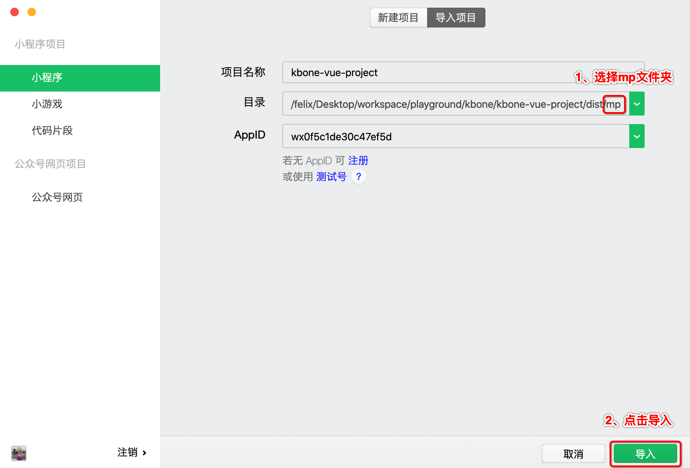
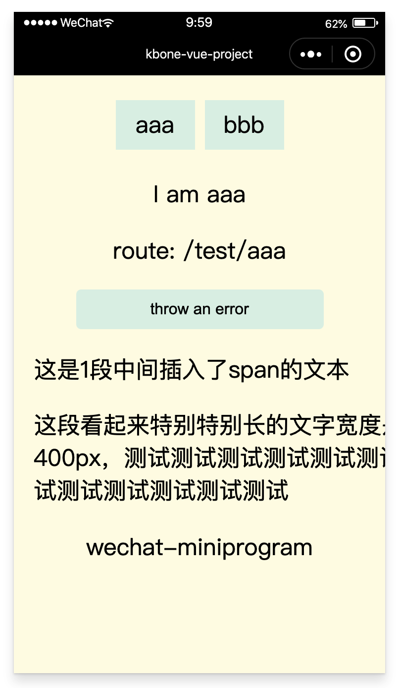

# Kbone + Vue 项目手工搭建流程

此方案基于 webpack 构建实现，构建 web 端代码的流程无需做任何调整，此处只介绍如何将源码构建成小程序端代码。

### 1、搭建 webpack 环境

在本地手工搭建一个 webpack 环境。在任意目录下执行以下命令：

```
// 创建项目目录
mkdir kbone-vue-project

// 生成 Node 包管理配置文件
cd kbone-vue-project
npm init -y

// 安装 webpack, webpack-cli
npm install webpack webpack-cli --save-dev
```

### 2、编写 webpack 配置

#### 2.1 webpack.mp.config.js

在项目跟目录下创建文件夹 build，在 build 下面新建一个 webpack.mp.config.js 文件，用于小程序端代码的构建，文件内容如下：

```js
const path = require('path')
const webpack = require('webpack')
const MiniCssExtractPlugin = require('mini-css-extract-plugin')
const { VueLoaderPlugin } = require('vue-loader')
const OptimizeCSSAssetsPlugin = require('optimize-css-assets-webpack-plugin');
const TerserPlugin = require('terser-webpack-plugin')
const MpPlugin = require('mp-webpack-plugin') // 用于构建小程序代码的 webpack 插件

const isOptimize = false // 是否压缩业务代码，开发者工具可能无法完美支持业务代码使用到的 es 特性，建议自己做代码压缩

module.exports = {
  mode: 'production',
  
  entry: {
    index: path.resolve(__dirname, '../src/index/main.mp.js'),
  },

  output: {
    path: path.resolve(__dirname, '../dist/mp/common'), // 放到小程序代码目录中的 common 目录下
    filename: '[name].js', // 必需字段，不能修改
    library: 'createApp', // 必需字段，不能修改
    libraryExport: 'default', // 必需字段，不能修改
    libraryTarget: 'window', // 必需字段，不能修改
  },

  target: 'web', // 必需字段，不能修改

  optimization: {
    runtimeChunk: false, // 必需字段，不能修改
    splitChunks: { // 代码分隔配置，不建议修改
      chunks: 'all',
      minSize: 1000,
      maxSize: 0,
      minChunks: 1,
      maxAsyncRequests: 100,
      maxInitialRequests: 100,
      automaticNameDelimiter: '~',
      name: true,
      cacheGroups: {
        vendors: {
          test: /[\\/]node_modules[\\/]/,
          priority: -10
        },
        default: {
          minChunks: 2,
          priority: -20,
          reuseExistingChunk: true
        }
      }
    },

    minimizer: isOptimize ? [
      // 压缩CSS
      new OptimizeCSSAssetsPlugin({
        assetNameRegExp: /\.(css|wxss)$/g,
        cssProcessor: require('cssnano'),
        cssProcessorPluginOptions: {
          preset: ['default', {
            discardComments: {
              removeAll: true,
            },
            minifySelectors: false, // 因为 wxss 编译器不支持 .some>:first-child 这样格式的代码，所以暂时禁掉这个
          }],
        },
        canPrint: false
      }),
      // 压缩 js
      new TerserPlugin({
        test: /\.js(\?.*)?$/i,
        parallel: true,
      })
    ] : [],
  },

  module: {
    rules: [
      {
        test: /\.css$/,
        use: [
          MiniCssExtractPlugin.loader,
          'css-loader'
        ],
      },
      {
        test: /\.vue$/,
        loader: 'vue-loader',
      },
      {
        test: /\.js$/,
        use: [
          'babel-loader'
        ],
        exclude: /node_modules/
      },
      {
        test: /\.(png|jpg|gif|svg)$/,
        loader: 'file-loader',
        options: {
          name: '[name].[ext]?[hash]'
        }
      }
    ]
  },

  resolve: {
    extensions: ['*', '.js', '.vue', '.json']
  },

  plugins: [
    new webpack.DefinePlugin({
      'process.env.isMiniprogram': process.env.isMiniprogram, // 注入环境变量，用于业务代码判断
    }),
    new MiniCssExtractPlugin({
      filename: '[name].wxss',
    }),
    new VueLoaderPlugin(),
    new MpPlugin(require('./miniprogram.config.js')),
  ],
}
```

#### 2.2 安装依赖

安装上述配置文件里的 loader 和 plugin 依赖：

```
npm install babel-loader @babel/core css-loader file-loader mini-css-extract-plugin vue-loader vue-template-compiler optimize-css-assets-webpack-plugin terser-webpack-plugin mp-webpack-plugin --save-dev
```

#### 2.3 编写 webpack 插件配置

这里的 webpack 插件配置即 MpPlugin 的配置参数文件。在 build 文件夹下创建 miniprogram.config.js 文件，内容如下：

```js
module.exports = {
  // 页面 origin，默认是 https://miniprogram.default
  origin: 'https://test.miniprogram.com',
  
  // 入口页面路由
  entry: '/test/aaa',
  
  // 页面路由，用于页面间跳转。其值是一个以页面名称作为 key 的对象，每项的值是该页面可以响应的路由
	router: {
		index: [
			'/test/aaa',
			'/test/bbb',
		],
  },
  
  // 特殊路由跳转
	redirect: {	
		notFound: 'index',	
		accessDenied: 'index',
  },
  
  // 构建输出配置
	generate: {
    /**
     * 注入全局变量，每一项为 [key, value] 的结构。构建时会将需要注入的全局变量声明在所有要执行的代码之前，以方便代码里直接使用。
     * 如果配置了 ['TEST_VAR_STRING', '\'miniprogram\'']，则会生成类似 var TEST_VAR_STRING = 'miniprogram' 的声明语句；
     * 不指定 value 的话，则会从 window 下读取，如 ['CustomEvent'] 则会生成类似 var CustomEvent = window.CustomEvent 的声明语句。
     */
		globalVars: [
      ['TEST_VAR_STRING', '\'miniprogram\''],
      ['TEST_VAR_NUMBER', '123'],
      ['TEST_VAR_BOOL', 'true'],
      ['TEST_VAR_FUNCTION', 'function() {return \'I am function\'}'],
			['TEST_VAR_OTHERS', 'window.document'],
			['open'],
    ],
    
    // 构建完成后是否自动安装小程序依赖。'npm'：使用 npm 自动安装依赖
		autoBuildNpm: 'npm',
  },
  
  // 小程序全局配置，参见 https://developers.weixin.qq.com/miniprogram/dev/reference/configuration/app.html#window
	app: {
		navigationBarTitleText: 'kbone-vue-project',
  },
  
  // 所有页面的全局配置
	global: {
		rem: true, // 是否支持 rem
    pageStyle: true, // 是否支持修改页面样式
  },
  
  // 项目配置，会被合并到 project.config.json 中
	projectConfig: {
		appid: '',
    projectname: 'kbone-vue-project',
  },
  
  // 包配置，会被合并到 package.json 中
	packageConfig: {
		author: 'wechat-miniprogram',
	},
}
```

### 3、新增入口文件

**3.1 在项目根目录下创建 `src/index` 目录，在 `index` 目录下创建 `main.mp.js`文件：**

```js
import Vue from 'vue'
import Router from 'vue-router'
import App from './App.vue'
import AAA from './AAA.vue'
import BBB from './BBB.vue'

export default function createApp() {
  const container = document.createElement('div')
  container.id = 'app'
  document.body.appendChild(container)

  // rem 和页面样式修改
  window.onload = function() {
    document.documentElement.style.fontSize = wx.getSystemInfoSync().screenWidth / 16 + 'px'
    document.documentElement.style.backgroundColor = '#fffbe7'
  }
  window.onerror = (message, source, lineno, colno, error) => {
    console.log('window.onerror => ', message, source, lineno, colno, error)
  };
  window.addEventListener('error', evt => console.log('window.addEventListener(\'error\') =>', evt))

  Vue.use(Router)

  const router = new Router({
    mode: 'history', // 是否使用 history api
    routes: [
      { path: '/test/aaa', component: AAA },
      { path: '/test/bbb', component: BBB }
    ]
  })

  return new Vue({
    el: '#app',
    router,
    render: h => h(App)
  })
}
```

**3.2 安装 Vue Vue-router**

```
npm install vue vue-router
```

### 4、构建项目文件

**4.1 创建App.vue**

在 `index` 目录下创建 `App.vue` 文件，实现了：

- 路由组件的展示和路由切换
- 载入子组件
- 全局变量的测试
- cookie的测试
- 抛出异常的测试

```vue
<template>
  <div>
    <ul class="tabbar">
      <li><router-link class="link" to="/test/aaa">aaa</router-link></li>
      <li><router-link class="link" to="/test/bbb">bbb</router-link></li>
    </ul>
    <router-view></router-view>
    <button class="btn" @click="throwError">throw an error</button>
    <div style="margin-left: 20px;">
      <p>这是<span>1</span>段中间插入了span的文本</p>
    </div>
    <div style="margin: 20px;">
      <p style="width: 400px;">这段看起来特别特别长的文字宽度是400px，测试测试测试测试测试测试测试测试测试测试测试测试</p>
    </div>
    <Footer/>
  </div>
</template>

<script>
import Footer from '../common/Footer.vue'
export default {
  name: 'App',
  components: {
    Footer,
  },
  mounted() {
    console.log(TEST_VAR_STRING)
    console.log(TEST_VAR_NUMBER)
    console.log(TEST_VAR_BOOL)
    console.log(TEST_VAR_FUNCTION)
    console.log(TEST_VAR_OTHERS)
    console.log(open)
    console.log('HTMLElement --> ', HTMLElement)
    console.log('Element --> ', Element)
    console.log('Node --> ', Node)
    console.log('localStorage --> ', localStorage)
    console.log('sessionStorage --> ', sessionStorage)
    console.log('navigator --> ', navigator)
    console.log('history --> ', history)
    console.log('location --> ', location)
    console.log('performance --> ', performance)
    console.log('Image --> ', Image)
    console.log('CustomEvent --> ', CustomEvent)
    console.log('Event --> ', Event)
    console.log('requestAnimationFrame --> ', requestAnimationFrame)
    console.log('cancelAnimationFrame --> ', cancelAnimationFrame)
    // cookie
    console.log('before set cookie', document.cookie)
    document.cookie = `time=${+new Date()}; expires=Wed Jan 01 2220 00:00:00 GMT+0800; path=/`
    console.log('after set cookie', document.cookie)
  },
  methods: {
    throwError() {
      setTimeout(() => {
        throw new Error('I am an error')
      }, 0)
    },
  },
}
</script>

<style>
.tabbar {
  margin-top: 20px;
  padding: 0;
  width: 100%;
  display: flex;
  list-style: none;
  justify-content: center;
}
.tabbar li {
  position: relative;
  display: block;
  height: 50px;
  width: 80px;
  text-align: center;
  line-height: 50px;
  background: #dff1e7;
  margin: 5px;
}
.tabbar li .link {
  display: block;
  width: 100%;
  height: 100%;
}
.btn {
  display: block;
  margin: 15px auto;
  width: 250px;
  height: 40px;
  line-height: 40px;
  text-align: center;
  color: #000;
  font-size: 16px;
  background: #dff1e7;
  border-radius: 5px;
}
</style>
```

**4.2 创建 Footer.vue组件**

在 `src` 目录下创建 `common` 目录，在 `common` 目录下创建 `Footer.vue` 文件：

```vue
<template>
  <div class="footer">
    <p>wechat-miniprogram</p>
  </div>
</template>

<script>
export default {}
</script>

<style>
.footer {
  margin-top: 10px;
  width: 100%;
  text-align: center;
}
</style>
```

**4.3 创建 AAA.vue 组件**

在 `src/index` 目录下创建 `AAA.vue` 组件：

```vue
<template>
  <div class="cnt">
    <p>I am aaa</p>
    <p>route: {{route}}</p>
  </div>
</template>

<script>
export default {
  name: 'AAA',
  computed: {
    route() {
      return this.$route.path
    }
  }
}
</script>

<style>
.cnt {
  width: 100%;
  text-align: center;
}
</style>
```

**4.4 创建 AAA.vue 组件**

在 `src/index` 目录下创建 `BBB.vue` 组件：

```vue
<template>
  <div class="cnt">
    <p>I am bbb</p>
    <p>route: {{route}}</p>
  </div>
</template>

<script>
export default {
  name: 'BBB',
  computed: {
    route() {
      return this.$route.path
    }
  }
}
</script>

<style>
.cnt {
  width: 100%;
  text-align: center;
}
</style>
```

### 5、执行构建

**5.1 安装 cross-env**

**为什么使用cross-env？**

cross-env 是运行跨平台设置和使用环境变量的脚本。

当您使用NODE_ENV=production, 来设置环境变量时，大多数Windows命令提示将会阻塞(报错)。

cross-env使得您可以使用单个命令，而不必担心为平台正确设置或使用环境变量。这个迷你的包(cross-env)能够提供一个设置环境变量的scripts，让你能够以unix方式设置环境变量，然后在windows上也能兼容运行。

**安装：**

```
npm install cross-env --save-dev
```

**5.2 编写 npm 脚本**

`NODE_ENV` 环境变量将由 `cross-env` 设置。打印 `process.env.NODE_ENV` 值为 'production'。

```json
"scripts": {
  "mp": "cross-env NODE_ENV=production webpack --config build/webpack.mp.config.js --progress --hide-modules"
}
```

### 6、项目效果预览

**6.1 执行命令：**

```
npm run mp
```

**6.2 预览效果：**

使用微信开发者工具导入项目根目录下 `dist` 目录下的项目 `mp`，直接选择 `mp` 文件夹即可，如下图所示：



项目运行效果如下图：

