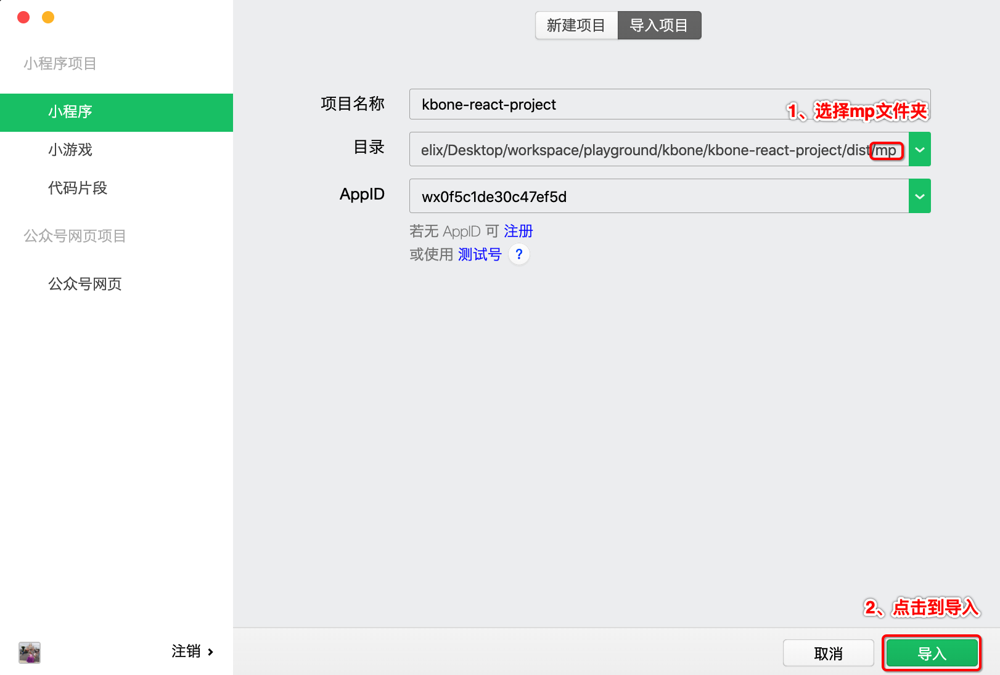
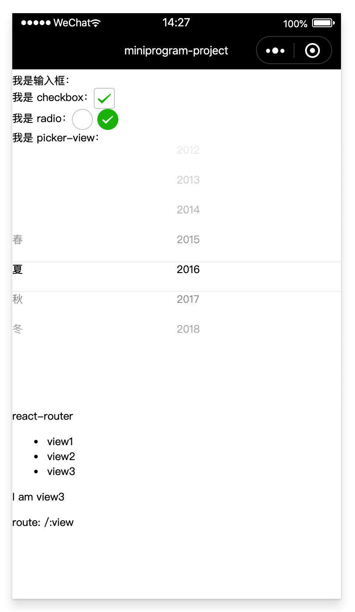

# Kbone + React 项目手工搭建流程

此方案基于 webpack 构建实现，构建 web 端代码的流程无需做任何调整，此处只介绍如何将源码构建成小程序端代码。

### 1、搭建 webpack 环境

在本地手工搭建一个 webpack 环境。在任意目录下执行以下命令：

```
// 创建项目目录
mkdir kbone-react-project

// 生成 Node 包管理配置文件
cd kbone-react-project
npm init -y

// 安装 webpack, webpack-cli
npm install webpack webpack-cli --save-dev
```

### 2、编写 webpack 配置

#### 2.1 webpack.mp.config.js

在项目跟目录下创建文件夹 build，在 build 下面新建一个 webpack.mp.config.js 文件，用于小程序端代码的构建，文件内容如下：

```js
const path = require('path')
const webpack = require('webpack')
const MiniCssExtractPlugin = require('mini-css-extract-plugin')
const OptimizeCSSAssetsPlugin = require('optimize-css-assets-webpack-plugin')
const TerserPlugin = require('terser-webpack-plugin')
const MpPlugin = require('mp-webpack-plugin')

const isOptimize = true // 是否压缩业务代码，开发者工具可能无法完美支持业务代码使用到的 es 特性，建议自己做代码压缩

module.exports = {
  mode: 'production',
  entry: {
    index: path.resolve(__dirname, '../src/main.mp.jsx')
  },
  output: {
    path: path.resolve(__dirname, '../dist/mp/common'), // 放到小程序代码目录中的 common 目录下
    filename: '[name].js', // 必需字段，不能修改
    library: 'createApp', // 必需字段，不能修改
    libraryExport: 'default', // 必需字段，不能修改
    libraryTarget: 'window', // 必需字段，不能修改
  },
  target: 'web', // 必需字段，不能修改
  optimization: {
    runtimeChunk: false, // 必需字段，不能修改
    splitChunks: { // 代码分隔配置，不建议修改
      chunks: 'all',
      minSize: 1000,
      maxSize: 0,
      minChunks: 1,
      maxAsyncRequests: 100,
      maxInitialRequests: 100,
      automaticNameDelimiter: '~',
      name: true,
      cacheGroups: {
        vendors: {
          test: /[\\/]node_modules[\\/]/,
          priority: -10
        },
        default: {
          minChunks: 2,
          priority: -20,
          reuseExistingChunk: true
        }
      }
    },

    minimizer: isOptimize ? [
      // 压缩CSS
      new OptimizeCSSAssetsPlugin({
        assetNameRegExp: /\.(css|wxss)$/g,
        cssProcessor: require('cssnano'),
        cssProcessorPluginOptions: {
          preset: ['default', {
            discardComments: {
              removeAll: true,
            },
            minifySelectors: false, // 因为 wxss 编译器不支持 .some>:first-child 这样格式的代码，所以暂时禁掉这个
          }],
        },
        canPrint: false
      }),
      // 压缩 js
      new TerserPlugin({
        test: /\.js(\?.*)?$/i,
        parallel: true,
      })
    ] : [],
  },
  module: {
    rules: [{
      test: /\.css$/,
      use: [
        MiniCssExtractPlugin.loader,
        'css-loader',
      ],
    }, {
      test: /\.[t|j]sx?$/,
      loader: 'babel-loader',
      exclude: /node_modules/,
      options: {
        presets: [
          "env",
          "stage-3",
          "react"
        ],
        "plugins": [
            "transform-runtime"
        ]
      }
    }, {
      test: /\.(png|jpg|gif|svg)$/,
      loader: 'file-loader',
      options: {
        name: '[name].[ext]?[hash]',
      },
    }]
  },
  resolve: {
    extensions: ['*', '.js', '.jsx', '.json']
  },
  plugins: [
    new webpack.DefinePlugin({
      'process.env.isMiniprogram': process.env.isMiniprogram, // 注入环境变量，用于业务代码判断
    }),
    new MiniCssExtractPlugin({
      filename: '[name].wxss',
    }),
    new MpPlugin(require('./miniprogram.config'))
  ],
}
```

#### 2.2 安装依赖

安装上述配置文件里的 loader 和 plugin 依赖：

```
npm install babel-loader @babel/core @babel/preset-env @babel/preset-react @babel/plugin-transform-runtime @babel/runtime css-loader file-loader mini-css-extract-plugin optimize-css-assets-webpack-plugin terser-webpack-plugin mp-webpack-plugin --save-dev
```

#### 2.3 编写 webpack 插件配置

这里的 webpack 插件配置即 MpPlugin 的配置参数文件。在 build 文件夹下创建 miniprogram.config.js 文件，内容如下：

```js
module.exports = {
  // 页面 origin，默认是 https://miniprogram.default
  origin: 'https://test.miniprogram.com',

  // 入口页面路由
  entry: '/view1',

  // 页面路由，用于页面间跳转。其值是一个以页面名称作为 key 的对象，每项的值是该页面可以响应的路由
	router: {
		index: ['/view1', '/view2'],
  },
  
  // 特殊路由跳转
	redirect: {	
		notFound: 'index',	
		accessDenied: 'index',
  },

  // 构建输出配置
	generate: {
    // 构建完成后是否自动安装小程序依赖。'npm'：使用 npm 自动安装依赖
		autoBuildNpm: 'npm'
  },
  
  // 小程序全局配置，参见 https://developers.weixin.qq.com/miniprogram/dev/reference/configuration/app.html#window
	app: {
		navigationBarTitleText: 'miniprogram-project',
  },

  // 所有页面的全局配置
	global: {
		rem: true, // 是否支持 rem
    pageStyle: true, // 是否支持修改页面样式
  },
  
  // 项目配置，会被合并到 project.config.json 中
	projectConfig: {
		appid: '',
    projectname: 'kbone-react-project',
  },
  
  // 包配置，会被合并到 package.json 中
	packageConfig: {
		author: 'wechat-miniprogram',
	}
}
```

### 3、新增入口文件

**3.1 在项目根目录下创建 `src` 目录，在 `src` 目录下创建 `main.mp.jsx`文件：**

```js
import React from 'react'
import {render, h} from 'react-dom'
import App from './App'

export default function createApp() {
  const container = document.createElement('div')
  container.id = 'app'
  document.body.appendChild(container)

  render(<App />, container)
}
```

**3.2 安装 React React-dom**

```
npm install react react-dom
```

### 4、构建项目文件

**4.1 创建App.jsx**

在 `src` 目录下创建 `App.jsx` 文件，实现了：

- 路由组件的展示和路由切换
- 表单组件展示：输入框、checkbox、radio、picker-view

```js
import React, {useState} from 'react'
import {render, h} from 'react-dom'
import {BrowserRouter as Router, Switch, Route, Link} from 'react-router-dom';
import './app.css'

import PickerView from './PickerView.jsx'
import View1 from './View1'
import View2 from './View2'
import View3 from './View3'

const App = (props, store) => {
  return (
    <div>
      <div>
        我是输入框：
        <input
          onClick={e => console.log('click', e)}
          onInput={e => console.log('input', e)}
          onFocus={e => console.log('focus', e)}
          onBlur={e => console.log('blur', e)}
          onChange={e => console.log('change', e)}
        />
      </div>
      <div>
        我是 checkbox：
        <input
          type="checkbox"
          onChange={e => console.log('change', e)}
        />
      </div>
      <div>
        我是 radio：
        <input
          type="radio"
          name="radio"
          value="1"
          onChange={e => console.log('change', e)}
        />
        <input
          type="radio"
          name="radio"
          value="2"
          onChange={e => console.log('change', e)}
        />
      </div>
      <div>
        我是 picker-view：
        <PickerView></PickerView>
      </div>
      <Router>
        <div>react-router</div>
        <ul>
          <li><Link to="/view1">view1</Link></li>
          <li><Link to="/view2">view2</Link></li>
          <li><Link to="/view3">view3</Link></li>
        </ul>
        <Switch>
          <Route path="/view1" component={View1}></Route>
          <Route path="/view2" component={View2}></Route>
          <Route path="/:view" component={View3}></Route>
        </Switch>
      </Router>
    </div>
  )
}

export default App
```

**4.2 安装 react-router-dom 依赖包**

```
npm install react-router-dom
```

**4.3 创建 PickerView 组件**

在 `src` 下里创建 `PickerView.jsx` 组件：

```jsx
import React from 'react'

class PickerView extends React.Component {
  constructor(props) {
    super(props)
    this.pickerView = React.createRef()
    this.state = {
      value: [0, 1],
    }
    this.onChange = evt => {
      console.log(evt.detail.value)
      this.setState({
        value: evt.detail.value,
      })
    }
  }

  componentDidMount() {
    this.pickerView.current.addEventListener('change', this.onChange)
  }

  componentWillUnmount() {
    this.pickerView.current.removeEventListener('change', this.onChange)
  }

  render() {
    return (
      <wx-picker-view 
        ref={this.pickerView} 
        style={{width: '100%', height: '300px'}} 
        value={this.state.value}
      >
        <wx-picker-view-column>
          <div>春</div>
          <div>夏</div>
          <div>秋</div>
          <div>冬</div>
        </wx-picker-view-column>
        <wx-picker-view-column>
          <div>2011</div>
          <div>2012</div>
          <div>2013</div>
          <div>2014</div>
          <div>2015</div>
          <div>2016</div>
          <div>2017</div>
          <div>2018</div>
        </wx-picker-view-column>
      </wx-picker-view>
    )
  }
}

export default PickerView
```

**4.4 创建 View1 组件**

在 `src` 目录下创建 `View1.jsx` 组件：

```jsx
import React from 'react'

class View1 extends React.Component {
  render() {
    return (
      <div>
        <p>I am view1</p>
        <p>route: {this.props.match.path}</p>
      </div>
    )
  }
}

export default View1
```

**4.5 创建 View2 组件**

在 `src` 目录下创建 `View2.jsx` 组件：

```jsx
import React from 'react'

class View2 extends React.Component {
  render() {
    return (
      <div>
        <p>I am view2</p>
        <p>route: {this.props.match.path}</p>
      </div>
    )
  }
}

export default View2
```

**4.6 创建 View3 组件**

在 `src` 目录下创建 `View3.jsx` 组件：

```jsx
import React from 'react';

class View3 extends React.Component {
  render() {
    return (
      <div>
        <p>I am view3</p>
        <p>route: {this.props.match.path}</p>
      </div>
    )
  }
}

export default View3
```

### 5、执行构建

**5.1 安装 cross-env**

**为什么使用cross-env？**

cross-env 是运行跨平台设置和使用环境变量的脚本。

当您使用NODE_ENV=production, 来设置环境变量时，大多数Windows命令提示将会阻塞(报错)。

cross-env使得您可以使用单个命令，而不必担心为平台正确设置或使用环境变量。这个迷你的包(cross-env)能够提供一个设置环境变量的scripts，让你能够以unix方式设置环境变量，然后在windows上也能兼容运行。

**安装：**

```
npm install cross-env --save-dev
```

**5.2 编写 npm 脚本**

`NODE_ENV` 环境变量将由 `cross-env` 设置。打印 `process.env.NODE_ENV` 值为 'production'。

```json
"scripts": {
  "mp": "cross-env NODE_ENV=production webpack --config build/webpack.mp.config.js --progress --hide-modules"
}
```

### 6、项目效果预览

**6.1 执行命令：**

```
npm run mp
```

**6.2 预览效果：**

使用微信开发者工具导入项目根目录下 `dist` 目录下的项目 `mp`，直接选择 `mp` 文件夹即可，如下图所示：



项目运行效果如下图：

