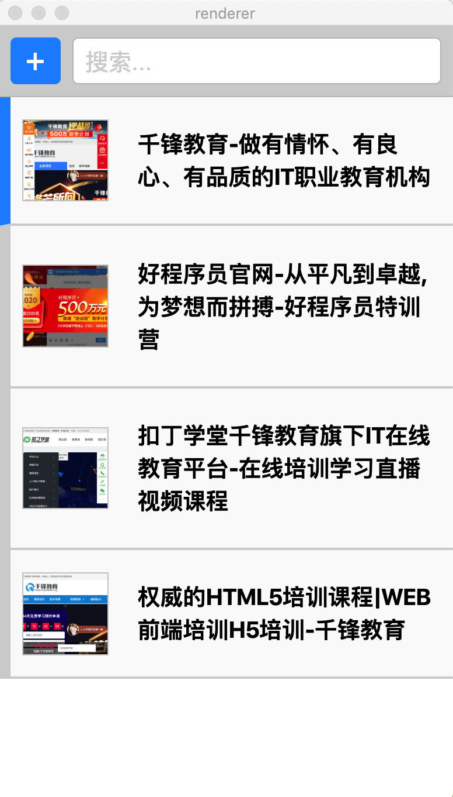
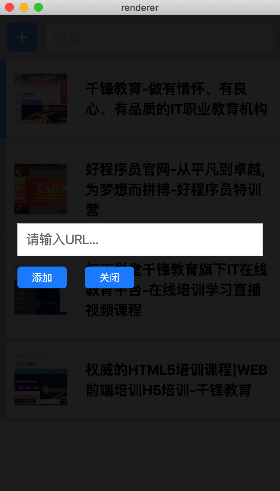

# 项目简介

本项目是应用 Electron + Vue.js 完成一个网站收集和网站浏览的功能。具体包括网站添加、网站浏览、列表项目删除、内容搜索、菜单定制及项目打包等功能。

### 1、目录：

[01-环境搭建](01-环境搭建.md)

[02-构建项目基本结构](02-构建项目基本结构.md)

[03-添加信息](03-添加信息.md)

[04-获得屏幕快照](04-获得屏幕快照.md)

[05-显示列表](05-显示列表.md)

[06-打开网站窗口](06-打开网站窗口.md)

[07-删除信息](07-删除信息.md)

[08-搜索信息](08-搜索信息.md)

[09-定制菜单](09-定制菜单.md)

[10-项目打包部署](10-项目打包部署.md)


### 2、项目部分截图




### 3、项目地址

```
https://github.com/lurongtao/felixbooks-electron
```